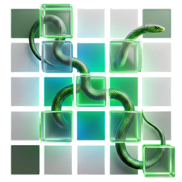

# SOKKANAEM

**S**patial-temporal **O**ptimized **K**ey-patch **K**ernel for **A**daptive **N**etwork **A**rchitecture and **E**fficient **M**amba

프레임 간 변화가 발생한 패치만 연산하는 실시간 비디오 깊이 추정 프레임워크. 설계 문서는 [IDEA.md](IDEA.md).

## 핵심 아이디어

Mamba 이산화 파라미터 Δ에 변화 마스크를 곱한다 (Δ-gating):
mask=0 이면 `exp(Δ·A)=I, Δ·B=0` 이므로 hidden state가 **정확히** 복사됨 — 연산 스킵 = 상태 유지가 수식 레벨에서 공짜.

## 이동 카메라 확장: Low-Res GMC + Feature-level Gating (IDEA.md §3.5)

고정 카메라를 넘어 블랙박스·드론 등 ego-motion 환경으로 확장하는 하이브리드 파이프라인.
센서(IMU) 없이 순수 RGB만 사용, 전처리 병목 없이 스킵 이득 유지:

1. **Low-Res GMC** (`gmc.py`) — 프레임을 저해상도(기본 128px)로 축소, 소수 특징점(≤50개) +
   LK 추적 + RANSAC 호모그래피로 프레임 t-1을 현재 시점으로 워핑 (~1-2ms). 추적 실패 시 항등 폴백.
   축소 이득은 HD 입력 기준 — PoC 기본 입력(128px)에서는 이미 저해상도라 무축소로 동작.
2. **Feature-level Gating** — 워핑된 t-1과 현재 프레임을 patch embedding(초기 인코더)에 통과,
   패치별 피처 상대 L1 차이로 active mask 확정. 정렬 잔차·조명 노이즈는 피처 레벨에서 흡수.
   임계값 로직(hysteresis/dilation/keyframe)은 기존 detector와 공유.

`SOKKANAEM(gmc=True)` 또는 `infer.py / eval.py --gmc`로 활성화. tau는 피처 스케일
(기본 0.1/0.05, 픽셀 MSE 스케일과 다름). opencv 필요: `uv pip install -e ".[video]"`.

## 설치 (conda + uv)

```bash
conda env create -f environment.yml   # python 3.11 + uv
conda activate sokkanaem
uv pip install -e ".[dev,video]"      # torch, numpy, pytest + opencv (GMC·비디오 입력)
```

## 사용

```bash
python -m pytest tests/ -q      # Δ-gating 정확성 + 데이터 파이프라인 검증

# 데이터셋 구성/검증
python scripts/prepare_data.py check --data scannet:/data/scannet
python scripts/prepare_data.py from-video cam.mp4 --out data/cctv

# 학습 — config가 기본값, CLI 플래그가 우선. 결과물은 work_dirs/<config명>/
python scripts/train.py --config configs/synthetic.toml
python scripts/train.py --config configs/scannet.toml --data scannet:/my/scannet
python scripts/train.py --config configs/mixed.toml   # 멀티 데이터셋 혼합

# 검증/추론 공통: ckpt 옆 config.toml에서 학습 시 [model] 설정(dim, tau, keyframe 등)
# 자동 복원 — CLI 플래그(--gmc, --tau-on)가 우선.
# 검증 — AbsRel/RMSE/δ1 + 시간 안정성 + active ratio, eval.txt에 기록
python scripts/eval.py --ckpt work_dirs/scannet/latest.pt --data scannet:/data/scannet
python scripts/eval.py --ckpt work_dirs/scannet/latest.pt --data scannet:/data/scannet --sweep-tau  # Go/No-Go 곡선

# 추론 — depth PNG는 기본 <ckpt dir>/viz/ 저장 ('none'으로 비활성)
python scripts/infer.py --ckpt work_dirs/scannet/latest.pt --video cam.mp4
python scripts/infer.py --ckpt work_dirs/scannet/latest.pt --frames-dir data/cctv/seq0/rgb

# 이동 카메라 (ego-motion): Low-Res GMC + feature gating (IDEA.md §3.5)
python scripts/infer.py --ckpt work_dirs/kitti/latest.pt --video dashcam.mp4 --gmc
python scripts/eval.py --ckpt work_dirs/kitti/latest.pt --data kitti:/data/kitti --gmc --sweep-tau
```

## Configs (`configs/`)

데이터셋 특성별 최적화: 모션 양이 스킵 상한 결정, 실내/실외가 tau·keyframe 주기 결정.

| config | 대상 | max_skip | tau_on | 비고 |
|---|---|---|---|---|
| `cctv.toml` | 고정 카메라 (주 타깃) | 0.9 | 0.01 | clip 16, keyframe 60 |
| `scannet.toml` | 실내 핸드헬드 | 0.8 | 0.02 | |
| `nyu.toml` | 실내 (Kinect) | 0.8 | 0.02 | |
| `bonn.toml` | 실내 동적 객체 | 0.7 | 0.02 | tau_off 낮춤 — 동적 객체 유지 |
| `kitti.toml` | 주행 (전역 모션) | 0.5 | 0.05 | keyframe 10 |
| `vkitti2.toml` | 합성 주행 (dense GT) | 0.5 | 0.05 | kitti와 동일 프로파일 |
| `mixed.toml` | 전체 혼합 (generalist) | 0.7 | 0.02 | 이후 개별 config로 fine-tune |
| `main.toml` | **본 학습**: TartanAir V2 + PointOdyssey + vkitti2 | 0.5 | 0.05 | 256px, 100k steps, PoC ablation 결과 반영 (§4.5) |

## 산출물 (`work_dirs/<이름>/`)

`latest.pt`(가중치), `train.log`, `config.toml`(사본), `eval.txt`(검증 기록 누적), `viz/`(depth PNG).

## 데이터셋

모든 데이터셋은 정규 포맷 `(frames, depth[m], valid)` 클립으로 환원.
어댑터는 "(rgb, depth) 경로 쌍 시퀀스 + depth 스케일"만 제공 (`sokkanaem/data.py`).

| spec | 레이아웃 | 스케일 |
|---|---|---|
| `scannet:/root` | `scene*/color, depth` | 1000 |
| `tum:/root`, `bonn:/root` | `seq*/rgb, depth` | 5000 |
| `nyu:/root` | `seq*/rgb, depth` | 1000 |
| `kitti:/root` | `drive*/image_02/data, proj_depth/groundtruth/image_02` | 256 |
| `vkitti2:/root` | `Scene*/변형/frames/{rgb,depth}/Camera_*` (cm, 65535=하늘→invalid) | 100 |
| `folder:/root:SCALE` | `*/rgb, depth` (범용) | 지정 |

`--data` 반복 지정으로 혼합. WeightedRandomSampler가 데이터셋별 추출 확률 균등화
(대형 데이터셋이 소형을 잠식하지 않음). 스케일 상이(실내 10m vs KITTI 80m)해도
scale-invariant log loss라 혼합 안전. 새 데이터셋 = 어댑터 함수 ~5줄 + 레지스트리 1줄.

**계획된 학습 커리큘럼** (IDEA.md §3.4): Stage 1 — **TIMo**(고정형 ToF 실내 모니터링,
실측 GT) 지도 학습 → Stage 2 — **VIRAT**(감시 비디오, GT 없음)에 SOTA 교사 모델로
pseudo depth GT 생성 후 distillation. 두 데이터셋 모두 어댑터 추가 예정.

## 구조

```
sokkanaem/
  detector.py   변화 감지: MSE + hysteresis + dilation + keyframe refresh (§3.1)
  gmc.py        Low-Res GMC: 저해상도 특징점 + RANSAC 호모그래피 + full-res 워핑 (§3.5)
  ssm.py        Selective SSM + Δ-gating, 순수 PyTorch 레퍼런스 스캔 (§3.2)
  model.py      T-Mamba/S-Mamba 교차 백본 + 경량 디코더, 스트리밍 API (§3.0-3.3)
                스트림별 상태(SSM hidden/detector/prev frame)는 전부 state dict에 —
                모델 하나로 다중 스트림 처리 가능. from_checkpoint()가 config 복원 로드
  data.py       멀티 데이터셋 로더: 어댑터 레지스트리 + 정규 클립 포맷 + 균등 혼합 샘플러
  losses.py     SI-log + gradient + temporal consistency (validity 마스킹)
scripts/
  train.py      학습 (config 기반, 랜덤 마스크 스케줄링 §3.4)
  eval.py       검증 (정확도/시간 안정성/tau sweep)
  infer.py      스트리밍 추론 + depth PNG 저장
  prepare_data.py  데이터셋 레이아웃 검증, 비디오 -> 프레임 추출
configs/        데이터셋별 최적화 학습 설정 (TOML)
tests/          핵심 주장 검증: mask=0 ⇒ bit-exact state copy, GMC 정렬 + 피처 게이팅,
                다중 스트림 독립성, ckpt config 복원
```

## PoC 범위 (로드맵 1단계)

포함: Δ-gating 수학 검증, 스킵 비율 측정, 스트리밍 추론, 시간 일관성 loss.
제외 (3단계): Triton 블록 희소 커널(wall-clock 가속), 실제 데이터셋 학습, teacher 증류.
순수 PyTorch 스캔이라 스킵은 **논리적**(연산량 비율 측정)이며 실측 속도 향상은 커널 구현 후.
