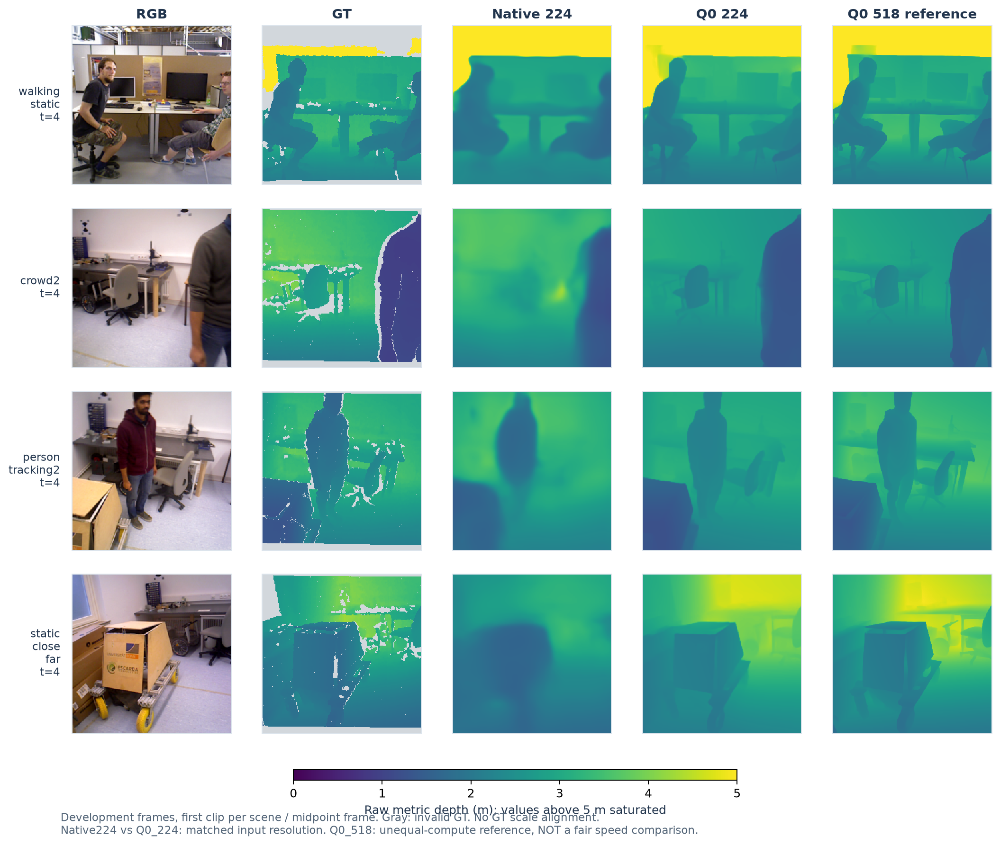

# 오차 분해 → 사전학습 모델 비교 → 해상도별 거리 보정

2026-09-08. 개발 실험이며 기존 논문의 모델·가중치·최종 결과는 변경하지 않았다.

## 핵심 결과

1. 공동 디코더 학습의 오차 증가는 단일 전역 scale 보정으로 해결되지 않았다.
2. 같은 224px 입력에서 Q0(Depth Anything V2 기반)는 native보다 경계 F1과 flat-TV가
   좋지만, metric 깊이 오차가 컸다. **구조 선명도와 거리 정확도를 분리해 다룰 근거**다.
3. 224px에서 거리 보정기만 1,600 step 재학습해도 raw AbsRel은 개선되지 않았다.
4. 새로운 최종 모델은 미채택. 인코더만 교체한 독립 대조, encoder-decoder 공동 학습,
   장기·다중 seed·장치 평가 및 원고 교체는 아직 하지 않았다.

## 1. 오차 분해

이전 공동 학습의 train/dev 토큰 캐시를 사용한다. GT 정합 없는 raw 지표와
클립별 GT median 정합 지표는 명확히 구분한다. 후자는 진단용이며 배포에 쓰지 않는다.

### 단일 scale은 충분하지 않다

학습 TUM/Bonn의 512프레임에서 각 클립 `mean(log(GT/pred))`를 구하고,
클립·source를 균등 평균한 뒤 exp하여 단일 배율을 얻었다. 개발 GT로 배율을 맞추지 않았다.

| 모델 | 학습으로 얻은 배율 | 개발 Raw AbsRel | 배율 적용 후 |
|---|---:|---:|---:|
| 기존 v11 | 0.977856 | 0.110890 | 0.120061 |
| 공동 학습 | 0.997123 | 0.114708 | 0.116154 |

이 배율은 train log-L2 기준의 전역 배율이며 AbsRel의 최적 배율이라고 주장하지 않는다.
두 모델 모두 개발 오차가 증가했다. 개발 mean log(pred/GT)는 기존 −0.05533,
공동 학습 −0.07946으로 더 가까운 쪽의 예측 편향이 커졌다. 학습/개발 편향의 차이가
있으며, 한 상수로 모든 장면을 보정하는 접근은 이번 조건에서 효과가 없었다.
보정 문제만이 유일한 원인이라는 결론도 내리지 않는다.

### 경계 위치 허용폭을 늘려도 미검출이 남는다

기존 평가와 별개로 GT/pred log-gradient >0.02 경계의 recall을 측정했다.
GT 유효 영역을 1px 침식했고, 위치 허용폭 1/2/4px를 함께 기록했다.

| 모델 | 1px recall | 2px recall | 4px recall | 경계 AbsRel | 비경계 AbsRel |
|---|---:|---:|---:|---:|---:|
| 기존 v11 | 0.2377 | 0.2826 | 0.3629 | 0.1529 | 0.1063 |
| 공동 학습 | 0.2569 | 0.3081 | 0.3995 | 0.1590 | 0.1099 |

허용폭에 따라 recall이 올라 위치 오차의 영향이 드러나지만, 4px에서도 많은 경계가
검출되지 않는다. 흐릿해서 임계에 못 미치는 경우와 구조 자체가 누락된 경우는
이 수치만으로 구분할 수 없다. **얇은 물체/작은 객체의 인스턴스별 recall은 아직 미측정**이며,
그 평가에는 별도 주석 또는 검증된 영역 정의가 필요하다. 경계 recall을 객체 복원율로 부르지 않는다.
영역이 없는 클립은 `None`과 missing count를 명시해 남겼다.

## 2. 사전학습 시스템의 해상도 통제 비교

로컬 Q0 체크포인트를 offline으로 로딩하고 전체 state dict를 strict하게 검증했다.
Q0의 인코더는 patch 14, native는 patch 16이므로 공통 배수인 **224px**에서 비교했다.
같은 RGB256을 bilinear로 224px로 변환하며, 결과는 같은 GT256에서 평가했다.
기존 native256/Q0_518은 별도 운용 해상도 참고값이다.

| 구분 | 모델 | Raw AbsRel ↓ | 경계 AbsRel ↓ | 경계 F1 ↑ | Overshoot ↓ | Flat-TV ↓ | GPU 중간 지연 ms |
|---|---|---:|---:|---:|---:|---:|---:|
| 동일 입력 해상도 | native224 | 0.116177 | 0.155459 | 0.311264 | 0.216172 | 0.027123 | 1.465 |
| 동일 입력 해상도 | Q0_224 | 0.138486 | 0.167574 | 0.468184 | 0.204454 | 0.022045 | 3.245 |
| 운용 해상도 참고 | native256 | 0.110890 | 0.152884 | 0.342477 | 0.196981 | 0.026897 | 2.228 |
| 운용 해상도 참고 | Q0_518 | 0.120160 | 0.148503 | 0.656019 | 0.189352 | 0.026034 | 7.515 |

- 개발 16클립·128프레임, source 균등 집계. 이미 관찰한 기존 개발 표본의 적응적 실험이다.
- 224px로 바꾼 두 모델 모두 해당 해상도로 재학습하기 전의 비교다. Q0 보정기의 518px
  학습 조건을 분리하기 위해 아래 추가 실험을 수행했다.
- 파라미터는 native 4,185,872, Q0 24,810,627. 입력 해상도가 같아도 용량·사전학습량·
  디코더·거리 보정·시간 상태가 다르므로 **인코더만의 인과 효과를 측정한 실험이 아니다.**
- RTX4090 FP32, GPU-resident 입력, 20프레임 warmup 후 매 프레임 동기화한 호출 시간이다.
  리사이즈·정규화·출력 변환은 포함, 파일 IO/H2D는 제외한다. 병렬 throughput이나 실제
  비디오 pipeline, Pi 4/Nano B01 지연이 아니다. GPU별 p95와 프레임별 시간은 JSON에 남겼다.
- 518px 행은 높은 연산 예산의 품질 참고값이지 native224와 공정한 속도 비교가 아니다.
- 동일 224px에서 Q0의 F1은 약 50.4% 상대 증가하지만 raw AbsRel이 약 19.2% 증가했다.
  기존 엄격 gate를 통과하지 못했다. 높은 선명도만으로 대체 모델을 선정하지 않았다.

## 3. Q0 거리 보정기만 224px에 맞춰 재학습

해상도 변경과 metric 보정 학습 조건의 불일치를 추가로 점검했다.

- 공간 모델 전체 동결. 정규화 relative disparity와 pooled 특징만 캐시했다.
- 기존 Q0 보정기 25,538 파라미터만 학습하며, 공간 encoder/decoder는 optimizer에 없다.
- TUM/Bonn 학습 512프레임, 개발 128프레임, 파일 교집합 없음.
- seed 735, 1,600 step, batch 8, AdamW lr 1e-4, 유효 GT log-depth L1.
- 기존 Q0에서 이어 학습했지만 가중치를 덮어쓰지 않고 별도 calibration checkpoint로 저장했다.

| Q0_224 | Raw AbsRel ↓ | 경계 AbsRel ↓ | 경계 F1 ↑ | Flat-TV ↓ |
|---|---:|---:|---:|---:|
| 기존 보정기 | 0.138486 | 0.167574 | 0.468184 | 0.022045 |
| 재학습 보정기 | 0.145043 | 0.168548 | 0.468209 | 0.022045 |

경계 형태는 거의 유지됐지만 거리 정확도는 악화했다. 재학습 후 150m 상한 포화 픽셀은
0%였다. 상한 포화가 없다는 것이 calibration 정확도나 일반화를 보장하지는 않는다.
이번의 한 작은 표본·한 seed 결과를 모든 metric 보정 방식의 실패로 일반화하지 않는다.

## 4. 시각화



각 장면의 첫 캐시 클립, 중간 프레임(t=4)을 고정 선택했다. 좋은 결과를 골라내지 않았다.
회색은 GT 결측, 깊이는 공통 0–5m(상한 포화), GT 정렬 없음.
오른쪽 518px는 다른 연산 예산의 참고값이다. 이 그림은 재학습 전 Q0 보정기를 사용한다.
선명한 구조의 차이는 보이지만 그것이 더 정확한 metric 깊이라는 뜻은 아니다.

## 5. 남은 작업의 정확한 상태

| 우선순위 | 상태 |
|---|---|
| 오차 원인 분해 | scale·경계·거리 구간 진단 완료. 작은 객체별 누락 평가 미완료 |
| 사전학습 공간 모델 비교 | 동일 해상도 전체 시스템 비교 및 보정기 적응 완료. 인코더만의 독립 대조는 미완료 |
| 인코더·디코더 공동 학습 | 이번 회차 미실행. 기존 회차는 동결 SSM + trainable decoder였음 |
| 확대 표본·다중 seed·새 개발 장면 | 미실행. 현재 비교는 재사용 개발 표본 |
| 장기 영상·캐시·Pi 4/Nano B01 | 미실행. GPU 모델 호출 시간만 참고 측정 |
| 새 모델 논문 반영 | 보류. 채택 모델이 없으며 final 결과 유지 |

다음에는 **같은 decoder/학습 감독 아래 인코더 특징만 비교하는 통제 실험**이 필요하다.
현재 Q0 전체 시스템의 우위를 그대로 SSM encoder 교체 효과로 간주하면 안 된다.
학습·개발의 metric 편향 차이와 새 장면 검증도 함께 설계해야 한다.
출력부/보정기만 작은 개발 표본에 계속 맞추는 방식은 이번 결과에서 뒷받침되지 않았다.

## 산출물 / 검증

- `sokkanaem/quality_diagnostics.py`
- `scripts/pretrained_quality_study.py`, `scripts/calibrate_pretrained_resolution.py`,
  `scripts/render_pretrained_comparison.py`
- `work_dirs/pretrained_quality_20260908/`: 오차 분해·해상도 비교·실제 예측·프로토콜.
- `work_dirs/pretrained_calibration_20260908/`: 보정기 가중치·학습 로그·캐시·gate 판정.
- `paper/pretrained_quality_visuals_20260908/`: PNG/PDF와 provenance.
- 관련 테스트 **49개 통과**. 체크포인트/실행 소스 해시 검증, 원본 가중치 불변 확인.

```bash
HF_HUB_OFFLINE=1 python scripts/pretrained_quality_study.py --out work_dirs/pretrained_quality_repro
HF_HUB_OFFLINE=1 python scripts/calibrate_pretrained_resolution.py --parent work_dirs/pretrained_quality_repro --out work_dirs/pretrained_calibration_repro
python -m pytest -q tests/test_quality_diagnostics.py
```

실행기는 기존 출력 경로를 덮어쓰지 않는다. 현재까지 정확도·경계·잡음을 동시에
개선한 새 모델은 없으며, 모든 후속 단계가 완료되었다고 표현하지 않는다.
