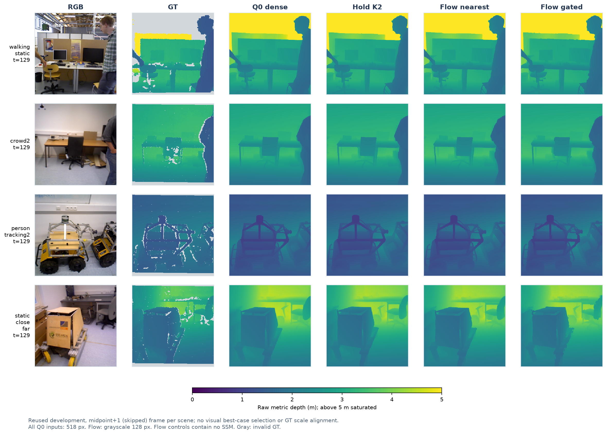

# RGB 대응 기반 깊이 캐시 이동: 품질·속도 동시 개발 기준 통과

후속: [특징 캐시·SSM 결합 대조](Q0_RGB_FLOW_FEATURES_STUDY_20260909.md).
결합 후보도 개발 기준을 통과했으나 SSM의 추가 우위는 아직 확인되지 않았다.

2026-09-09. [깊이 후보 선택 실험](Q0_TRANSPORT_STUDY_20260909.md)의 후속.

깊이 값 유사도로 이동 위치를 고르는 대신 RGB 광학 흐름을 사용했다.
**최근접 보간의 K2 출력 이동 대조군이 L32/L256 모두 기존 품질·가속 기준을 통과했다.**
갱신 시작 위치를 바꾼 검사도 품질 기준을 통과했다. 단, 이는 **SSM 없는 대조군**이며
SOKKANAEM의 고유 기여, 독립 장면 성능, 엣지 실기기 성능을 입증한 결과는 아니다.

## 1. 고정 조건

- 기존 동결 Q0, inference518 / scoring256, 개발 L32 8클립256프레임 및 L256 4클립1024프레임.
  두 자료의 프레임은 겹치지 않지만 같은 개발 장면이며 이미 여러 번 관찰했다.
- 학습 없음. GT와 현재 프레임 dense Q0는 평가·동등성 확인에만 사용하고 생략 추론 입력으로 사용하지 않는다.
- K2: 처음부터 한 프레임씩 번갈아 전체 Q0를 호출하고, 생략 프레임은 직전 깊이를 이동한다.
- OpenCV5.0.0 DIS ULTRAFAST, 128×128 grayscale, CPU1thread. Current→previous backward flow로 이전 깊이를 샘플링한다.
- Forward/backward 오차≤1.5px, 밝기 오차≤12.75/255, 범위 검사 및3×3 erosion으로 신뢰도 proxy를 계산한다.
  이것은 실제 가림 정답이나 보장된 대응 신뢰도가 아니다.
- 네 조건은 실행 전 고정: bilinear, nearest, nearest+불확실 픽셀 hold, 마지막 조건+불확실 비율>10%면 전체 갱신.
  별도로 기존 단순 hold K2와 dense Q0를 비교했다. 사후 임계값 완화 없음.
- Raw/edge AbsRel·overshoot·flat-TV 각 Q0 대비+1% 이내, 경계F1 감소≤.005,
  source별 raw+2% 이내의 기존 품질 gate를 모두 요구한다. 평균 시간 감소≥5%도 별도로 요구한다.

## 2. L256 결과

| 구성 | Raw AbsRel↓ | 경계 F1↑ | Flat-TV 상대 변화 | 평균 ms¹ | 품질 / 가속 동시 판정 |
|---|---:|---:|---:|---:|---|
| Q0 dense | .159183 | .614665 | 기준 | 7.540 | 기준 |
| 단순 hold K2 | .159210 | .612048 | +1.603% | 3.863 | Flat-TV 실패 |
| Flow bilinear | .159014 | .597355 | +1.197% | 4.377 | 경계·Flat-TV 실패 |
| **Flow nearest** | **.159120** | **.620225** | **+0.852%** | **4.375** | **통과** |
| Flow nearest + 불확실 픽셀 hold | .158407 | .628173 | +3.333% | 4.379 | Flat-TV 실패 |
| 위 방식 + 불확실>10% 전체 갱신 | .159172 | .614893 | +0.019% | 8.512 | 품질 통과, 가속 실패 |

¹ 이 표는 최초 단일 평가의 실제 측정값이다. 반복 측정 결과는 아래에 별도로 제시한다.

Nearest의 edge AbsRel은 .174638(Q0 .174237), source raw 상대 변화는 TUM−.675%, Bonn+.487%다.
정확도가 모든 지표·source에서 개선된 것은 아니며, **Q0 대비 허용 품질 범위를 유지하면서 가속했다**는 의미다.
Flat-TV 허용치는+1%로 고정했고 관찰값+0.852%는 한계보다 약0.148%p 낮을 뿐이므로 여유가 크지 않다.

L32 nearest도 raw .128506(Q0 .128127), 경계F1 .662756(Q0 .660219), flat-TV+.655%로 모든 기준을 통과했다.
L32의 단순 hold와 픽셀별 gated 방식도 통과하지만, L256에서는 각각 flat-TV를 통과하지 못했다.

### 대조 해석

- 같은 흐름에서 bilinear→nearest 변경 시 경계F1이 .597355→.620225로 회복됐다.
  이 구현·데이터에서 깊이 보간 방식이 중요했다는 근거이며, 모든 bilinear 사용이 나쁘다는 결론은 아니다.
- 픽셀별 hold 혼합은 raw/F1을 더 개선했지만 flat-TV가 악화됐다.
  이동/비이동 출력의 접합부 불연속은 가능한 원인이나, 이번에는 원인별 공간 오차 분해를 하지 않았다.
- 보수적 전체 갱신은 L32 6/256, L256 11/1024프레임만 생략했다. 흐름 계산 후 대부분 Q0를 다시 호출해 더 느렸다.
- Nearest는 신뢰도에 따라 픽셀을 선택하지 않고 전체 깊이를 이동한다. 경계 밖은 border 복제다.
  가림 해제·큰 움직임·조명 변화에 안전하다는 보장은 없다. 신뢰도 계산 비용도 현재 실행에 포함되어 있다.

## 3. 갱신 위치와 반복 시간 감사

처음 두 프레임을 전체 추론한 뒤 K2를 시작해 생략/갱신 위치를 뒤집었다. 임계값이나 가중치는 바꾸지 않았다.

| 개발 자료 | 원래 위치 경계F1 | 바꾼 위치 경계F1 | 바꾼 위치 raw | 바꾼 위치 품질 gate |
|---|---:|---:|---:|---|
| L32 | .662756 | .661266 | .128077 | 통과 |
| L256 | .620225 | .619933 | .158895 | 통과 |

바꾼 위치에서 L256 flat-TV .031028, dense .030988 대비 약+.129%다.
갱신 위상 민감도 한 가지를 검사했을 뿐 독립 검증은 아니다.

64프레임 warmup 후 dense/nearest 순서를 교대해3회 반복했다. 각 반복은 해당 개발 자료 전체를 사용했다.

| 자료 | Dense 평균 ms | Nearest 평균 ms | 시간 감소 | 평균 비율 가속 |
|---|---:|---:|---:|---:|
| L32 | 7.483 | 4.347 | 41.92% | 1.722× |
| L256 | 7.509 | 4.357 | 41.98% | 1.724× |

L256 3회 평균의 범위는 dense7.499–7.516ms, nearest4.354–4.362ms였다.
Nearest 전체 갱신 프레임 평균7.620ms, 생략 프레임 평균1.094ms이며 encoder 호출은 절반이다.
RTX4090 FP32의 동기화된 GPU-resident 프레임 호출 시간으로, resize·CPU 흐름2회·내부 GPU↔CPU 전송·warp를 포함한다.
최초 입력 파일IO/H2D와 비디오 decode는 제외한다. 다른 GPU 프로세스가 존재하는 환경이며
반복 범위를 통계적 신뢰구간 또는 Raspberry Pi4/Jetson Nano 지연으로 해석하지 않는다.

## 4. 검증 및 실제 영상

- 관련 테스트82개 통과. 실제 DIS의 합성 평행 이동 방향도 별도 확인했다.
- 주 실험 전체 갱신3823프레임 + 위상 감사652프레임에서 해당 dense Q0와 출력 차이0.
  여러 정책에서 같은 프레임이 반복된 비교 횟수이며, 고유 프레임4475개라는 뜻은 아니다.
- 주 실험/감사의 실행 소스·Q0·입력 데이터 hash 재검사 통과.
- 기존 학습 checkpoint, 논문 원고, reserved final 평가 결과는 수정하지 않았다.

[고해상도 PNG](qflow_visuals_20260909/comparison.png) · [PDF](qflow_visuals_20260909/comparison.pdf).
4개 L256클립 각각 midpoint+1인129번 생략 프레임을 고정 선택했다. 최상 사례 선별이나 GT scale 정렬 없음.
공통0–5m 색 범위(그 이상 포화), 회색은 invalid GT다. 육안상 작은 차이가 전체 정량 개선을 보장하지 않는다.
원본 예측과 선택 프레임·파일 해시는 시각화 provenance에 기록했다.

## 5. 결정과 다음 단계

출력-flow nearest를 **후속 연구의 품질·속도 기준 대조군**으로 유지한다. 논문 모델로 승격하지 않는다.
SSM 없는 방식도 이득을 내므로, SOKKANAEM 주장은 반드시 이 대조군보다 나은 기여를 입증해야 한다.

1. 같은 RGB flow를 특징 캐시/SSM에 적용하고 SSM 업데이트 제거 대조를 수행한다.
2. 필요하면 정렬된 특징 분포에 맞춘 training-only distillation을 한다. 갱신마다 h를 초기화하는 K2에서는 장기 기억 기여를 주장하지 않는다.
3. 후보를 고정한 뒤 독립 개발 장면·빠른 이동/가림/카메라 이동·다른 갱신 주기에서 검증한다.
4. 이후에만 사용자 장치 Pi4/Nano B01 5W·10W의 실제 실행 경로를 검증한다. 기존 기기 로그를 새 모델 측정으로 대체하지 않는다.

## 재현 / 산출물

- `sokkanaem/qflow.py`, `tests/test_qflow.py`
- `scripts/qflow_study.py --out <새 경로>` → `work_dirs/qflow_20260909/`
- `scripts/audit_qflow.py --out <새 경로>` → `work_dirs/qflow_audit_20260909/`
- `scripts/render_qflow.py --out <새 경로>` → `paper/qflow_visuals_20260909/`
- Python: `/home/hyunsu/miniforge3/envs/sokkanaem/bin/python`.
  시각화만 `PYTHONPATH=work_dirs/paper_tools/quality_plot_python`을 추가한다.

Audit/render는 이번 실행 경로를 입력으로 고정한다. 각 결과의 protocol/results/parity/integrity/provenance JSON에 근거가 있다.
