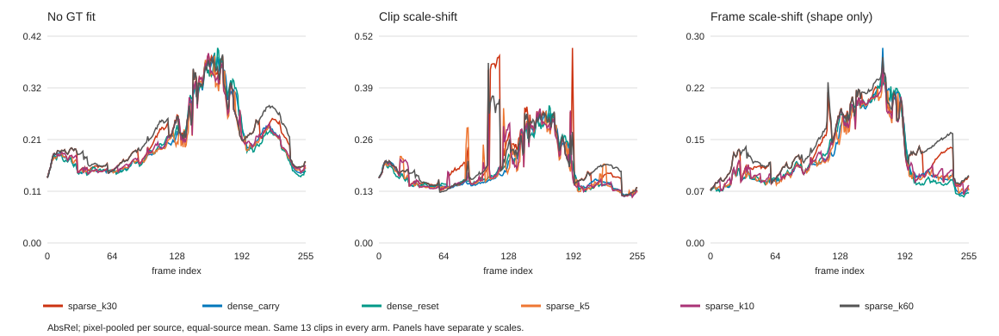

# 논문화 작업 5~8 결과

2026-09-06. 고정 v11, 신규 학습 없음. 개발 검증 분석이며 최종 테스트는 열지 않았다.

## 실행·재현 범위

- L8: 488개 중 유효 GT 클립 487개. L256: 13개, 동일 3,328 프레임.
- 비교군: DPT-Large, DA V2 Small, ZoeDepth N-K. 모두 single-frame이며 미래 프레임을 사용하지 않는다.
- 체크포인트와 원본 자료 해시, baseline revision, 소스 버전은 `work_dirs/paper_study_5_8/study.json` 및 `data_files.json`에 기록했다.
- 새 4개 TUM test 시퀀스와 기존 가중치·v1 freeze 기록은 변경하지 않았다. 이번 결과로 최종 테스트 성능을 주장하지 않는다.
- 공식 해상도 행은 원본 RGB의 채점 ROI에서 시작한다. 256px RGB 재확대 방식의 과거 행과 직접 같은 실험으로 간주하지 않는다.

표의 AbsRel/RMSE/δ1/TCE는 각 소스(TUM/Bonn) 내부의 유효 픽셀 합산 점수를 구한 뒤 두 소스를 1:1로 평균한다. 시퀀스 균등 평균이나 전체 클립 단순 평균과는 다르다. 실패 수는 실제 클립 수의 합이다. `실패`는 채점 유효 영역의 비양수 예측 또는 정합 후 비양수 시차가 존재함을 뜻하며 실행 중단 건수가 아니다. AbsRel>1인 catastrophic과 중복될 수 있다. RMSE의 단위는 m다. 정의는 [평가 계약](PROTOCOL.md)을 따른다.

## 5. 동일 프레임 정확도

### none

| 모델/입력 조건 | 실제 입력 | M params | AbsRel↓ | RMSE↓ | δ1↑ | 실패 | AbsRel>1 |
|---|---|---|---|---|---|---|---|
| sparse_k30 | 256×256 | 4.19 | 0.1892 | 0.8428 | 0.7374 | 0 | 16 |
| zoe_common | 256×256 | 345.07 | 0.4034 | 1.8189 | 0.1930 | 0 | 19 |
| zoe_official | 512×512 | 345.07 | 0.1392 | 0.8440 | 0.8322 | 0 | 16 |

### median

| 모델/입력 조건 | 실제 입력 | M params | AbsRel↓ | RMSE↓ | δ1↑ | 실패 | AbsRel>1 |
|---|---|---|---|---|---|---|---|
| sparse_k30 | 256×256 | 4.19 | 0.1235 | 0.5941 | 0.8679 | 0 | 0 |
| dpt_common | 256×256 | 343.03 | 0.9524 | 259.6097 | 0.6725 | 134 | 82 |
| da2_common | 252×252 | 24.79 | 0.5619 | 57.3037 | 0.6657 | 113 | 24 |
| zoe_common | 256×256 | 345.07 | 0.2672 | 1.2292 | 0.6041 | 0 | 5 |
| dpt_official | 384×384 | 343.03 | 0.6542 | 236.7316 | 0.6602 | 104 | 59 |
| da2_official | 518×518 | 24.79 | 0.5611 | 69.2551 | 0.6727 | 125 | 26 |
| zoe_official | 512×512 | 345.07 | 0.0957 | 0.7608 | 0.8956 | 0 | 0 |

### scaleshift

| 모델/입력 조건 | 실제 입력 | M params | AbsRel↓ | RMSE↓ | δ1↑ | 실패 | AbsRel>1 |
|---|---|---|---|---|---|---|---|
| sparse_k30 | 256×256 | 4.19 | 0.1153 | 1.5199 | 0.8655 | 1 | 1 |
| dpt_common | 256×256 | 343.03 | 0.0965 | 0.7316 | 0.9151 | 0 | 0 |
| da2_common | 252×252 | 24.79 | 0.1233 | 6.7727 | 0.9219 | 7 | 3 |
| zoe_common | 256×256 | 345.07 | 0.2892 | 11.1058 | 0.6176 | 30 | 11 |
| dpt_official | 384×384 | 343.03 | 0.0863 | 0.7125 | 0.9286 | 0 | 0 |
| da2_official | 518×518 | 24.79 | 0.2065 | 13.0032 | 0.9271 | 18 | 7 |
| zoe_official | 512×512 | 345.07 | 0.0891 | 0.7607 | 0.9284 | 0 | 0 |

동일 입력 목표의 relative-shape에서 native AbsRel은 0.1153, DPT는 0.0965다. Native의 상대 오차 차이는 +19.6%다. None은 실제 거리 정확도, median은 GT 스케일 보정 후 정확도이므로 다른 정합 표의 순위를 섞지 않는다.

DPT/DA2의 median 행은 offset이 미확정인 상대 disparity를 깊이로 변환한 뒤 1개 scale만 맞추는 보조 진단이다. 큰 오차와 실패를 절대 깊이 성능으로 해석하거나 native 우월성의 근거로 쓰지 않는다. Scale–shift 역시 disparity 제곱오차를 최소화하므로 역수 변환 후 AbsRel/RMSE 개선을 보장하지 않는다.

소스별 전체 수치: [study5_accuracy.csv](tables/study5_accuracy.csv).

## 6. 취약 영역과 오차 꼬리

아래는 common-input relative-shape의 소스 균형 AbsRel이다. 동적 영역은 GT 의미 분할이 아니라 동일 RAFT backward flow에서 dominant motion을 뺀 1.5px 초과 영역이다. 경계는 동일 GT에서 생성한다.

| 영역 | Native | DPT | DA2 | Zoe |
|---|---|---|---|---|
| edge | 0.1563 | 0.1300 | 0.1444 | 0.2625 |
| flat | 0.1100 | 0.0922 | 0.1216 | 0.2917 |
| dynamic | 0.2563 | 0.1181 | 0.2258 | 0.4651 |
| static | 0.0990 | 0.0934 | 0.1121 | 0.2665 |
| near | 0.2107 | 0.1039 | 0.1933 | 0.3603 |
| mid | 0.0847 | 0.0762 | 0.0830 | 0.2615 |
| far | 0.1537 | 0.2407 | 0.3061 | 0.4263 |

| 모델 | Clip P50 | Clip P95 | 실패 | catastrophic |
|---|---|---|---|---|
| sparse_k30 | 0.0855 | 0.2692 | 1 | 1 |
| dpt_common | 0.0889 | 0.1669 | 0 | 0 |
| da2_common | 0.0876 | 0.2296 | 7 | 3 |
| zoe_common | 0.2052 | 0.4676 | 30 | 11 |

P50/P95는 소스별 통계의 평균이며 global quantile이 아니다. 실패 클립은 평균에서 제외하지 않았다.

[영역별 전체 표](tables/study6_regions.csv) · [오차 꼬리](tables/study6_tails.csv) · [실패 및 소스별 worst-5 클립](tables/study6_failures.csv).

## 7. 동일 L256에서 장기 열화 분리

모든 행은 같은 13개 클립이다. Dense carry/reset은 매 프레임 all-active이며, K 조건은 고정 가중치에서 키프레임 주기만 변경했다. 실제 RGB 변화량과 dense fallback은 활성률에 반영된다.

| 조건 | 활성률(전체) | none AbsRel | median | scaleshift/clip | scaleshift/frame | clip TCE |
|---|---|---|---|---|---|---|
| sparse_k30 | 24.2% | 0.2201 | 0.1907 | 0.2091 | 0.1373 | 0.0435 |
| dense_carry | 100.0% | 0.2102 | 0.1768 | 0.1822 | 0.1241 | 0.0294 |
| dense_reset | 100.0% | 0.2097 | 0.1769 | 0.1823 | 0.1242 | 0.0331 |
| sparse_k5 | 41.3% | 0.2071 | 0.1747 | 0.1847 | 0.1224 | 0.0441 |
| sparse_k10 | 31.3% | 0.2109 | 0.1796 | 0.1863 | 0.1261 | 0.0400 |
| sparse_k60 | 22.4% | 0.2265 | 0.2006 | 0.2039 | 0.1441 | 0.0390 |



곡선의 early/late 차이는 영상 내용 변화도 포함한다. 원인 해석은 같은 시점의 carry/reset/sparse 차이로 한다. Frame 정합은 실제 scale drift를 제거하므로 temporal 성능으로 읽지 않는다.

같은 프레임의 carry−reset AbsRel은 -0.000088, sparse−carry는 +0.026908다. 이는 이 checkpoint와 데이터에서의 결과이며 모든 재귀 모델의 성질로 일반화하지 않는다.

Dense carry의 clip-fit TCE는 0.0294, reset은 0.0331다. 따라서 이 비교에서 상태 유지의 깊이 정확도 이득이 작다는 결과와 시간 일관성 이득이 있다는 결과를 구분한다.

[길이/정합 분해 표](tables/study7_long.csv) · [프레임별 수치](tables/study7_frame_curves.json).

## 8. 동일 mask에서 readout·출력 재사용·캐시 비교

모든 행은 sparse K30의 post-fallback mask를 그대로 재생했다. `delta_sp`와 `drop_sp`는 temporal output cache를 끈 상태에서 readout 처리만 다르고 공간 캐시가 켜져 있다. `*_no_sp`는 공간 캐시도 끈다. `both_cache_replay`는 기본 모델 출력을 수치적으로 재현하는지 검사했다.

| 조건 | AbsRel↓ | δ1↑ | TCE↓ | 실패 | Linear+Conv GMAC | ms/frame |
|---|---|---|---|---|---|---|
| both_cache_replay | 0.2091 | 0.7548 | 0.0435 | 2 | 0.656 | 1.698 |
| delta_sp | 0.2079 | 0.7550 | 0.0441 | 2 | 0.804 | 1.701 |
| drop_sp | 0.2317 | 0.7529 | 0.0538 | 3 | 0.804 | 1.714 |
| delta_no_sp | 0.1863 | 0.7768 | 0.0288 | 0 | 1.395 | 1.897 |
| drop_no_sp | 0.3207 | 0.4541 | 0.0511 | 0 | 1.395 | 1.905 |
| temporal_cache_only | 0.1937 | 0.7655 | 0.0275 | 0 | 1.247 | 1.996 |
| output_hold | 0.1953 | 0.7680 | 0.0312 | 0 | 0.990 | 1.307 |

정확도/TCE는 clip scale–shift 표이며 [전체 정합 ablation](tables/study8_ablations.csv)에 none/median도 보존했다. MAC은 실제 실행된 Linear/Conv2d만 집계하며 fused SSM scan·정규화·elementwise·resize 등을 제외한다. 이 수치를 전체 모델 FLOPs라고 부르면 안 된다. 현재 drop 구현은 temporal 출력을 나중에 mask하므로 state/readout 효과와 실제 linear 연산 절감은 다를 수 있다.

`output_hold`는 stateless dense predictor의 active patch 출력만 채택하고 나머지는 이전 출력을 유지한다. 완전 비활성 프레임을 제외하면 predictor는 여전히 dense다. 따라서 선택 비율을 곧바로 연산 절감률로 환산하지 않았다.

정확도와 MAC은 전체 L256 3,328프레임에서, 시간 측정은 각 개발 시퀀스의 첫 L256 클립 중 앞 64프레임(총 256프레임), warmup 1회·반복 3회에서 구했다. 따라서 시간과 품질의 집계 프레임 집합은 다르다. GPU-resident FP32 eager, 고정 mask, 같은 프레임의 반복 window 평균을 소스 균형 집계했다. 검출기·I/O·지표는 제외했으므로 이 값은 9~10번의 end-to-end latency가 아니다. GT 정합 계산 역시 측정 시간에서 제외했다.

## 논문 주장에 대한 판정

| 주장 | 이번 결과의 판단 | 후속 작업 |
|---|---|---|
| 작은 모델로 동급 형상 정확도 | 4.19M의 크기 이점은 확인되지만 common DPT 대비 AbsRel 19.6% 열세 | 9번에서 경량 경쟁군과 비교 |
| 기본 희소 경로의 장기 정확도 유지 | K30은 동일 L256 dense carry 대비 AbsRel 14.8% 증가 | 11번 통계, 13번 refresh/캐시 개선 후보 검증 |
| Δ readout의 효과 | 공간 캐시 on·시간 캐시 off에서 drop 대비 AbsRel 10.3% 감소 | 같은 추론 개입 범위로 한정; 재학습 대조는 별도 |
| 현재 캐시 조합의 최적성 | 캐시 off(delta_no_sp)는 기본 대비 AbsRel 10.9% 감소하지만 부분 MAC 증가 | 품질·비용 trade-off로 보고 |
| 단순 출력 재사용 대비 우월성 | output_hold AbsRel 0.1953 < 기본 0.2091; 제한된 시간 측정에서도 더 빠름 | 보편적 우월성 주장은 보류; 9~10번 동일 운용점 검증 |

이번 결과만으로 정확도 동등성·end-to-end 가속·독립 테스트 일반화를 주장하지 않는다. 단순 출력 재사용은 기본보다 부분 MAC이 많으므로 모든 비용 축에서 우월하다는 뜻도 아니다. 후속 후보를 제안하는 분석이며 기본 checkpoint나 K를 결과에 맞춰 변경하지 않았다.

## 완료 상태와 남은 한계

5~8의 개발 분석을 완료했다. 신규 학습·최종 test 평가·외부 제출은 하지 않았다. 성능 목표 달성 여부는 위 결과로 판단해야 하며, 실험 완료 자체가 정확도 개선이나 투고 준비 완료를 뜻하지 않는다.

시퀀스는 네 개뿐이며 인접 클립은 독립 표본이 아니다. 다중 학습 seed와 paired sequence CI는 11번에 남겨둔다. 기여 분리 행은 같은 체크포인트의 추론 시 개입이며, 대체 방식을 별도로 재학습했을 때의 최선 성능 비교가 아니다. TCE/OPW의 가림 처리는 in-bounds와 GT validity warp만 사용하며 forward/backward flow 일치성 검사는 없다. 미래 프레임을 사용하는 비디오 baseline 전체 비교와 다른 도메인 일반화도 이 표의 범위가 아니다.

DPT loader의 누락된 네 파라미터는 첫 fusion layer의 사용되지 않는 residual branch에 해당한다. 그 모듈이 실행되면 중단하는 hook을 설치했고, 전체 평가가 그 검사 아래 완료됐다. 로딩 정보와 실제 라이브러리 소스 해시는 `baseline_loading.json`에 있다.

재실행:

```bash
python scripts/paper_study.py --out work_dirs/paper_study_5_8
python scripts/paper_study_report.py --out work_dirs/paper_study_5_8
```
