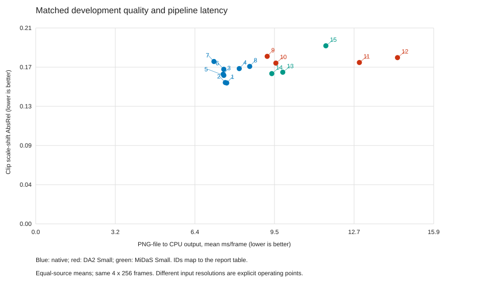

# 논문화 작업 9~11 결과

2026-09-06. 고정 v11 개발 검증. 신규 학습·최종 테스트 추론·외부 제출 없음.

## 9. 경량 비교군과 품질–시간 운용점

15개 운용점을 L256 13개/3,328프레임에서 평가했다. 아래 표의 품질과 시간은 모두 개발 시퀀스당 첫 L256 하나씩, 동일한 4개/1,024프레임에 한정한다. 같은 가중치의 K/해상도 변경이며 모델을 재학습하지 않았다.

AbsRel/δ1/TCE는 clip scale–shift 정합 후 값이며 실시간 거리 보정 없는 정확도와 다르다. 소스별 유효 픽셀 합산 후 TUM/Bonn을 1:1로 평균했다. 시간도 소스 균형 평균이고 정합/GT/지표 계산은 시간에서 제외했다.

| ID | 조건 | 실제 입력 | M params | AbsRel↓ | δ1↑ | 실패 | 평균 ms↓ | P95 ms | peak MiB |
|---|---|---|---|---|---|---|---|---|---|
| 1 | sparse_k5 | 256x256 | 4.19 | 0.1535 | 0.7827 | 0 | 7.637 | 8.108 | 63.7 |
| 2 | sparse_k10 | 256x256 | 4.19 | 0.1539 | 0.7804 | 1 | 7.580 | 8.104 | 63.7 |
| 3 | sparse_k30 | 256x256 | 4.19 | 0.1630 | 0.7576 | 0 | 7.496 | 8.098 | 63.7 |
| 4 | sparse_k60 | 256x256 | 4.19 | 0.1691 | 0.7428 | 0 | 8.138 | 8.776 | 63.7 |
| 5 | dense_carry | 256x256 | 4.19 | 0.1617 | 0.7694 | 0 | 7.521 | 7.612 | 61.4 |
| 6 | dense_reset | 256x256 | 4.19 | 0.1684 | 0.7714 | 0 | 7.520 | 7.615 | 49.4 |
| 7 | output_hold | 256x256 | 4.19 | 0.1769 | 0.7611 | 0 | 7.126 | 7.736 | 51.2 |
| 8 | gmc_k30 | 256x256 | 4.19 | 0.1715 | 0.7726 | 1 | 8.555 | 8.848 | 63.9 |
| 9 | da2_196 | 196x196 | 24.79 | 0.1825 | 0.7336 | 0 | 9.255 | 9.331 | 117.8 |
| 10 | da2_256 | 252x252 | 24.79 | 0.1751 | 0.7663 | 0 | 9.602 | 9.708 | 128.6 |
| 11 | da2_350 | 350x350 | 24.79 | 0.1758 | 0.7782 | 1 | 12.941 | 13.102 | 151.3 |
| 12 | da2_518 | 518x518 | 24.79 | 0.1811 | 0.7799 | 1 | 14.465 | 14.583 | 209.9 |
| 13 | midas_192 | 192x192 | 21.32 | 0.1652 | 0.7740 | 0 | 9.878 | 10.084 | 154.6 |
| 14 | midas_256 | 256x256 | 21.32 | 0.1637 | 0.7758 | 0 | 9.439 | 9.590 | 156.8 |
| 15 | midas_384 | 384x384 | 21.32 | 0.1940 | 0.7161 | 0 | 11.601 | 11.950 | 160.6 |

P95는 각 시퀀스의 프레임별 반복 측정 95분위를 소스 균형 집계한 값이며 전체 프레임의 global P95가 아니다. Peak는 한 번에 한 모델만 로딩한 프로세스의 최대 allocated GPU memory이며 가중치·활성·상태·런타임 workspace를 포함한다.

256 목표는 frozen common RGB, 나머지 목표는 원본 해상도의 동일 scoring ROI다. MiDaS/DA2는 metric 출력이나 미래 프레임을 사용하지 않는 상대 깊이 모델이다. GMC는 tau=0.1/0.05의 별도 진단 행으로 기본 pixel gate tau=0.05/0.025와 다르다.



### 사전 지정 허용오차 내 비교

품질 허용선은 기본 대비 AbsRel ≤1.05×, δ1 손실 ≤0.01, 실패 수 증가 없음이다. 동일 시간 탐색은 기본 latency의 1.10× 이하다. 이는 실측 grid 탐색이지 통계적 동등성 판정이 아니다.

- 품질 조건을 만족하는 가장 빠른 비교군: `midas_256`, AbsRel 0.1637, 9.439 ms. 기본은 7.496 ms이며 비교군/기본 시간 비는 1.26×다.
- 평가한 비교군 grid에 시간 허용선을 만족하는 점이 없다. 같은 시간에서의 품질 우위는 산출하지 않는다.

[운용점 전체 CSV](tables/study9_operating_points.csv) · [전체 13개와 시간 subset의 품질 분리](tables/study9_quality.csv) · [운용점 선택 결과](tables/study9_matched_points.json)

### 시간 subset의 대표성 한계

시간 subset은 결과를 보기 전에 정한 각 시퀀스의 첫 클립이다. 전체 13개와 점수·순위가 달라질 수 있다. 아래와 같이 같은 모델도 달라지므로 전체 정확도와 subset latency를 합쳐 같은 품질의 speedup으로 제시하지 않는다. 기존 native 경로 7종×13클립은 5~8의 점수와 동등함을 확인했다.

| 조건 | 전체 13개 AbsRel | 시간 subset 4개 AbsRel |
|---|---|---|
| sparse_k30 | 0.2091 | 0.1630 |
| dense_carry | 0.1822 | 0.1617 |
| output_hold | 0.1953 | 0.1769 |
| da2_256 | 0.2194 | 0.1751 |
| midas_256 | 0.1749 | 0.1637 |

운용점의 우열은 이 개발 subset 및 지정 허용오차에 한정한다. 전체 스트림에서의 품질 보존이나 새 장면 일반화의 증거로 확대하지 않는다.

## 10. 실제 경로와 비용 분해

RTX 4090, batch=1, FP32 eager, TF32 off, PyTorch/OpenCV thread=2/1. PNG 파일 읽기/디코딩, crop/resize/정규화, H2D, 실제 검출기·GMC·키프레임·fallback·backbone·decoder, 256 출력 보간과 CPU 복사를 포함했다. 모델 로딩/GT/RAFT/정합/채점/출력 파일 저장은 제외했다. 파일 캐시는 warm 상태이며 카메라·영상 코덱·네트워크·cold storage를 포함한 제품 지연은 아니다.

각 256프레임 클립 warmup 1회 뒤 상태를 초기화해 5회 반복했다. 첫 프레임/키프레임도 포함한다. 매번 가장 빠른 결과만 선택하지 않았다. 모든 반복의 출력 SHA-256이 품질 pass와 같음을 검사했다. 각 반복 시작에 다른 GPU compute process가 있으면 중단하도록 했고 앞뒤 GPU 상태를 기록했다. 이는 주기적 프로세스 검사이며 하드웨어를 독점 예약하거나 clock을 고정한 측정은 아니다.

아래 비용 분해는 별도 1회 계측 pass에서 component 경계마다 GPU 동기화를 추가했다. 합산 총시간은 이 계측 pass의 값이며 위 주 latency와 동일하지 않다. 상대 모델은 network와 출력 보간을 한 항목으로 묶었다.

| 조건 | 입력 | H2D | 검출 | GMC | embed | backbone | decoder | 상대모델 전체 | D2H | 기타 | 계측 합계 ms |
|---|---|---|---|---|---|---|---|---|---|---|---|
| sparse_k30 | 5.304 | 0.112 | 0.106 | 0.000 | 0.053 | 1.557 | 0.355 | 0.000 | 0.051 | 0.101 | 7.638 |
| dense_carry | 5.323 | 0.112 | 0.015 | 0.000 | 0.056 | 1.726 | 0.345 | 0.000 | 0.050 | 0.080 | 7.708 |
| output_hold | 5.340 | 0.112 | 0.114 | 0.000 | 0.040 | 1.296 | 0.260 | 0.000 | 0.050 | 0.123 | 7.336 |
| gmc_k30 | 5.336 | 0.112 | 0.055 | 0.766 | 0.106 | 1.879 | 0.348 | 0.000 | 0.051 | 0.176 | 8.828 |
| da2_256 | 5.700 | 0.105 | 0.000 | 0.000 | 0.000 | 0.000 | 0.000 | 3.800 | 0.054 | 0.026 | 9.685 |
| midas_256 | 6.063 | 0.108 | 0.000 | 0.000 | 0.000 | 0.000 | 0.000 | 3.277 | 0.053 | 0.028 | 9.529 |

[시퀀스별 latency·반복 범위·stream state](tables/study10_latency_sequences.csv) · [키프레임/fallback별 시간](tables/study10_frame_events.csv) · [비용 분해](tables/study10_components.csv)

이 측정은 모든 모델의 FP32 eager 경로 비교다. FP16/compile/TensorRT 최적화 모델의 최고 성능이나 이전 GPU-resident 속도 표와 직접 혼합하지 않는다. MAC이 적다고 파일-to-depth 지연이 반드시 줄지는 않는다.

## 11. 시퀀스 단위 paired 불확실성과 seed

아래의 차이는 `left − right`이며 AbsRel/TCE/시간은 음수가 left에 유리하다. 각 시퀀스 내 pixel-pooled 점수를 구한 뒤 네 시퀀스를 동일 가중 평균한다. 위 TUM/Bonn 1:1 평균과 estimand가 다르다.

95% 구간은 paired sequence bootstrap의 4⁴=256개 복원추출 조합을 전수 열거한 percentile 구간이다. 표본이 네 개라 coverage가 보장되는 정확한 구간이 아니며 탐색적이다. 양측 sign-flip도 2⁴=16개를 전수 열거했다. 가능한 최소 p=0.125이므로 5% 유의성을 주장하지 않는다. 인접 클립이나 실행 반복을 독립 시퀀스로 세지 않았고, 다중 비교 보정 없는 구간을 확정 검정으로 해석하지 않는다.

부호 반전 p는 귀무가설 아래 차이의 대칭성/교환가능성을 가정한 보조 진단이다. 시퀀스를 무작위 배정한 실험이 아니므로 인과적 우월성 검정으로 읽지 않는다. 이 작은 표본에서는 bootstrap 구간이 0을 제외해도 sign-flip 기준 유의성과 일치하지 않을 수 있다.

| 자료 | 비교 | 지표 | 차이 | paired 95% 구간 | 양측 p |
|---|---|---|---|---|---|
| L8_existing_487 | sparse_k30 − dpt_common | absrel | +0.02414 | [+0.01107, +0.03643] | 0.125 |
| L256_existing_13 | sparse_k30 − dense_carry | absrel | +0.03033 | [+0.00574, +0.06840] | 0.125 |
| L256_existing_13 | dense_carry − dense_reset | tce | -0.00330 | [-0.00418, -0.00242] | 0.125 |
| L256_existing_13 | delta_sp − drop_sp | absrel | -0.02312 | [-0.06630, -0.00038] | 0.250 |
| L256_new_13 | sparse_k30 − midas_256 | absrel | +0.01729 | [-0.02548, +0.06007] | 0.625 |
| latency_4x256 | sparse_k30 − dense_carry | ms_per_frame | +0.03849 | [-0.33828, +0.41525] | 1.000 |

[시퀀스별 점수](tables/study11_sequences.csv) · [전체 paired CI](tables/study11_paired_ci.csv) · [순서·시퀀스별 차이 JSON](tables/study11_paired_details.json)

### 마지막 8k 단계의 seed 0/1/2

기존 세 checkpoint를 현재 동일 채점 코드로 비교했다(seed0 기존 전수 결과 재사용, L256 streaming 동등성 재검사). 세 모델은 같은 v10 부모에서 마지막 8,000단계만 seed가 다르므로 독립적인 전체 학습 3회가 아니다. 기록된 학습 인자는 seed/저장 경로 외 동일하다. 기록된 commit에는 RAFT batch 분할 및 기본값 1.0의 bin temperature 추가 차이가 있다. 이는 현재 추론 코드를 통일한 비교이며 당시 미기록 worktree 변경까지 증명하지 않는다.

| 길이 | 정합 | AbsRel mean±sample SD | 범위 |
|---|---|---|---|
| 8 | none | 0.1923 ± 0.0027 | [0.1892, 0.1941] |
| 8 | median | 0.1243 ± 0.0009 | [0.1235, 0.1253] |
| 8 | scaleshift | 0.1146 ± 0.0007 | [0.1140, 0.1153] |
| 256 | none | 0.2238 ± 0.0035 | [0.2201, 0.2271] |
| 256 | median | 0.1919 ± 0.0019 | [0.1907, 0.1941] |
| 256 | scaleshift | 0.2040 ± 0.0077 | [0.1951, 0.2091] |

SD는 마지막 학습 단계의 관측 변동성이지 전체 학습/새 시퀀스 일반화의 신뢰구간이 아니다. 기존 개발 자료가 모델 선택에 반복 사용되었으므로 이 평균과 구간도 독립 test의 성능 추정으로 승격하지 않는다. [seed별 전체 지표](tables/study11_seed_runs.csv) · [평균·SD·범위](tables/study11_seed_summary.csv). 각 checkpoint/config/부모 해시와 역사적 소스 fingerprint는 `work_dirs/paper_study_9_11/seed_provenance.json`에 있다.

## 논문 주장에 대한 판정

- **경량 모델의 이점과 희소화의 이점은 별개다.** 기본 7.496 ms와 동일 가중치 dense 7.521 ms의 차이는 -0.025 ms (-0.33%)다. 이 값을 이전의 MAC 절감률과 동일시하거나 큰 실사용 가속으로 표현하지 않는다.
- 기본 경로의 read/decode/preprocess는 별도 계측 총시간의 69.4%다. 이 실행 경계에서는 네트워크 연산만 줄여 얻을 수 있는 이득이 제한된다.
- 기본의 stream state 최대 13.501 MiB는 dense의 12.000 MiB보다 작지 않다. 캐시는 추가 저장 공간을 사용한다. 작은 전체 모델과 작은 stream state를 혼동하지 않는다.
- 품질–시간의 허용오차 내 비교 결과는 위 실측 subset에 한정한다. 희소화가 큰 end-to-end 가속을 제공한다는 주장, 독립 test 일반화, 전체 학습 seed 안정성은 별도로 검증해야 한다.

## 완료 범위와 재현

9~11의 위 개발 분석을 완료했다. 성능 목표 충족·독립 최종 test 성공·투고 준비 완료를 뜻하지 않는다. 이번 비교군은 DA2 Small과 MiDaS Small이며 둘 다 native보다 파라미터가 많다. 서로 다른 사전학습/학습 자료와 학습량은 통제되지 않았고 데이터 중복도 완전히 검증되지 않았다. 따라서 차이를 아키텍처 하나의 인과적 효과로 해석하지 않는다. FastDepth 공식 서버의 HTTP/HTTPS 연결 timeout으로 해당 실측은 포함하지 않았고, 초소형 경쟁군 전체에 대한 우월성을 주장하지 않는다. GMC는 이 네 개발 시퀀스의 진단일 뿐, 새로운 움직이는 카메라/장면의 검증을 대신하지 않는다.

실행 계획: [STUDY_9_11_PLAN.md](STUDY_9_11_PLAN.md). 기존 가중치·평가 코드·최종 test 봉인 자료는 변경하지 않았다.

```bash
python scripts/prepare_efficiency_dependencies.py
python scripts/paper_efficiency_study.py --phase quality
python scripts/paper_efficiency_study.py --phase latency
python scripts/paper_efficiency_study.py --phase profile
python scripts/paper_efficiency_study.py --phase seeds
python scripts/paper_efficiency_report.py
```

MiDaS는 [공식 소형 모델](https://pytorch.org/hub/intelisl_midas_v2/)과 [v2.1 구현](https://github.com/isl-org/MiDaS/tree/94afff70fe0873c3af70355e5388e4d482bfc807)을 사용했다. 가중치와 transitive EfficientNet 구현은 로컬 revision/파일 해시로 기록했다. FastDepth의 공식 배포 위치는 [저자 저장소](https://github.com/dwofk/fast-depth)에 따른다.
