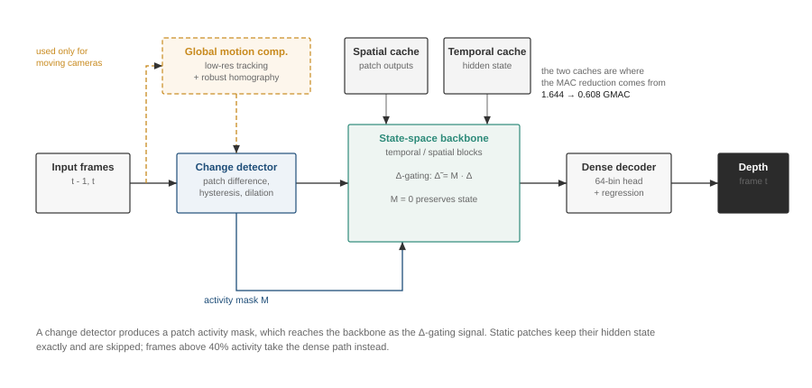
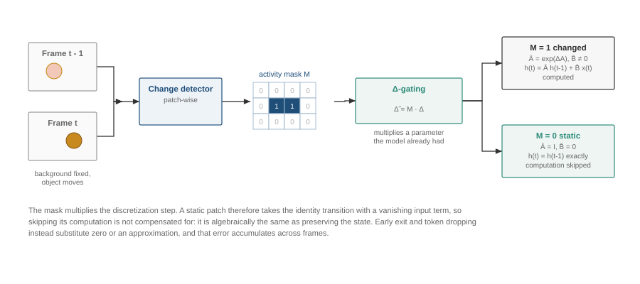
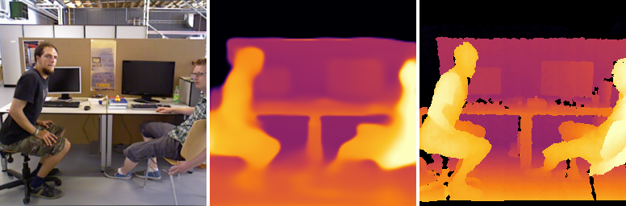

# SOKKANAEM: Exact Change-Gated State-Space Modeling for Efficient and Stable Video Depth

> **Working draft — 27 July 2026.** Author names, affiliations, venue formatting, citations, qualitative figures, and Jetson measurements remain to be added. All numerical claims below are limited to completed experiments in this repository.

## Abstract

Video depth models repeatedly process large static regions and often exhibit frame-to-frame flicker. We introduce **SOKKANAEM**, a compact recurrent video-depth model that connects patch-level change detection to the discretization step of a selective state-space model (SSM). Given a binary activity mask \(M\), we replace the SSM step size \(\Delta\) with \(\widetilde{\Delta}=M\Delta\). For a static patch, \(\widetilde{\Delta}=0\) yields \(\bar A=I\) and \(\bar B=0\), so the hidden state is copied exactly rather than approximately reconstructed. A temporal SSM preserves per-location memory, while a spatial SSM and a dense decoder recover spatial context and depth. For moving cameras, low-resolution global motion compensation (GMC) precedes feature-space change detection.

A 4.19M-parameter model reaches 0.1595 AbsRel and 0.8262 \(\delta_1\) on a real indoor holdout at 32.2% activity; cutting computation thirteen-fold to 7.1% activity costs 13% relative AbsRel while raw frame-to-frame variation falls by a factor of 2.8. It runs at 0.378 ms per frame in half precision, 2.2x faster and at 2.4x less memory than a comparable-size baseline that it also outperforms on accuracy, while remaining behind a 30x larger generalist on accuracy and on motion-compensated temporal error.

Three results delimit the contribution, and each narrows a claim we initially expected to make. A fused scan kernel that removes the dominant cost also removes the sparse path's latency advantage on a desktop GPU, leaving sparsity's benefit established in compute and memory rather than measured time. On unseen real driving footage, accuracy transfers while sparsity does not: activity rises from 26% to 93%, recoverable to 14% only with motion compensation and per-domain threshold calibration. And an iso-mask token-drop control, which collapsed by a factor of four on an earlier checkpoint whose sparse path was never trained, is now a wash on accuracy — preserved-state readout buys temporal stability, not depth accuracy. These results establish exact change-gated state preservation as a useful mechanism while marking precisely where its efficiency claim does and does not hold.

## 1. Introduction

Monocular depth estimation has advanced rapidly, but applying image models independently to video leaves two structural inefficiencies. First, every frame is processed at nearly fixed cost even when most of the scene is unchanged. This is particularly wasteful for fixed surveillance cameras, where foreground motion may occupy only a small fraction of the image. Second, independent predictions can flicker even when the underlying geometry is stable. Video-specific models improve temporal coherence, but commonly retain dense per-frame computation or add a separate temporal refinement stage.

This work asks a narrower question: **can an SSM treat “no visual change” as an exact no-op on its temporal memory?** The zero-order-hold discretization of a selective SSM (Gu & Dao, 2023) provides a direct construction. Multiplying its step size by a binary patch mask makes a masked update equal the identity map on hidden state. Static patches therefore retain memory without a learned approximation, feature imputation, or a separately invalidated temporal cache.

We instantiate this idea in SOKKANAEM, a streaming video-depth architecture with alternating temporal and spatial SSM blocks. A lightweight detector produces patch activity masks using hysteresis, dilation, and periodic keyframes. A sensor-free GMC and feature-space detector extend the mechanism to ego-motion. We evaluate not only depth accuracy and raw frame variation, but also optical-flow-warped consistency (OPW), a GT-referenced temporal consistency error (TCE), constant-output controls, analytical MACs, and measured latency.

The completed experiments support four conclusions:

1. **Exact state preservation.** For \(M=0\), \(\Delta\)-gating gives a bit-exact state copy in implementation and an identity transition analytically.
2. **A favorable sparsity–accuracy trade-off.** On real indoor footage, reducing activity from 96.2% to 32.2% costs 2.8% relative AbsRel, and to 7.1% costs 13%.
3. **Preserved-state readout buys temporal stability, not accuracy.** At matched masks, replacing \(\Delta\)-gating with token dropping leaves accuracy unchanged but degrades all three temporal metrics. An earlier fourfold accuracy collapse turned out to measure an untrained sparse path (Section 5.4).
4. **The efficiency claim has a sharp boundary.** After a fused scan kernel, the model is overhead-bound rather than compute-bound on a desktop GPU, and dense execution is faster than the sparse path at every activity level. Sparsity's benefit is established in MACs and per-stream state, and its conversion into time and energy is unmeasured (Section 5.6).

We deliberately avoid a broader claim of universal temporal-consistency superiority. SOKKANAEM leads raw frame-difference error, a flicker-oriented measure, but Depth Anything 3 is stronger on motion-compensated and GT-referenced measures in the current evaluation.

## 2. Related Work

### 2.1 Monocular and video depth

Modern monocular systems built on dense prediction transformers (Ranftl et al., 2021) and large-scale mixed-dataset training (Ranftl et al., 2022; Yang et al., 2024) provide strong frame-wise depth but hold no persistent state across a stream. Video depth methods introduce temporal attention, motion modules, or post-processing to improve consistency (Chen et al., 2025). Their primary objective is prediction quality; computation generally remains dense in space and time. SOKKANAEM instead studies conditional temporal state updates and is complementary to stronger pretrained encoders and decoders.

### 2.2 Dynamic token and change-based computation

Token pruning, merging, and early exiting reduce computation within an image (Rao et al., 2021; Kong et al., 2022). DeltaCNN (Parger et al., 2022), skip convolutions (Habibian et al., 2021), and eventful transformers (Liang et al., 2023) exploit change across frames, but must preserve or reconstruct dense outputs using feature caches and cache-consistency rules. SOKKANAEM shares the principle of recomputing changed regions while storing temporal information in the SSM hidden state, so no cache-invalidation rule is needed for the temporal path. Our token-drop ablation directly tests whether merely bypassing static tokens suffices; it does not (Section 5.4).

### 2.3 Visual state-space models

State-space sequence models (Gu et al., 2022) with input-dependent selection (Gu & Dao, 2023) replace quadratic attention with linear scans, and have been extended to images and video (Zhang et al., 2023; Liu et al., 2024). Standard variants still update every token. Our contribution is to connect externally detected visual change to the discretization parameter itself, and to distinguish exact hidden-state preservation from the approximate spatial output caching that sits alongside it.

## 3. Method

### 3.1 Overview

**Figure 1. Streaming pipeline.** A change detector produces a patch activity mask, which reaches the backbone as the \(\Delta\)-gating signal. Two caches — spatial outputs and temporal hidden state — are where the MAC reduction comes from. The global-motion-compensation branch is used only for moving cameras. Frames above 40% activity take the dense path.

For frames \(I_{t-1}\) and \(I_t\), the model:

1. partitions the image into \(p\times p\) patches (\(p=16\) in completed main experiments);
2. estimates a binary activity mask \(M_t\);
3. embeds the current frame;
4. alternates temporal \(\Delta\)-gated SSM and spatial SSM blocks;
5. decodes the dense depth map \(\widehat D_t\);
6. carries detector state and per-patch SSM state into the next frame.

The model supports independent state dictionaries, allowing a single set of weights to serve multiple streams without state leakage.

### 3.2 Patch change detector

The default pixel detector assigns patch \(i\) the mean squared change

\[
s_{t,i}=\frac{\lVert P_{t,i}-P_{t-1,i}\rVert_2^2}{p^2 C}.
\]

Two thresholds implement hysteresis:

\[
M_{t,i} =
\begin{cases}
1,&s_{t,i}>\tau_{\mathrm{on}},\\
0,&s_{t,i}<\tau_{\mathrm{off}},\\
M_{t-1,i},&\text{otherwise}.
\end{cases}
\]

We dilate active regions by one patch to protect object boundaries and force a full update every \(K\) frames to limit drift. Evaluation-only ablations found pixel MSE and cosine detection comparable at matched activity, so MSE remains the default. Training with i.i.d. random masks was at least as robust as detector-driven fine-tuning in the completed three-arm study.

### 3.3 Exact \(\Delta\)-gating

**Figure 2. \(\Delta\)-gating.** The mask multiplies the discretization step, so a static patch takes the identity transition and its input term vanishes. Skipping is not compensated for; it is algebraically identical to preserving the state.

For a continuous SSM with state matrix \(A\), input projection \(B\), and step \(\Delta_i\), zero-order-hold discretization gives

\[
\bar A_i=\exp(\Delta_i A), \qquad
\bar B_i=(\Delta_i A)^{-1}\left(\exp(\Delta_i A)-I\right)\Delta_i B,
\]

\[
h_i=\bar A_i h_{i-1}+\bar B_i x_i,\qquad
y_i=C_i h_i+D x_i.
\]

We apply the activity mask to the step:

\[
\widetilde{\Delta}_i=M_i\Delta_i.
\]

If \(M_i=0\), then

\[
\bar A_i=I,\qquad \bar B_i=0,\qquad h_i=h_{i-1}.
\]

Thus the state transition for a static patch is exactly the identity. Importantly, the output may still read the preserved state through \(C_i h_i\). This distinction explains both the accuracy of \(\Delta\)-gating and its compute floor: exact state preservation does not authorize dropping all static-token projections and readout.

### 3.4 Spatiotemporal backbone

The temporal block scans each spatial patch through the frame axis, so its hidden state is a memory tied to a fixed image location. The spatial block mixes context within a frame. Alternating these blocks combines temporal persistence with spatial reasoning. The reported model uses dimension 192, four blocks, state dimension 16, patch size 16, and 4,185,872 parameters (16.7 MB of fp32 weights).

An optional spatial output cache gathers active patches, updates them, and scatters them back while reusing previous outputs for static locations. Unlike temporal \(\Delta\)-gating, this operation is approximate because static spatial tokens no longer contribute fresh context. It is useful only at low activity in the current inference-only implementation.

### 3.5 Moving-camera extension

Camera motion makes raw pixel differences dense. We therefore estimate a homography from at most 50 tracked points on a low-resolution frame using Lucas–Kanade tracking and RANSAC. The previous frame is warped to the current view, after which relative \(L_1\) differences between patch embeddings produce the activity mask. Failure falls back to the identity transform, increasing activity rather than silently suppressing changes.

On Virtual KITTI 2, GMC plus feature gating reaches 23.7% activity with only +0.7% relative AbsRel over full computation. At 2.3% activity, AbsRel rises from 0.2054 to 0.2098. These results validate the mechanism on clean synthetic ego-motion; real noisy dashcam footage remains untested.

### 3.6 Decoder and objective

The reported checkpoints use a dense upsampling decoder in the DPT family (Ranftl et al., 2021) with a binned depth head (Bhat et al., 2021). Training minimizes

\[
\mathcal L =
\mathcal L_{\mathrm{SI-log}}
+0.5\mathcal L_{\mathrm{grad}}
+0.1\mathcal L_{\mathrm{temp}}
+0.05\mathcal L_{\mathrm{normal}}.
\]

The mask is binary and non-differentiable, so gradients pass through a straight-through estimator (Bengio et al., 2013). Random mask scheduling increases the skip ratio during training. A failed run used Kendall-style automatic loss weighting: the optimizer drove the temporal-loss weight to its upper clamp, making a constant depth map optimal. That checkpoint was discarded, fixed weights were restored, and a prediction-variance collapse detector was added.

## 4. Experimental Setup

### 4.1 Data

The main synthetic training mixture contains Virtual KITTI 2 (Cabon et al., 2020), TartanAir v2 (Wang et al., 2020), and PointOdyssey (Zheng et al., 2023). Dataset-balanced sampling prevents the largest source from dominating. The principal synthetic holdout contains 8,929 clips; all headline comparisons use the same deterministic first 1,000 clips.

For the deployment-relevant real domain, we use TUM RGB-D fixed-camera sequences (Sturm et al., 2012) and Bonn RGB-D Dynamic (Palazzolo et al., 2019). RGB and depth are paired by timestamp within 20 ms. The reported checkpoint is trained for 60,000 steps on two real and three synthetic sources on a single GPU, taking 13 hours 11 minutes. Evaluation uses 100 clips per source with held-out sequences, so no evaluated sequence appears in training.

The early proof of concept uses the full Virtual KITTI 2 corpus (42,520 frames; 21,120 training clips) at 128 pixels and 30k optimization steps.

### 4.2 Metrics

We report AbsRel, RMSE, and \(\delta_1\) (Eigen et al., 2014) after the evaluation protocol's per-clip scale alignment. Activity is the fraction of patch updates enabled by the detector.

Temporal metrics are:

- **t-delta:** mean adjacent-frame output difference; it measures raw flicker but is minimized by a constant output.
- **OPW:** optical-flow-warped prediction error using RAFT-small (Teed & Deng, 2020).
- **TCE:** the difference between the prediction's warped residual and the GT's warped residual. This penalizes a constant prediction when GT geometry changes.

Every full temporal table includes a per-clip optimal constant-depth control. This control exposes the degeneracy of t-delta and OPW and supplies the dataset-specific residual floor for TCE.

### 4.3 Baselines and implementation

We compare with Depth Anything V2 Small (24.8M), Depth Anything 3 Base (120M), and Video Depth Anything Small metric (28.4M), using the same 1,000 clips and common metric implementation. The reported SOKKANAEM model has 4.19M parameters and is a single checkpoint used for every table in Section 5. Latency is measured with batch size 1 on an RTX 4090. Analytical multiply–accumulate counts are derived from the configured model. No Jetson result is available yet.

## 5. Results

### 5.1 Activity–accuracy trade-off

All tables in this section come from a single checkpoint (4.19M parameters, 60k steps) so that no comparison mixes model versions. Each row sweeps the detector threshold; 100 clips per source, dataset-balanced mean.

**Table 1. Activity sweep on both domains. The constant-depth control is the per-clip optimal constant prediction.**

| \(\tau_{\mathrm{on}}\) | Synth. active (%) | Synth. AbsRel | Synth. \(\delta_1\) | Real active (%) | Real AbsRel | Real \(\delta_1\) | Real t-delta |
|---|---:|---:|---:|---:|---:|---:|---:|
| 0.005 | 70.1 | 0.3734 | 0.4941 | 96.2 | 0.1552 | 0.8373 | 0.0836 |
| 0.02 | 60.2 | 0.3768 | 0.4880 | 74.0 | **0.1545** | 0.8365 | 0.0994 |
| 0.05 (default) | 49.6 | 0.3791 | 0.4821 | 32.2 | 0.1595 | 0.8262 | 0.0751 |
| 0.1 | 39.2 | 0.3814 | 0.4807 | **7.1** | 0.1753 | 0.8106 | **0.0299** |
| Constant control | — | 0.5504 | 0.3574 | — | 0.3581 | 0.5957 | 0.0000 |

On real footage, cutting computation by a factor of thirteen — 96.2% to 7.1% activity — costs 13% relative AbsRel, and the default operating point at 32.2% costs 2.8%. At 74.0% activity accuracy is in fact slightly *better* than at full computation (0.1545 against 0.1552), consistent with gating cutting stale context rather than only saving work. The gap to the constant control remains large at every operating point, which the raw t-delta column alone would not establish.

The synthetic sweep does not reach low activity because TartanAir stays between 80% and 100% active regardless of threshold. This is the same phenomenon quantified in Section 5.5: how much a stream can skip is a property of the capture, not only of the method.

**Figure 3. Qualitative result on held-out real indoor footage** (RGB, prediction, ground truth; 3.5% of patches active on this frame). The prediction is smoother than the ground truth, which is what Section 6.3 quantifies: the model sits well above its own patch-grid ceiling, so the loss of detail is a capacity and training limitation rather than an output-resolution one.

### 5.2 Real indoor results

An earlier synthetic-only checkpoint failed to transfer to real indoor Kinect depth and lost to a constant predictor. Mixed-domain fine-tuning reverses this failure, and two auxiliary losses added at the final training stage — a flow-warped log-depth residual term and a depth-boundary-weighted term — improve accuracy and temporal stability together at unchanged compute.

**Table 2. Held-out real indoor RGB-D (TUM and Bonn), 100 clips per source, dataset-balanced mean. The two rows share an activity ratio of 32.2%, so the improvement is not bought with computation.**

| Model | AbsRel | RMSE (m) | \(\delta_1\) | t-delta | OPW | TCE |
|---|---:|---:|---:|---:|---:|---:|
| Previous checkpoint | 0.1633 | 0.6279 | 0.8211 | 0.0915 | 0.0271 | 0.0351 |
| **Confirmed checkpoint (4.19M)** | **0.1595** | **0.6063** | **0.8262** | **0.0751** | **0.0243** | **0.0323** |

Per source, the confirmed model reaches 0.1321 AbsRel and 0.8426 \(\delta_1\) on TUM at 19.7% activity, and 0.1869 and 0.8098 on Bonn at 44.7%. On the synthetic holdout it reaches 0.3791 AbsRel and 14.22 RMSE.

Two cautions apply. The synthetic \(\delta_1\) difference between these checkpoints lies inside a measured seed standard deviation of \(\pm\)0.015 and is not claimed. More importantly, the two rows differ in initialisation lineage and cumulative steps, so Table 2 is a comparison of checkpoints, not a controlled loss ablation; the controlled ablation exists only at 8k steps, where the ranking was in fact reversed. Short-probe rankings of loss terms did not survive to convergence, which we report as a methodological finding: brief probes can settle whether a term helps but not how strongly to weight it.

### 5.3 Comparison with larger depth models

Table 3 compares against current baseline checkpoints under one shared protocol on both domains: 100 clips per source, identical holdout sequences, identical metric implementation, per-clip median alignment.

**Table 3. Baselines under a single protocol. Dataset-balanced means; lower is better except \(\delta_1\).**

| Model | Params | Domain | AbsRel | \(\delta_1\) | t-delta | TCE |
|---|---:|---|---:|---:|---:|---:|
| Depth Anything 3 Base | 120M | real | **0.1244** | **0.8790** | 0.1024 | **0.0252** |
| Depth Anything V2 Small | 24.8M | real | 0.2256 | 0.9050 | 0.9920 | 0.1015 |
| **SOKKANAEM (ours)** | **4.19M** | real | 0.1595 | 0.8262 | **0.0751** | 0.0323 |
| Depth Anything 3 Base | 120M | synthetic | **0.3618** | 0.4409 | 1.0128 | **0.0593** |
| Depth Anything V2 Small | 24.8M | synthetic | 0.3818 | **0.7301** | 5.0124 | 0.1265 |
| **SOKKANAEM (ours)** | **4.19M** | synthetic | 0.3791 | 0.4821 | **0.2242** | 0.0622 |

Three readings. Against a 30x larger generalist we remain behind on accuracy and on GT-referenced temporal error, though raw frame-to-frame variation is 1.36x lower on real footage and 4.5x lower on synthetic. Against a comparable-size model we lead every real-domain metric except \(\delta_1\); Depth Anything V2's high \(\delta_1\) alongside poor AbsRel follows from per-clip scale-and-shift alignment, which ranks most pixels correctly while letting a few far pixels dominate squared error. And on throughput the ordering reverses entirely: at fp16 with compilation we run 0.378 ms per frame against Depth Anything V2 Small's 0.816 ms, at 20.6 MB against 49.6 MB (Section 5.6).

We do not claim a general temporal-consistency lead. Of the three temporal measures, only raw frame difference favours us; Depth Anything 3 is better on both motion-compensated OPW and GT-referenced TCE. The defensible claim is flicker suppression without post-processing, at a fraction of the parameters and latency.

### 5.4 What preserved-state readout actually buys

\(\Delta\)-gating freezes hidden state at static positions but still reads it through \(C_i h_i\). A token-drop arm freezes the same state under the same masks and additionally bypasses the temporal block's output. Comparing the two isolates the value of the readout itself.

**Table 4. Gating-location ablation at matched masks (49.6% activity), confirmed checkpoint, synthetic holdout. Both arms run with the temporal cache disabled so that the \(\Delta\)-gating arm actually performs the dense readout under test.**

| Method | AbsRel | RMSE | \(\delta_1\) | t-delta | OPW | TCE |
|---|---:|---:|---:|---:|---:|---:|
| \(\Delta\)-gating | 0.3791 | 14.22 | 0.4821 | **0.2251** | **0.0309** | **0.0622** |
| Token drop | **0.3771** | **13.98** | **0.4866** | 0.2684 | 0.0337 | 0.0649 |

**This result reverses an earlier finding of ours and we report the reversal rather than the earlier number.** On an earlier checkpoint whose sparse path was an inference-time approximation never seen during training, token dropping collapsed: 1.7178 AbsRel against 0.4292 at 31.6% activity, a factor of four. On the confirmed checkpoint, trained with the sparse path in the loop and with randomised mask ratios, accuracy is a wash — token dropping is in fact marginally ahead — and the entire difference has moved into the temporal metrics: 19% worse raw frame difference, 9% worse OPW, 4% worse TCE.

The honest reading is that the earlier experiment measured the fragility of an untrained sparse path, not the value of state readout. What survives is narrower and still meaningful: **reading preserved state buys temporal stability, not depth accuracy.** A model trained to tolerate missing static tokens recovers the accuracy on its own, but only the readout keeps consecutive predictions from moving. Since flicker suppression is the property this architecture is built around, the ablation still supports the design — it simply supports a smaller claim than we first made.

### 5.5 Cross-domain transfer and real moving cameras

We evaluate the confirmed checkpoint on five KITTI raw drives (Geiger et al., 2012) (885 frames) that appear in no training split. Only the synthetic clone of this domain was trained on, so the experiment isolates the synthetic-to-real axis rather than an arbitrary domain shift. Ground truth is projected LiDAR: capped near 80 m and 30% valid.

**Table 5. Zero-shot real driving against the in-domain synthetic holdout.**

| Setting | Active (%) | AbsRel | RMSE (m) | \(\delta_1\) | t-delta | TCE | Median scale |
|---|---:|---:|---:|---:|---:|---:|---:|
| KITTI raw, zero-shot | **92.8** | 0.2894 | 11.03 | 0.4955 | 2.0716 | 0.0995 | 2.630 |
| Virtual KITTI 2 holdout, in-domain | 25.8 | 0.3619 | 33.89 | 0.3943 | 0.3115 | 0.0243 | 0.760 |

Accuracy does not collapse; it is nominally better on real footage. That ordering should not be read as a generalization result, because the two rows solve problems of different difficulty: the synthetic holdout contains structure at hundreds of metres that a 256-pixel input cannot resolve, while the LiDAR ground truth is capped and concentrated in the near field. The defensible statement is that representations learned on synthetic driving remain usable on real driving.

**What does not transfer is sparsity.** Activity rises from 25.8% to 92.8% on the same scene type. Measuring the detector alone with the deployment fallback disabled reproduces this: at a pixel threshold of 0.05, synthetic sequences leave 7-10% of patches active while real drives leave 40-74%. Sensor noise, exposure variation, rolling shutter, and compression artifacts all register as change. The skip ratios reported for fixed cameras are therefore measured values for that setting, and the synthetic driving ratios are optimistic.

**Moving-camera gating.** Pixel gating and GMC feature gating operate on different score scales, so comparing them at equal thresholds is meaningless — at their default thresholds the two are indistinguishable in accuracy while GMC uses more computation. The fair comparison is the activity-accuracy curve.

**Table 6. Same 30 clips, both gating strategies swept.**

| Gating | Active (%) | AbsRel | \(\delta_1\) | t-delta | TCE |
|---|---:|---:|---:|---:|---:|
| Pixel | 100.0 | 0.3083 | 0.5142 | 3.0852 | 0.1189 |
| Pixel | 92.7 | 0.3093 | 0.5089 | 3.1016 | 0.1236 |
| Pixel | 51.1 | 0.3357 | 0.4749 | 2.5108 | 0.1074 |
| GMC + feature | 87.1 | 0.3065 | 0.5170 | 3.0533 | 0.1173 |
| **GMC + feature** | **43.8** | **0.3084** | **0.5342** | 1.9319 | 0.0992 |
| **GMC + feature** | **14.1** | 0.3178 | **0.5341** | **1.2314** | **0.0922** |

At matched activity GMC is clearly better: 43.8% active gives 0.3084 AbsRel and 0.5342 \(\delta_1\) against 0.3357 and 0.4749 for pixel gating at 51.1% — less computation and 8.1% lower relative error. GMC at 14.1% activity still beats the pixel-gating point at 51.1% on every metric. Within the GMC curve, cutting computation sevenfold costs 3.1% relative AbsRel while \(\delta_1\) and both temporal metrics improve monotonically, reproducing on real footage the pattern previously observed only in simulation.

The practical caveat is that GMC's default threshold leaves real driving at 100% activity. The correct statement is not that enabling GMC suffices, but that GMC plus per-domain threshold calibration recovers most of the sparsity that pixel gating loses on real video.

### 5.6 Compute and wall-clock analysis

Two results in this section point in opposite directions, and both matter.

**Analytical compute.** The current architecture costs 1.644 GMAC/frame at full activity. With both caches, 15.4% activity costs 0.608 GMAC — 37.0% of full. The decoder is 23.1% of the dense floor and patch embedding 2.3%, so the saving is real and comes from the backbone, where sparsity applies.

**Measured latency.** The scan implementation, not the gather, dominated wall-clock. Profiling a sparse frame at 22% activity attributes 71% of it to the spatial scan and only 6% to gathering and scattering active tokens. The reference scan is chunked and materialises a \((B, C, C, P, S)\) pairwise-decay tensor per chunk: at \(L=64\), \(P=384\), \(S=16\) it moves roughly 25 MB to perform 0.4 MMAC. We therefore replaced it with a fused Triton (Tillet et al., 2019) kernel that keeps the recurrence in registers, used at inference while training retains the differentiable chunked path. \(\Delta\)-gating remains bit-exact through the kernel — \(\widetilde{\Delta}=0\) gives \(\exp(0)=1\) and a zero input term — and every evaluation metric is unchanged to four decimal places.

Per-frame latency on one RTX 4090 at 256 pixels, single stream, fp32, 22% activity:

| Path | Chunked scan | Fused kernel | Speedup |
|---|---:|---:|---:|
| Full compute, eager | 11.38 ms | 1.98 ms | 5.7x |
| **Full compute, compiled** | 4.70 ms | **1.29 ms** (776 FPS) | 3.6x |
| Sparse, eager | 4.87 ms | 2.40 ms | 2.0x |
| Sparse + bucket padding | 5.39 ms | 2.55 ms | 2.1x |
| Sparse + bucket + compiled | 2.99 ms | 2.04 ms (491 FPS) | 1.5x |

In fp16 the sparse path reaches 1.69 ms (593 FPS) with 37 MB peak memory and 6.38 MB of persistent state per stream; four batched streams run at 2,060 FPS aggregate on the full-compute path.

**The inversion.** Before the kernel, the sparse path was 1.57x faster than compiled full compute at 22% activity. After it, compiled full compute is faster at *every* activity level (1.29 ms against 2.03–2.20 ms). The explanation is immediate: what sparsity saved was the scan, and the scan is now nearly free. What remains is fixed bookkeeping that does not scale with activity — `nonzero` gather, the column-major argsort, bucket padding, cache cloning, scatter, and the host synchronisations these force. Latency is now flat in activity for every path (full compute varies only between 1.973 and 1.994 ms across 5–70% activity), which is the signature of an overhead-bound rather than compute-bound regime.

We report this plainly because it bounds the contribution. Exact state preservation, the MAC reduction, and the kernel itself all stand. The claim that the sparse path is *faster* does not stand on this GPU. Whether a 63% MAC reduction converts into time and energy depends on the hardware being compute-bound, which a 4090 at this model scale is not; settling that requires the edge measurement listed in Section 7.

## 6. Ablations and Diagnostic Findings

### 6.1 Mask policy

MSE and cosine change scores perform similarly at matched activity. Keyframe intervals between the tested settings have little effect on short-clip accuracy. Training with i.i.d. random masks produced better robustness than detector-driven mask fine-tuning, contrary to the initial expectation that train–deployment mask matching would be essential.

### 6.2 DINOv2 feature distillation

Matching final backbone tokens to frozen DINOv2-small features does not improve depth accuracy: 0.4315 AbsRel against 0.4292 without it, measured on an earlier checkpoint pair. It yields small improvements in temporal metrics (TCE 0.0846 versus 0.0879), suggesting regularization rather than better geometric representation.

### 6.3 Where the remaining accuracy error lives

Pushing ground truth through the model's own output bottleneck — average-pool to the token grid over valid pixels, bilinear back up, median-align — measures what a perfect patch-token head could score. On the real indoor holdout at the current patch size of 16, that ceiling is 0.0844 AbsRel and 0.9140 \(\delta_1\) on TUM and 0.0651 and 0.9442 on Bonn, against our 0.1321 and 0.1869. We are two to three times above our own structural ceiling, and that ceiling already exceeds the 120M baseline's 0.1244 AbsRel.

**Patch size and input resolution are therefore not the bottleneck.** Halving the patch to 8 lifts the ceiling to 0.0466 and 0.0306, but there is no reason to buy headroom that the model is not using. Capacity, optimisation, and dynamic-scene handling are what stand between the model and its current ceiling.

The gap is concentrated: Bonn sits three times above its ceiling while TUM sits two times above, and Bonn is the source with moving people and occlusion. Closing half of Bonn's gap alone would bring the dataset-balanced mean from 0.1595 to below 0.13. This also suggests a specific suspect among the auxiliary losses — the flow-warped residual term assumes photometric correspondence, which is precisely what fails at a moving object's depth discontinuity.

This measurement is easy to get wrong. Our first version pooled ground truth without a validity mask, so sensor holes averaged in; in disparity space a single zero becomes 1/eps and dominates its patch, giving 11.4 AbsRel on TUM, and the corresponding depth-space numbers suggested the model had already surpassed the ceiling — the opposite conclusion.

## 7. Limitations

The present study has several important limitations.

1. Every table in Section 5 comes from one checkpoint, but two diagnostic results in Section 6 (mask policy, feature distillation) were measured on earlier checkpoints and are reported as such rather than re-run.
2. Video Depth Anything is absent from the baseline table: the local checkout was lost and re-acquiring its metric weights was out of scope for this round. The comparison therefore covers one comparable-size and one much larger baseline.
3. OPW and TCE do not support a general temporal-consistency lead. Raw t-delta can be gamed by constant predictions and is interpreted only alongside accuracy and the constant control.
4. A fused scan kernel removed the dominant cost and, in doing so, removed the sparse path's wall-clock advantage on an RTX 4090: compiled full compute is now faster at every activity level. The remaining sparse-path cost is activity-independent bookkeeping. Sparsity's benefit is presently established in MACs and per-stream state, not in measured latency on this device.
5. Execution on an RTX 4090 is overhead-bound at this model scale, so reduced analytical MACs do not become higher FPS. Jetson Orin latency, energy, and multi-stream measurements have not been performed, and they are the measurement that decides whether the MAC reduction is worth anything in deployment.
6. GMC is validated on real ego-motion (Section 5.5), but only on five driving sequences from one dataset, and only with per-domain threshold calibration; its default threshold is inoperative on real video. Handheld and aerial motion remain untested.
7. Cross-domain evaluation covers real driving only. Unseen indoor domains (NYU, ScanNet) were not evaluated: the former's host was unreachable and the latter requires a signed agreement. The claim of generalization is therefore limited to the synthetic-to-real axis of one scene type.
8. The current experiments cover at most 270-frame long streams for drift analysis. Very long streaming behavior is unknown.
9. Patch-size, refinement, and fully trained decoder/cache ablations remain incomplete.
10. Results are single-seed at 60k steps. Seed variance was characterised only at 8k steps (Appendix A), and differences below that noise floor are not claimed.

## 8. Conclusion

SOKKANAEM demonstrates that patch-level visual change can control an SSM through its discretization step, turning a static observation into an exact identity transition on temporal state. Across synthetic and real RGB-D evaluations, aggressive patch sparsity causes little loss in depth accuracy, and an iso-mask token-drop control confirms that continued readout of preserved state is critical. The model strongly suppresses raw frame-to-frame flicker while remaining much smaller than evaluated depth baselines.

The experiments also reveal the boundary of the idea. Exact state skipping is not synonymous with end-to-end sparse inference: dense readout, spatial context, and decoding remain. Nor does low raw frame variation guarantee motion-correct temporal accuracy. A fused scan kernel closed the kernel gap and, unexpectedly, made dense streaming the faster configuration on a desktop GPU, which relocates the efficiency argument from latency to compute and memory until an edge device settles it. Real moving-camera evaluation and cross-domain transfer are now measured, and both sharpen rather than confirm the picture: change gating is a property of the content and the capture, not of the method alone. The next decisive step is edge-device measurement, which is what determines whether the compute reduction is worth anything in deployment. Within these boundaries, exact \(\Delta\)-gating provides a principled foundation for change-adaptive streaming vision.

## Appendix A. Reproducibility

**Model.** Dimension 192, four alternating temporal/spatial blocks, state dimension 16, four-direction spatial cross-scan, depthwise local convolution branch, DPT-style decoder with a 64-bin depth head over 0.3-150 m. 4,185,872 parameters; 16.7 MB fp32 weights; 12.75 MB of persistent state per stream in fp32 and 6.38 MB in fp16. Stream state lives entirely in an external dictionary, so one set of weights serves many streams without leakage.

**Training.** 60,000 steps, seed 0, input 256x256, single RTX 4090, 13 h 11 min. Loss is scale-invariant log depth plus 0.5 gradient, 0.1 temporal, 0.05 normal, a 64-bin cross-entropy term at weight 0.2, and two auxiliary terms at weight 2.0 — a flow-warped log-depth residual and a depth-boundary-weighted term. Mask ratios are sampled i.i.d. during training rather than taken from the detector.

**Detector defaults.** \(\tau_{\mathrm{on}}=0.05\), \(\tau_{\mathrm{off}}=0.025\), one-patch dilation, keyframe refresh every 30 frames, dense fallback above 40% activity. For GMC these thresholds are on a feature scale and must be recalibrated per domain (Section 5.5).

**Evaluation.** 100 clips per source, 8 frames per clip, held-out sequences only, per-clip median alignment before every metric. Temporal metrics use RAFT-small flow. Every full temporal table carries the per-clip optimal constant-depth control.

**Measured variance.** Seed variation was estimated from six 8k-step runs: real AbsRel \(\pm\)0.005, real \(\delta_1\) \(\pm\)0.004, synthetic \(\delta_1\) \(\pm\)0.015. Differences smaller than these are not claimed anywhere in this paper. The 60k runs are single-seed, so absolute numbers at that scale have no confidence interval.

**Timing protocol.** Batch size 1, 256 pixels, 100 iterations after 20 warm-up, fastest of three repetitions, on an otherwise idle GPU. Activity is forced by a detector stub so the x axis is identical across configurations, and the dense-fallback policy is disabled during timing so that each configuration is actually measured.

## References

Bengio, Y., Léonard, N., & Courville, A. (2013). *Estimating or propagating gradients through stochastic neurons for conditional computation*. arXiv:1308.3432.

Bhat, S. F., Alhashim, I., & Wonka, P. (2021). AdaBins: Depth estimation using adaptive bins. *Proceedings of the IEEE/CVF Conference on Computer Vision and Pattern Recognition*, 4009–4018.

Cabon, Y., Murray, N., & Humenberger, M. (2020). *Virtual KITTI 2*. arXiv:2001.10773.

Chen, S., Guo, H., Zhu, S., Zhang, F., Huang, Z., Feng, J., & Kang, B. (2025). Video Depth Anything: Consistent depth estimation for super-long videos. *Proceedings of the IEEE/CVF Conference on Computer Vision and Pattern Recognition*.

Dosovitskiy, A., Beyer, L., Kolesnikov, A., Weissenborn, D., Zhai, X., Unterthiner, T., Dehghani, M., Minderer, M., Heigold, G., Gelly, S., Uszkoreit, J., & Houlsby, N. (2021). An image is worth 16x16 words: Transformers for image recognition at scale. *International Conference on Learning Representations*.

Eigen, D., Puhrsch, C., & Fergus, R. (2014). Depth map prediction from a single image using a multi-scale deep network. *Advances in Neural Information Processing Systems*, 27.

Geiger, A., Lenz, P., & Urtasun, R. (2012). Are we ready for autonomous driving? The KITTI vision benchmark suite. *Proceedings of the IEEE Conference on Computer Vision and Pattern Recognition*, 3354–3361.

Gu, A., & Dao, T. (2023). *Mamba: Linear-time sequence modeling with selective state spaces*. arXiv:2312.00752.

Gu, A., Goel, K., & Ré, C. (2022). Efficiently modeling long sequences with structured state spaces. *International Conference on Learning Representations*.

Habibian, A., Ben Yahia, H., Abati, D., Gavves, E., & Porikli, F. (2021). Skip-convolutions for efficient video processing. *Proceedings of the IEEE/CVF Conference on Computer Vision and Pattern Recognition*, 2695–2704.

Kong, L., Wu, B., Chen, Y., Zhang, X., & Sun, J. (2022). *EViT: Expediting vision transformers via token reorganization*. arXiv:2202.07800.

Liang, F., et al. (2023). Eventful transformers: Leveraging temporal redundancy in vision transformers. *Proceedings of the IEEE/CVF International Conference on Computer Vision*.

Liu, Y., Tian, Y., Zhao, Y., Yu, H., Xie, L., Wang, Y., Ye, Q., & Liu, Y. (2024). VMamba: Visual state space model. *Advances in Neural Information Processing Systems*, 37.

Palazzolo, E., Behley, J., Lottes, P., Giguère, P., & Stachniss, C. (2019). ReFusion: 3D reconstruction in dynamic environments for RGB-D cameras exploiting residuals. *IEEE/RSJ International Conference on Intelligent Robots and Systems*.

Parger, M., Tang, C., Twigg, C. D., Keskin, C., Wang, R., & Steinberger, M. (2022). DeltaCNN: End-to-end CNN inference of sparse frame differences in videos. *Proceedings of the IEEE/CVF Conference on Computer Vision and Pattern Recognition*, 12497–12506.

Rao, Y., Zhao, W., Liu, B., Lu, J., Zhou, J., & Hsieh, C.-J. (2021). DynamicViT: Efficient vision transformers with dynamic token sparsification. *Advances in Neural Information Processing Systems*, 34.

Ranftl, R., Bochkovskiy, A., & Koltun, V. (2021). Vision transformers for dense prediction. *Proceedings of the IEEE/CVF International Conference on Computer Vision*, 12179–12188.

Ranftl, R., Lasinger, K., Hafner, D., Schindler, K., & Koltun, R. (2022). Towards robust monocular depth estimation: Mixing datasets for zero-shot cross-dataset transfer. *IEEE Transactions on Pattern Analysis and Machine Intelligence*, 44(3), 1623–1637.

Sturm, J., Engelhard, N., Endres, F., Burgard, W., & Cremers, D. (2012). A benchmark for the evaluation of RGB-D SLAM systems. *IEEE/RSJ International Conference on Intelligent Robots and Systems*, 573–580.

Teed, Z., & Deng, J. (2020). RAFT: Recurrent all-pairs field transforms for optical flow. *European Conference on Computer Vision*, 402–419.

Tillet, P., Kung, H. T., & Cox, D. (2019). Triton: An intermediate language and compiler for tiled neural network computations. *Proceedings of the 3rd ACM SIGPLAN International Workshop on Machine Learning and Programming Languages*, 10–19.

Wang, W., Zhu, D., Wang, X., Hu, Y., Qiu, Y., Wang, C., Hu, Y., Kapoor, A., & Scherer, S. (2020). TartanAir: A dataset to push the limits of visual SLAM. *IEEE/RSJ International Conference on Intelligent Robots and Systems*.

Yang, L., Kang, B., Huang, Z., Zhao, Z., Xu, X., Feng, J., & Zhao, H. (2024). Depth Anything V2. *Advances in Neural Information Processing Systems*, 37.

Zhang, Y., et al. (2023). *Vision Mamba: Efficient visual representation learning with bidirectional state space model*. arXiv:2401.09417.

Zheng, Y., Harley, A. W., Shen, B., Wetzstein, G., & Guibas, L. J. (2023). PointOdyssey: A large-scale synthetic dataset for long-term point tracking. *Proceedings of the IEEE/CVF International Conference on Computer Vision*.

**Bibliographic entries still to verify against the originals before submission.** Depth Anything 3 (used as the 0.12B baseline throughout; author list, venue and year unconfirmed). TartanAir V2 (the entry above is the original TartanAir paper; whether V2 has its own citable reference is unconfirmed). Video Depth Anything, Vision Mamba and Eventful Transformers (venue, page numbers and full author lists unconfirmed). NVDS is cited in the related-work discussion but has no entry yet.
