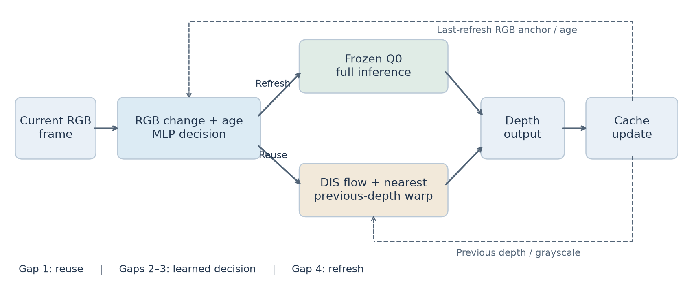
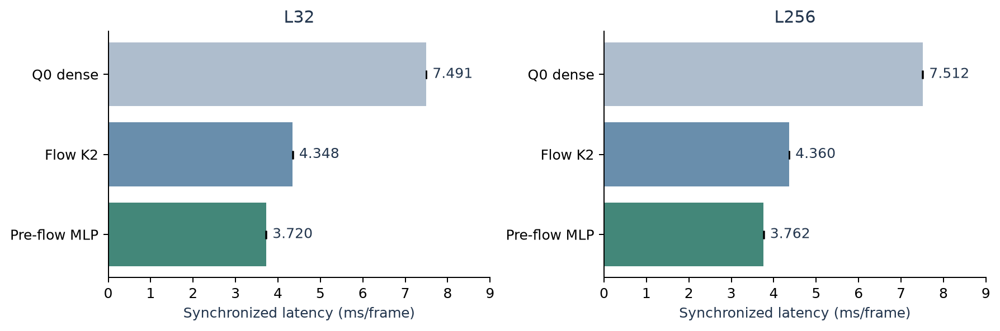
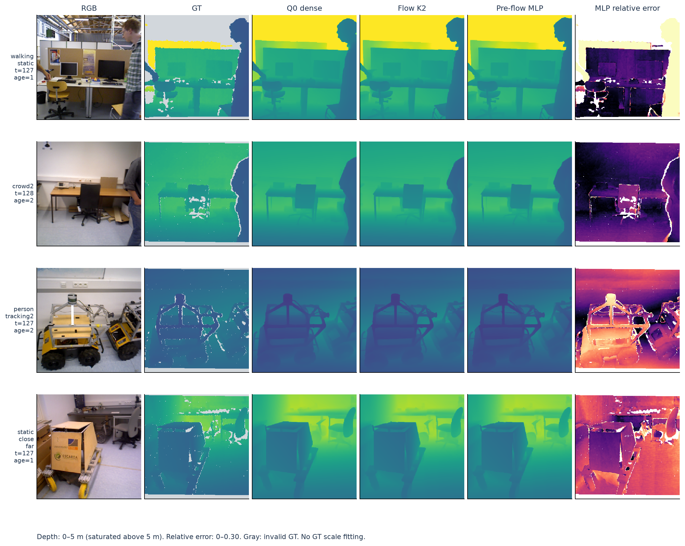
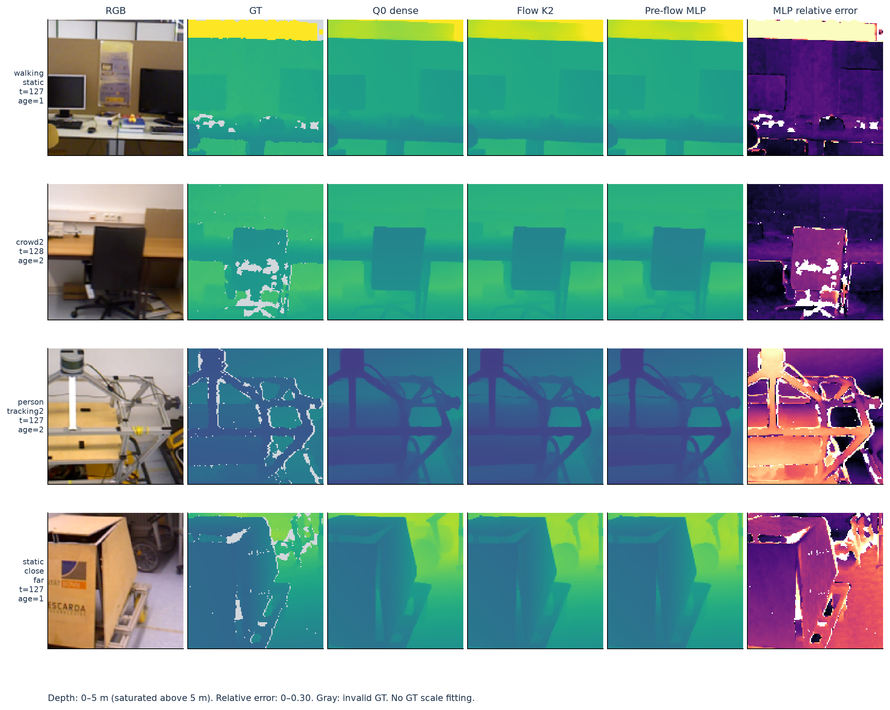
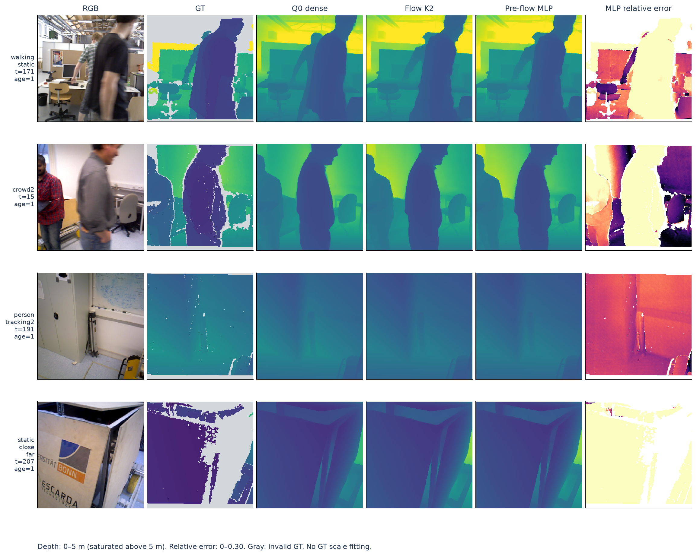

# SOKKANAEM-Refresh: Toward Efficient Streaming Depth Estimation for Fixed-View Cameras

> Working draft, 10 September 2026. Target application fixed to indoor, fixed-view cameras observing dynamic scenes. This scope was chosen after a new moving-camera test failed short-clip quality; the failure is retained. Existing experiments are mixed-camera evidence, not completed fixed-camera validation. This is not submission-ready. The [native-SSM draft](draft_native_20260909.md) and original `submission/manuscript.tex` are preserved. These speed results do not belong to the 4.19M native model.

## Authors and declarations

Names, affiliations, correspondence, contributions, funding, conflicts of interest, permissions and release arrangements will be completed and verified by the authors. No external submission or public release is implied.

## Abstract

We target indoor fixed-view cameras observing dynamic scenes, where reduced camera-induced change motivates reuse but does not eliminate object motion or disocclusion. This application hypothesis still requires a fresh, verified fixed-camera evaluation; real-time deployment is a target, not an established result.

Reusing estimated depth can reduce streaming inference cost, but motion compensation and refresh decisions can consume the intended savings. We investigate SOKKANAEM as a causal inference pipeline combining a frozen depth predictor, transported depth caches and a lightweight pre-flow refresh policy. The policy uses current-to-anchor RGB statistics and cache age to decide whether to run the full predictor before paying optical-flow cost. Accepted reuse nearest-warps the previous depth; full refresh reproduces the frozen predictor. A 1,688-parameter MLP is trained on a depth-and-gradient discrepancy proxy and compared with similarly sized state-space policies. On reused TUM/Bonn development clips of 32 and 256 frames, the selected MLP satisfies a fixed multi-metric quality screen. Three timing repeats on a shared RTX 4090 give 3.762 ms/frame on the 256-frame clips, compared with 7.512 ms for the dense predictor and 4.360 ms for fixed-period K2 reuse: a 13.73% latency reduction relative to K2. A one-frame initialization shift also passes. However, the long-clip flat-region variation increase is 0.963%, close to the 1% tolerance. These findings support pre-flow scheduling as a development-stage efficiency mechanism, not a general accuracy guarantee, independently validated generalization result or state-space memory advantage.

The subsequent frozen-candidate test on two newly acquired TUM sequences passes the long-clip screen but fails the short-clip screen: aggregate overshoot increases 2.285%. Thus, the development speed–quality result does not transfer uniformly to the new sequences.

## 1. Introduction

A streaming depth system produces a dense map for each incoming frame. A strong single-image estimator supplies detailed predictions, yet evaluating every frame repeats expensive computation. Reuse trades computation for approximation: cached depth must follow motion, and transport errors may accumulate until refresh.

The question here is whether a learned policy can extend reuse beyond a strong fixed-period K2 control without exceeding a stated quality tolerance and while costing less. A decision that computes optical flow and then rejects reuse can waste the computation it was intended to save. We therefore place a compact RGB decision before flow.

We call the selected pipeline **SOKKANAEM-Refresh**, distinguishing it from the earlier native SSM architecture. It preserves the expensive depth estimator and changes when it runs. It does not introduce a new monocular-depth backbone or use current ground-truth depth at inference. Its investigated contributions are a causal pre-flow pipeline, controlled fixed/learned and early/late decision comparisons, and a reproducible development screen with exact-output audits and failure visualizations. Temporal reuse itself is not claimed as a first contribution.

### 1.1. Fixed-view application contract

The primary application is monocular RGB streaming from an indoor camera whose position, orientation and focal length remain fixed during a recording. People and objects moving, entering or leaving the view, occlusion, disocclusion and illumination changes remain in scope. A fixed camera is not a static scene. Small camera vibration will be reported separately as quasi-fixed sensitivity analysis; moving cameras, PTZ and zoom are outside the primary application. Reconnection or a known recording cut requires a new stream initialization; automatic cut detection has not been implemented.

The expected benefit is reduced camera-induced variation, which may permit more reuse. This is a mechanism-based hypothesis, not a measured fixed-camera advantage. The current method schedules whole-frame Q0 calls and does not selectively recompute spatial regions. The frozen checkpoint and threshold have not changed with the application scope. We record that the narrowing occurred after observing the Section 6.6 failure, avoiding a retrospective claim of successful validation. The full [scope contract](streaming_draft/FIXED_CAMERA_SCOPE.md) specifies inclusion rules and pending tests.

## 2. Related work

Depth Anything V2 supplies the pretrained representation and decoder [1]. Our Q0 reference combines its Small model with an existing locally trained metric-calibration head. The reference's pretrained shape quality is not a contribution of the refresh policy. Dense Inverse Search (DIS) supplies the optical-flow method [2]. Eventful Transformers exploit temporal redundancy within transformer computation [3]; our method instead selects complete depth-model calls and transports output maps, without sparse transformer kernels.

Video Depth Anything and Online Video Depth Anything address video-depth prediction and temporal consistency [4,5]. They are relevant video-specific comparators, but no matched evaluation of their current implementations is included here. We do not claim superiority to them or infer temporal consistency from low per-frame error. Related-work coverage and novelty require further review before submission.

## 3. Method

### 3.1. Depth reference and streaming state

Let $I_t$ be the RGB frame and $D_t=Q(I_t)$ the frozen Q0 output. Q0 is the existing Depth Anything V2 Small path with a local metric-calibration head, approximately 24.81M parameters, evaluated internally at 518 pixels. Outputs are scored at 256-by-256. The calibration head was previously trained for 4,000 steps with the shape branch frozen; neither is retrained here.

State comprises previous predicted depth, previous grayscale image, last-refresh RGB anchor and cache age. The selected MLP has no useful recurrent hidden memory. Its experimental interface retains a zero-valued policy-state tensor for compatibility with SSM controls, not as evidence of recurrence.

Figure 1. Conceptual data/control flow. The RGB policy selects full Q0 inference or motion-compensated reuse. The reuse branch reads previous depth and grayscale; the policy reads anchor RGB and age. Only the selected branch runs. This is the new refresh pipeline, not the archived SSM architecture.

### 3.2. RGB features and policy

Current and anchor RGB are bilinearly resized to 37-by-37. Their difference contributes three channel mean absolute values and three root-mean-square values; the current image supplies three channel means and three standard deviations. Age divided by three and mean absolute horizontal gradient of the RGB difference complete 14 features.

Six unused coordinates are fixed to zero, retaining the 20-dimensional input architecture of the preceding flow-input study for comparison. Its 96 zero-coordinate input weights have zero data gradient. Normalization statistics are fitted on policy-training data only.

The MLP uses a 20-to-16 linear layer, LayerNorm and GELU, a 16-to-39-to-16 GELU core, and scalar head. Its score is $s_t=0.05\operatorname{softplus}(z_t)$. This estimates a Q0 discrepancy proxy, not a calibrated failure probability or certified error bound.

### 3.3. Refresh and transport

Let $a_t$ be attempted age since the last full Q0 call. The refresh rule is

$$
r_t=\begin{cases}
1,&\text{uninitialized or }a_t\geq4,\\
0,&a_t=1,\\
\mathbb{1}[s_t>\tau],&a_t\in\{2,3\}.
\end{cases}
$$

The frozen candidate uses $\tau=0.05327536165714264$, the median calibration-subset prediction. Compulsory age-one reuse means an abrupt scene change immediately after refresh cannot trigger a new full call. Maximum age bounds reuse duration, not its geometric error.

On refresh, $\widehat D_t=Q(I_t)$ and age resets; rejected reuse computes no flow. Otherwise, DIS computes both current-to-previous and previous-to-current flow at grayscale 128-by-128, and $\widehat D_t=W_t(\widehat D_{t-1})$. The operator upsamples the backward displacement and nearest-samples depth with border padding. It does not average neighboring depth values, but incorrect correspondence and disocclusion remain possible.

The implementation also computes a forward–backward/photometric reliability mask. The selected ungated transport does not use that mask to suppress or replace depth pixels; both flows and mask computation remain included in timing. No learned residual changes the reused depth.

### 3.4. Training and operating points

The training cache has 192 four-frame clips: 64 each from TUM, Bonn and Virtual KITTI 2. Within each source, 48 clips fit the policy and 16 set thresholds, totaling 144/48 clips. Two anchors produce 384 traces and 960 observations: 288 fit traces and 96 calibration traces, with 144 calibration observations at eligible ages two/three. Fit and calibration frame-path sets are disjoint.

For transported candidate $C_t$ and teacher $D_t$, the target is

$$y_t=\|\log C_t-\log D_t\|_1+2\mathcal G(C_t,D_t),$$

where depths clamp below at $10^{-4}$ and norms denote element means. $\mathcal G$ averages horizontal/vertical log-gradient discrepancies at strides 1, 2 and 4, with weights $1+4\min(|\nabla\log D_t|,0.25)$. Q0 labels are training-only. They do not directly encode every GT-based acceptance metric.

Carry SSM, per-input-reset SSM and MLP are each trained for 1,000 AdamW steps, batch 32, learning rate .001, seed 741, with the same sampled order and shared-layer initialization. Masked Smooth L1 compares scores and targets divided by .05; gradient norm clips at one. SSM controls have 1,689 parameters and MLP 1,688, but different core functions. Thresholds are each model's calibration prediction quartiles, saved before development inference. Selecting MLP q50 after development comparison makes subsequent checks post-selection analyses.

## 4. Conditional error and cost analysis

### 4.1. Transport error

For a fixed realized flow, finite-grid nearest sampling with border replication selects one input value per output. Hence $\|W_t(X)-W_t(Y)\|_\infty\leq\|X-Y\|_\infty$. Define $e_t=\widehat D_t-D_t$ and $b_t=W_t(D_{t-1})-D_t$. Linearity of this fixed sampling operator gives $e_t=W_t(e_{t-1})+b_t$ on reuse. A full refresh at $k$ has $e_k=0$, yielding

$$\|e_t\|_\infty\leq\sum_{j=k+1}^{t}\|b_j\|_\infty$$

until the next refresh, by the triangle inequality and repeated non-expansiveness. Q0 is stateless; exact refresh here does not claim to restore a recurrent dense history.

The defects are not certified by RGB statistics or a predicted mean log-error. Q0 itself can be wrong. No boundary-F1 or normalized flat-TV guarantee follows. This elementary conditional analysis is a design explanation, not a new universal stability theorem; independent mathematical review remains pending.

### 4.2. Paid computation

For identical RGB policies and deterministic flow operations, early and late decisions have identical outputs, but late decisions additionally compute flow on rejected reuse attempts. Under additive accounting, early scheduling avoids that cost. With refresh fraction $p$, a simplified average is $C_P+pC_Q+(1-p)C_W$, where policy/preparation, full-Q0 and reuse costs are $C_P,C_Q,C_W$. Reducing $p$ helps only if overhead and approximation remain acceptable. Actual hardware effects require timing; skipped-call fractions are not measured speedups.

## 5. Experimental protocol

### 5.1. Data and independence

L32 has eight clips/256 frames; L256 has four clips/1,024 frames. Both cover TUM walking_static [6] and Bonn crowd2, person_tracking2 and static_close_far [7]. Sampled frame paths do not overlap, but the same four scenes have repeatedly informed development. These are not independent scene-level tests. Scores average clips within scene, scenes within source, and then the two sources equally; scenes do not receive equal global weight.

A first local real-data audit found 28 scene directories: four reused development scenes and 24 training-eligible scenes under the recorded Q0 setup. Training eligibility does not prove historical sampling, but prevented certifying these remaining scenes as untouched validation. We subsequently acquired Freiburg1 room and Freiburg2 desk from the official TUM source after fixing the candidate. Their identifiers were absent from the searched local training/experiment text records, and they are separate from the recorded policy training/calibration and reused development sequences. This establishes a new local sequence holdout, not certified disjointness from DA2 pretraining or all possible external history. The native-model reserved final remains unused for this candidate. Section 6.6 reports the new holdout without threshold retuning.

The existing numerical results below retain their original mixed-camera status. A subsequent pose audit matched RGB timestamps to the closest recorded camera pose within 50 ms. Its diagnostic low-motion rule requires at least 95% pose coverage, 95th-percentile displacement at most 0.02 m and rotation at most 1 degree relative to the first matched pose. Eleven of the twelve development clips exceed this motion rule; one has insufficient coverage (93.75%). None is certified as fixed-mounted. For L256 walking_static, displacement and rotation percentiles are 0.0311 m and 2.656 degrees. Dataset names alone therefore cannot establish fixed-camera eligibility. These diagnostic thresholds are not accuracy guarantees; see the [pose audit](streaming_draft/CAMERA_POSE_AUDIT.md).

For the new application, two public-data admission rounds are complete and the depth reference is still not accepted; the second round finds bulk values compatible with millimetres but does not establish reference validity or registration. Eligibility requires documented fixed mounting, usable time pairing, known metric-depth encoding and RGB/depth registration. Foreground segmentation annotations must not be mistaken for depth ground truth, nor may normalized depth visualization be treated as metric depth. Sequence and location groups will be fixed before GT evaluation; different views or clips of the same event will not count as independent scenes. No fixed-camera GT-accuracy result is reported yet. Section 6.7 reports a separately registered RGB-only execution pilot.

### 5.2. Metrics and acceptance

Raw AbsRel uses unaligned metric predictions and valid sensor GT, excluding nonfinite GT and depths at least 150 m. Edge AbsRel uses the GT log-depth boundary band. Boundary F1, overshoot and flat-TV follow the preserved `sokkanaem/sharpness.py` implementation; shape diagnostics use per-frame normalized disparity. GT fitting never changes inference outputs. Shape diagnostics, raw metric error and temporal consistency are distinct.

The fixed screen requires balanced raw/edge AbsRel, overshoot and flat-TV each to increase by no more than 1% versus Q0, boundary F1 to drop by at most .005, and each source's raw AbsRel to increase by at most 2%. These are engineering tolerances, not equivalence tests or safety certificates. Borderline failures are retained without rounding them into passes.

### 5.3. Timing and controls

Timing uses a shared RTX4090, batch one, GPU-resident input and per-frame synchronization. RGB statistics, policy, CPU DIS, internal transfers, warping and Q0 calls are included; initial I/O and input H2D are excluded. The archived native paper's PNG-to-depth timing has a different boundary and is not directly comparable.

Three order-rotated timing repeats follow 64 warmup frames. Controls include dense Q0, fixed output-flow K2/K4, carry/reset SSM and MLP quartiles, and late decisions. A sensitivity check refreshes the first two frames before applying the unchanged selected policy, shifting initialization by one frame.

## 6. Results

### 6.1. Quality retention

| Data / method | Raw AbsRel | Edge AbsRel | Boundary F1 | Flat-TV change | Screen |
|---|---:|---:|---:|---:|---|
| L32 Q0 | .128127 | .159325 | .660219 | reference | reference |
| L32 Flow K2 | .128506 | .159792 | .662756 | +.655% | pass |
| L32 MLP | .128377 | .160155 | .661137 | +.715% | pass |
| L256 Q0 | .159183 | .174237 | .614665 | reference | reference |
| L256 Flow K2 | .159120 | .174638 | .620225 | +.852% | pass |
| L256 MLP | .159336 | .174666 | .621973 | +.963% | pass |

Long-clip raw and edge errors rise .096% and .246%, while boundary F1 improves. This is retention within tolerances, not improvement of every measure. Unrounded flat-TV growth is .963363%, leaving only .036637 percentage points below the tolerance.

Shifted initialization passes both screens: L32/L256 raw AbsRel .127773/.159334, F1 .663258/.621707 and flat-TV growth .309%/.921%. One successful shift is not robustness to arbitrary starting times.

### 6.2. Repeated latency

| Data | Q0 ms | K2 ms | MLP ms | Late MLP ms | Q0 speedup | K2 time reduction |
|---|---:|---:|---:|---:|---:|---:|
| L32 | 7.491 | 4.348 | 3.720 | 3.931 | 2.014x | 14.45% |
| L256 | 7.512 | 4.360 | 3.762 | 4.026 | 1.997x | 13.73% |

Figure 2. Three-repeat means with minimum/maximum repeat-mean error bars, not confidence intervals. MLP ranges are 3.716–3.728 ms (L32) and 3.760–3.765 ms (L256). Full-Q0 skip fractions are 62.11% and 61.72%. Ratios of means are not device throughput or energy measurements.

### 6.3. Policy ablations

| Policy | L32 screen | L256 screen | L256 skip | L256 ms, single run |
|---|---|---|---:|---:|
| Flow K2 | pass | pass | 50.00% | 4.390 |
| Flow K4 | edge fail | edge/flat fail | 75.00% | 2.692 |
| Carry SSM q25 | pass | pass | 53.03% | 4.508 |
| Carry SSM q50 | edge fail | pass | 64.55% | 3.706 |
| Carry SSM q75 | pass | edge/source fail | 69.92% | 3.315 |
| Reset SSM q25 | pass | pass | 52.93% | 4.508 |
| Reset SSM q50 | flat fail | pass | 63.09% | 3.795 |
| Reset SSM q75 | edge fail | edge fail | 69.82% | 3.325 |
| MLP q25 | pass | pass | 53.22% | 4.371 |
| MLP q50 | pass | pass | 61.72% | 3.791 |
| MLP q75 | raw/edge/flat/source fail | raw/edge fail | 69.63% | 3.237 |

No SSM operating point combines both screens and a K2 latency advantage in both segments. MLP performance cannot be attributed to SSM memory. Full numeric records, including late controls, are in `streaming_draft/evidence_table.json`.

For identical Carry q25 on L256, early decisions reduce flow calculations from 1,990 to 1,086: 452 rejected attempts each avoid two flow computations. Single-run time decreases from 4.895 to 4.508 ms. Across Carry quartiles and both lengths, early/late outputs and schedules match on 3,840 frames. This isolates computation placement for the same policy; older flow-input policy comparisons also change features and training outcomes.

### 6.4. Qualitative results and failures

Figure 3. All four L256 scenes, using the skipped MLP frame nearest each temporal midpoint, ties toward earlier frames. Depth shares 0–5 m colors, saturating above 5 m. Last column: absolute relative error against GT, saturated at .30. Gray in GT and white masked error pixels are invalid sensor locations. Cache age is shown. Similar appearance does not imply identical accuracy.

Figure 4. Central 128-by-128 crops of Figure 3 at [64:192,64:192]. These are fixed detail views, not selected GT edge regions. Boundary evidence comes from full-image metrics.

Figure 5. Each scene's skipped frame with the largest per-frame raw AbsRel increase relative to Q0. This explicitly post-hoc, unfavorable selection exposes errors hidden by averages; it does not tune the frozen policy. Paths, selection rules and refresh telemetry are in `streaming_draft/visual_provenance.json`.

### 6.5. Execution checks

Initial comparisons verify 6,759 full-refresh frames against Q0; shifted initialization adds 497, totaling 7,256 exact matches. Independent replay recomputes 9,561 learned-policy skipped outputs with exact equality. Calibration thresholds are independently reproduced, and code/checkpoint/input hashes remain unchanged. Related regression tests: 98 passed. These establish consistency of tested executions, not statistical reliability on new scenes.

### 6.6. Frozen-candidate moving-camera holdout: preserved stress test

Before new predictions, we registered two sequences, the three methods, the unchanged acceptance criteria and deterministic sampling. For each sequence, L32 uses the first and last 32 timestamp-associated frames; L256 uses 256-frame windows centered at one-third and two-thirds of the associated timeline. The totals are 128 and 1,024 frames. Selected RGB/depth paths do not overlap between windows. Official PNG depths are divided by 5,000, with no additional camera-scale correction because the released images are already corrected.

| Data / method | Raw AbsRel | Boundary F1 | Overshoot change | Flat-TV change | Screen |
|---|---:|---:|---:|---:|---|
| New L32 Q0 | .283891 | .606404 | reference | reference | reference |
| New L32 K2 | .284293 | .609204 | +.557% | +.012% | pass |
| New L32 MLP | .284206 | .609718 | +2.285% | +.377% | FAIL |
| New L256 Q0 | .212614 | .583142 | reference | reference | reference |
| New L256 K2 | .212594 | .586912 | -.390% | +.290% | pass |
| New L256 MLP | .212941 | .587015 | -.441% | +.363% | pass |

Sequence-level diagnostics reveal failures hidden by aggregation. On short Freiburg1 room clips, overshoot grows 4.032% for MLP and 1.593% for K2. On short Freiburg2 desk clips, MLP flat-TV grows 1.262%. Both methods pass both long-clip sequence screens. The MLP's long-clip single-run latency is 4.260 ms versus 4.383 ms for K2 and 7.534 ms for Q0; its K2 advantage is only 2.81% here and has not been established by repeated timing. Short-clip MLP is faster but fails quality, so it is not a quality-preserving speedup.

All 1,083 full-refresh comparisons in the new experiment exactly match Q0, and recorded weights/code/input hashes remain unchanged. The candidate is not promoted or retuned. The report and provenance are available in [the new-sequence validation report](streaming_draft/INDEPENDENT_VALIDATION.md). This two-sequence holdout has now been consumed; using these outcomes to revise the policy would make it development data for that later model.

### 6.7. Fixed-camera data admission and separate RGB-only pilot

We acquired the official SBM-RGBD Shadows release and its corrected fall01cam1 depth, derived from the ceiling-mounted camera in UR Fall Detection. The sequence has 160 contiguous RGB/depth IDs. Five complete CRC-verified RGB files recovered from an incomplete original-archive prefix exactly match the corresponding released RGB frames. Sparse annotated-background feature checks support the documented fixed mounting, but are not pose ground truth. This is one event, not multiple independent locations.

The depth-admission check failed. Using the original published conversion, the first original frame spans approximately 2174--3390 mm, while the registered derivative includes positive stored values down to 1. Some values fall outside the source range in all eleven available original-depth samples. Removing neighborhoods of zero-depth pixels does not eliminate all such values. We do not establish whether registration, interpolation or another processing step caused the discrepancy. We neither fit a replacement scale to model predictions nor report GT accuracy using this unapproved reference.

A separate predeclared RGB-only pilot processes all 160 frames continuously with three repeats and unchanged model weights/threshold. A minimal periodic output-hold control invokes Q0 on every second frame and otherwise copies the previous depth, without flow or an RGB detector. Mean resident-input times are 7.549 ms for dense Q0, 3.791 ms for hold K2, 4.407 ms for flow K2 and 3.239 ms for MLP. The MLP makes 48 full calls, skipping 70% of calls. Its repeated p95 range is 7.884--7.903 ms, versus 7.584--7.592 ms for Q0: mean acceleration does not imply lower tail latency. These fixed-order shared-RTX4090 measurements exclude initial I/O/H2D and do not establish live end-to-end real-time performance.

The complete original RGB and depth archives subsequently extended provenance checks to all 160 frames; all RGB frames are pixel-identical to the released inputs. Depth value agreement still fails the prespecified criterion. A researcher-defined source-range/erosion mask improves distributional agreement, but is not a publisher-provided validity mask and does not verify pixelwise accuracy. Bulk values are compatible with millimetres; this does not exclude all scale or processing errors.

Three cross-modal registration attempts did not corroborate alignment; the final attempt triggered its declared void condition. These failures do not establish that alignment is impossible to test. The low-relief statistic used in a subsequent screen depends on bin width, direction and aggregation and is not a validated dataset-exclusion rule. A new, separately recorded instrument check fixes histogram edges and common support, avoids border wrap and recovers all 27 injected shifts (three synthetic-texture cases and 24 depth self-alignment cases from eight frames); a constant-field negative control is correctly ambiguous. This checks known-shift localization only, not actual RGB/depth correspondence. No admission decision is reversed. The [review addendum](streaming_draft/FIXED_CAMERA_REVIEW.md) supersedes the broad impossibility and unit-error-exclusion interpretations in the preserved [historical admission report](streaming_draft/FIXED_CAMERA_REFERENCE_ADMISSION.md).

The mean absolute relative output difference from dense Q0 is 1.800% for hold K2, 1.728% for flow K2 and 2.743% for MLP. These are reference-retention diagnostics, not sensor-GT AbsRel and not eligible for the GT quality gate. Sparse foreground annotations also sample refresh phases unevenly; they cannot establish a general foreground advantage. Across repeats, 624 full-refresh comparisons and 1,280 replayed frames match exactly. The [fixed-camera validation report](streaming_draft/FIXED_CAMERA_VALIDATION.md) preserves the failed data admission, data-only visualization and reproduction records. Related regression tests including admission and minimal-hold controls: 107 passed.

## 7. Discussion and limitations

Fixed-view deployment is now the primary research scope, but narrowing the scope does not repair the previously observed failures or establish in-scope performance. Static backgrounds may dominate image-wide averages; future evaluation must also separate moving foreground, depth boundaries and newly revealed regions where annotations permit, and label estimated region masks as proxies. The periodic output-hold baseline has been implemented and timed in the RGB-only pilot; it still needs a GT comparison alongside dense Q0, fixed-K2 flow reuse and the learned policy to determine whether motion compensation and learned scheduling contribute in this setting.

The improvement combines bounded reuse with sufficiently inexpensive decisions. Expressive policy models alone do not guarantee a benefit: conservative passing SSM policies remain slower than K2, while unrestricted K4 reuse loses quality. Strong fixed-period controls are essential.

Repeated use of four development scenes and post-selection auditing permit selection bias. The subsequently registered two-sequence holdout exposes nonuniform transfer, while pretrained-data overlap is still unknown. The new sequence count is too small for broad statistical generalization claims. Only one training seed and one initialization shift are tested. Compulsory age-one reuse can miss abrupt changes; transport cannot infer disoccluded geometry. Proxy learning does not certify GT boundary or flat-region risk, and the original flat-TV margin is small. A matched modern video-depth baseline, candidate-specific motion-referenced temporal metrics, continuous long-horizon evaluation and new Nano/Pi measurements remain absent.

The original native SSM line remains separate. Its 4.19M parameter count, state-preservation analysis, final scores and historical hardware evidence do not transfer to Q0-Refresh. Conversely, this pipeline's model-path speedup does not prove acceleration of the native architecture. Independent novelty and mathematical review are necessary before stronger claims.

## 8. Conclusion

SOKKANAEM-Refresh targets efficient streaming depth for indoor fixed-view cameras through pre-flow selection of full inference or transported reuse. Historical mixed-camera development results show approximately 14% lower repeated mean latency than K2 within stated quality tolerances, but the new moving-camera holdout fails short-clip quality. These results motivate investigation; they do not yet validate the fixed-camera application. The next requirement is a frozen-candidate test on separately sourced, verified fixed-camera RGB-D recordings, followed by continuous hardware end-to-end timing. Any model changes require separate development and another fresh holdout. Neither general-purpose quality preservation nor an SSM-memory advantage is established.

## Reproduction and availability

`streaming_draft/frozen_candidate.json` fixes checkpoint, threshold and evidence. Reproduction entry points are:

- Training/evaluation: `scripts/qpreflow_study.py`.
- Replay: `scripts/audit_qpreflow.py`.
- Timing/phase: `scripts/audit_qpreflow_candidate.py`.
- Assets and local split audit: `scripts/prepare_streaming_draft.py`.
- Figure 1 layout refinement: `scripts/refine_streaming_layout.py`.
- Camera-pose audit: `scripts/audit_camera_pose.py`.

The [fixed-camera scope](streaming_draft/FIXED_CAMERA_SCOPE.md), [public-data screening record](streaming_draft/PUBLIC_DATASET_SCREENING.md) and subsequent [admission/pilot report](streaming_draft/FIXED_CAMERA_VALIDATION.md) distinguish the new target from completed historical experiments. Public source documentation is available for [URFD](https://fenix.ur.edu.pl/~mkepski/ds/uf.html) and [SBM-RGBD](https://rgbd2017.na.icar.cnr.it/SBM-RGBDdataset.html). Data and RGB-only pilot entry points are `scripts/admit_fixed_camera_sbm.py`, `scripts/diagnose_fixed_depth.py` and `scripts/benchmark_fixed_rgb.py`. The second admission round against the complete original reference uses `scripts/admit_fixed_camera_urfd.py`, `scripts/audit_fixed_camera_registration.py` and `scripts/audit_fixed_camera_registration2.py`. The hardware objective is sustained 30-frame/s input, assessed using end-to-end mean/p95 latency, 33.3 ms deadline exceedance and backlog/dropped frames. Current resident-input RTX 4090 timings do not establish this objective on Jetson Nano B01 or Raspberry Pi 4.

The preserved scorer supplies exact diagnostic thresholds and normalization. Public release, dataset/weight redistribution rights and author approval remain unconfirmed.

## References

1. Yang, L., et al. Depth Anything V2. 2024. [Paper](https://arxiv.org/abs/2406.09414).
2. Kroeger, T., et al. Fast Optical Flow using Dense Inverse Search. 2016. [Paper](https://arxiv.org/abs/1603.03590).
3. Dutson, M.; Li, Y.; Gupta, M. Eventful Transformers: Leveraging Temporal Redundancy in Vision Transformers. 2023. [Paper](https://arxiv.org/abs/2308.13494).
4. Chen, S., et al. Video Depth Anything: Consistent Depth Estimation for Super-Long Videos. 2025. [Paper](https://arxiv.org/abs/2501.12375).
5. Online Video Depth Anything: Temporally-Consistent Depth Prediction with Low Memory Consumption. 2025. [Paper](https://arxiv.org/abs/2510.09182).
6. TUM RGB-D benchmark dataset documentation. [Dataset](https://cvg.cit.tum.de/data/datasets/rgbd-dataset).
7. Bonn RGB-D Dynamic Dataset. [Dataset](https://www.ipb.uni-bonn.de/data/rgbd-dynamic-dataset/).

Full reference metadata, dataset citations in context, related-work completeness and journal-specific formatting require a final bibliographic pass before submission.
