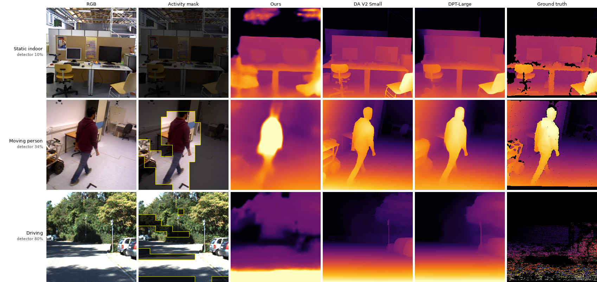

# SOKKANAEM: 효율적이고 안정적인 비디오 깊이 추정을 위한 정확한 변화 게이팅 상태공간 모델

> **2026-09-07 R3 정정 — 과거 초안, 투고 원고가 아님.** 현재 원고는
> [최신 영문 draft.md](draft.md)이며, 이 한국어 파일은 최신 번역본이 아니다.
> [submission/manuscript.tex](submission/manuscript.tex), 판정 기준은
> [R3 대응표](self-revision/r3/revision-status.md)다. 아래 과거 표·초록의 우위 주장은
> 현재 동결 평가로 승계하지 않는다. 특히 Table 7d는 v9/v10 및 서로 다른 표본 수의
> 결과이며, endpoint 차이는 전체 구간의 안정성 증거가 아니다. metric 출력도 배율
> drift를 겪는다. 과거 clip-bootstrap 구간은 시퀀스 상관을 처리하지 못하며,
> bootstrap 승률은 p-value나 동등성 검정이 아니다. `table_check.py`의 숫자 일치만으로
> 체크포인트·표본·집계의 출처가 검증되지는 않는다. 아래의 '확정' 표식은 과거 자기평가다.

> **2026-09-06 프로토콜 개정.** 기준 모델·데이터 역할은 [PREPARATION.md](PREPARATION.md),
> 평가 계약은 [PROTOCOL.md](PROTOCOL.md)에 고정한다. 기존 결과표는 각 원래 프로토콜의 개발·검증
> 자료이며, 새로 확보한 최종 평가 집합의 결과가 아니다.

> **작업 초안 — 2026년 8월 24일.** [draft.md](draft.md)의 한국어판이며 내용은 동일하다.
> 저자·소속·학회 양식은 추후 추가해야 한다. 아래의 정량 주장은 저장소에서 완료된
> 실험으로 범위를 제한하며, 모든 표 행은 단일 측정 실행에 대조해 검증한다(`scripts/table_check.py`).
>
> **프로토콜 주의.** 이 초안의 수치는 2026년 8월 20일 이전에 보고한 모든 수치를 대체한다. 클립 상한이
> 각 소스의 holdout 전체가 아니라 첫 holdout 시퀀스를 표본하고 있었고(§4.2), 그 교정으로 실촬 동작점이
> 활성 32.2%의 AbsRel 0.1595에서 활성 22.0%의 0.1302로 이동하며, 진단 결과 세 건이 철회 또는 축소된다.
>
> **절 상태 표식.** 어떤 수치가 확정이고 어떤 것이 움직이는 중인지 제목에 표시한다:
>
> - `[검증 중]` — 실행 중이거나 대기 중인 실험이 이 절의 결론을 직접 겨냥한다. 결론이 뒤집힐 수 있다.
> - `[체크포인트 종속]` — 보고한 체크포인트에 대해 성립한다. 체크포인트가 바뀌면 수치가 움직이지만
>   정성적 주장까지 바뀔 것으로 보지는 않는다.
> - 표식이 없는 절은 확정이다 — 구조·데이터에서 따라오거나, 재학습이 바꾸지 않는 측정이다.

## 초록

비디오 깊이 모델은 넓은 정적 영역을 프레임마다 다시 처리하며 출력이 흔들리기 쉽다. 본 연구는 패치
수준 변화 감지를 선택적 상태공간 모델의 이산화 단계에 묶는 소형 순환 비디오 깊이 모델
**SOKKANAEM**을 제안한다. 이진 활성 마스크 \(M\)에 대해 시간 간격을 \(\widetilde{\Delta}=M\Delta\)로
바꾸면 정적 패치에서 \(\bar A=I\), \(\bar B=0\)이 되어 hidden state가 근사 복원되지 않고 그대로
옮겨진다 — 억제된 갱신이 아니라 항등 전이다. 조건부 순환 갱신 자체는 선행 연구가 있으며, 기여는
**외부의 학습되지 않은 변화 신호 + 정확한 no-op + 조밀한 스트리밍 출력의 조합**과, 그 주장이 어디서
멈추는지에 대한 측정이다.

4.19M 파라미터 모델은 실촬 실내 holdout에서 프레임당 패치 22.0%를 갱신하며 AbsRel 0.1263에 도달하고,
갱신율을 4.6%로 낮추는 대가는 상대 오차 6.7%다. 하나의 프로토콜로 측정한 상용 깊이 모델 7종 대비
정확도는 최하위권이고, 원시 프레임 간 차이는 256프레임에서 1.23배로 1위이며 클립 단위 짝지은
부트스트랩에서도 유지되는 우위다(95% CI 1.18~1.29). 8프레임에서는 1.10배이지만 같은 부트스트랩이 이
방향을 확정하지 못한다. 모션 보정 지표와 GT 기준 지표에서는 앞서지 않으며, 일반적인 시간 일관성
우위를 주장하지 않는다.

**가장 날카로운 결과는 프로토콜에 관한 부정적 결과다.** 클립 길이가 답을 바꾼다 — 클립 단위 오차가
8프레임에서 512프레임 클립으로 갈 때 128% 커지고, 긴 클립 fine-tuning은 그중 5분의 1을 없애면서
8프레임 수치는 소수점 네 자리까지 그대로 둔다. 즉 이 분야가 쓰는 8프레임 관행은 스트리밍 거동을 가장
크게 개선하는 개입에 눈이 멀어 있다. 1,024프레임 스트림을 프레임별로 채점하면 원인이 분리된다 —
프레임별 오차는 첫 프레임에서 천 번째 프레임까지 1.1% 오르는데 클립 단위 오차는 36% 악화한다. 즉 클립
단위 벌점의 대부분은 국소 깊이 형상의 드리프트가 아니라 정합 창 하나가 흡수할 수 없는 시간에 따라
변하는 전역 배율이다. 희소성의 다른 주장들도 비슷하게 경계가 있고, 그 경계는 기기가 긋는다 — 융합
스캔 커널 이후 데스크톱 GPU에서는 모든 활성률에서 dense가 희소보다 빠르지만, 연산 제약 Jetson Nano에서는
순서가 뒤집혀 활성 5%에서 13.7배다. 따라서 희소성의 실측 속도 이득은 메커니즘의 성질이 아니라
**산술 대 오버헤드 비**의 성질이며, 그렇게 보고한다.

## 1. 서론

단안 깊이 추정은 빠르게 발전했지만, 이미지 모델을 비디오에 독립적으로 적용하면 두 가지 구조적
비효율이 남는다. 첫째, 장면 대부분이 변하지 않아도 프레임마다 거의 고정된 비용이 든다. 전경
움직임이 화면의 일부만 차지하는 고정 감시 카메라에서 특히 낭비가 크다. 둘째, 기저 기하가
안정적이어도 독립 예측은 흔들릴 수 있다. 비디오 전용 모델은 시간 일관성을 개선하지만, 대개
프레임별 dense 연산을 유지하거나 별도의 시간 정제 단계를 추가한다.

본 연구는 더 좁은 질문을 던진다: **SSM이 "시각적 변화 없음"을 시간 기억에 대한 정확한 no-op으로
취급할 수 있는가?** 선택적 SSM의 영차 유지(ZOH) 이산화가 직접적인 구성을 제공한다. 시간 간격에
이진 패치 마스크를 곱하면, 마스킹된 갱신이 hidden state에 대한 항등 사상과 같아진다. 따라서 정적
패치는 학습된 근사나 피처 대체, 별도로 무효화되는 시간 캐시 없이 기억을 유지한다.

이 아이디어를 시간축·공간축 SSM 블록을 교차 적층한 스트리밍 비디오 깊이 구조 SOKKANAEM으로
구현한다. 경량 검출기가 이력 현상, 팽창, 주기적 키프레임으로 패치 활성 마스크를 생성한다. 센서
없는 GMC와 피처 공간 검출기가 이 메커니즘을 ego-motion으로 확장한다. 평가는 깊이 정확도와 원시
프레임 변동뿐 아니라 광학 흐름 워프 일관성(OPW), GT 기준 시간 일관성 오차(TCE), 상수 출력 대조군,
해석적 MAC, 실측 지연 시간까지 포함한다.

조건부 순환 갱신에는 선행 연구가 있고, 하나의 대수적 항등식 자체는 기여가 아니다. §2.4가 학습된
skip 게이트와 이벤트 구동 상태공간 모델 대비 이 연구의 위치를 정리한다. 우리가 주장하는 것은 그
조합이다 — 외부의 학습되지 않은 변화 신호를 이산화 파라미터에 직접 연결해 정적 패치의 전이를
억제된 갱신이 아니라 정확한 항등으로 만드는 것, 그 정확한 시간 보존과 조밀 출력에 필요한 근사적
공간 캐싱의 분명한 분리, 보존된 상태를 읽는 것과 정적 토큰을 그냥 건너뛰는 것을 가르는 동일 마스크
대조군, 그리고 그 결과 얻은 효율·안정성 주장이 성립을 멈추는 지점의 실증적 규명 — 커널 융합 이후의
데스크톱 GPU, 희소성이 전이되지 않는 실촬, 드리프트가 드러날 만큼 긴 스트림.

한 가지 범위 조건이 논문 전체를 관통한다. **정확(exact)하다는 말은 시간축 hidden state 전이에만
해당한다.** 공간 출력 캐시는 근사이고, decoder는 조밀하며, 희소 추론 경로 전체는 전체 연산과
비트 단위로 같지 않다 — 정적 패치가 옮기는 상태만이 그렇다.

완료된 실험은 다섯 가지 결론을 뒷받침한다.

1. **정확한 상태 보존.** \(M=0\)에서 \(\Delta\)-게이팅은 구현상 비트 단위로 동일한 상태 복사를,
   해석적으로는 항등 전이를 준다.
2. **유리한 희소성–정확도 교환.** 실촬에서 패치 갱신율을 22배 줄이는 대가(100% → 4.6%)가 상대
   AbsRel 6.7%이고, 기본 동작점 22.0%의 대가는 1.7%다. 같은 구간에서 원시 프레임 차이는 2배 개선된다.
3. **보존된 상태의 readout은 정확도가 아니라 원시 프레임 변동 억제를 산다.** 마스크를 맞춘 조건에서
   \(\Delta\)-게이팅을 토큰 제거로 바꿔도 정확도는 그대로이고 시간 지표 3종만 악화한다. 토큰 제거가
   실패하는 것이 아니라, 보존된 상태 readout의 안정성을 재현하지 못하는 것이다. 이전에 보고한 4배
   정확도 붕괴는 학습되지 않은 희소 경로를 재고 있었다(§5.5).
4. **효율 주장에는 날카로운 경계가 있다.** 융합 스캔 커널 이후 이 모델은 데스크톱 GPU에서 연산이
   아니라 오버헤드에 묶여 있고, 모든 활성 수준에서 dense 실행이 희소 경로보다 빠르다. 희소성의
   이득은 MAC과 스트림당 상태에서 확립돼 있으며, 시간·전력으로의 환산은 미측정이다(§5.7).
5. **클립 길이가 답을 바꾸며, 8프레임 관행은 모두에게 낙관적이다.** 우리 오차는 8프레임에서
   256프레임으로 갈 때 87% 커진다. 상태가 없는 프레임 단위 baseline은 같은 클립에서 더 크게
   악화하는데(116%, 145%), 클립이 길어지면 클립당 정합이 어려워지기 때문이다 — 따라서 유지된
   상태는 키프레임 주기 안에서 정확도를 누적하지 못하더라도 긴 스트림에서는 순이득이다. 긴 클립
   fine-tuning은 256프레임 오차의 5분의 1을 없애면서 8프레임 수치는 소수점 네 자리까지 동일하게
   두므로, 짧은 클립 평가는 그 개선을 "효과 없음"으로 채점한다(§5.8).

시간 일관성 전반의 우위라는 더 넓은 주장은 의도적으로 피한다. SOKKANAEM은 플리커 지향 지표인 원시
프레임 차이에서 앞서지만, 모션 보정 지표(OPW)와 GT 기준 지표(TCE)에서는 Depth Anything 3가 더
강하고 256프레임에서는 Video Depth Anything과 ZoeDepth도 그렇다.

## 2. 관련 연구

### 2.1 단안 및 비디오 깊이

DPT와 Depth Anything 계열의 현대 단안 시스템은 강한 프레임별 깊이를 제공하지만 스트림을 가로지르는
지속 상태가 없다. 비디오 깊이 기법은 시간 어텐션, 모션 모듈, 후처리로 일관성을 개선한다. 주된
목표는 예측 품질이고 연산은 대체로 공간·시간 양쪽에서 dense하게 남는다. SOKKANAEM은 대신 조건부
시간 상태 갱신을 연구하며, 더 강한 사전학습 인코더·디코더와 상보적이다.

### 2.2 동적 토큰 및 변화 기반 연산

토큰 가지치기·병합·조기 종료는 이미지 내부 연산을 줄인다. DeltaCNN, skip convolution, eventful
transformer는 프레임 간 변화를 활용하지만, 피처 캐시와 캐시 일관성 규칙으로 dense 출력을 보존하거나
복원해야 한다. SOKKANAEM은 변화한 영역만 재계산한다는 원리를 공유하되, 시간 정보를 SSM hidden
state에 저장한다. 본 연구의 토큰 제거 ablation은 정적 토큰을 단순히 우회하는 것으로 충분한지를
직접 검증하며, 충분하지 않음을 보인다.

### 2.3 시각 상태공간 모델

시각 SSM은 이차 어텐션을 선형 스캔으로 대체하며 이미지와 비디오로 확장돼 왔다. 표준 변형들은 여전히
모든 토큰을 갱신한다.

### 2.4 조건부·이벤트 구동 상태 갱신

순환 상태 갱신을 조건부로 만드는 것 자체는 새롭지 않으며, 가장 가까운 선행 연구를 대조가 아니라 정확히
명시하는 편이 옳다. Skip RNN(Campos et al., 2018)은 순환 셀에 학습된 이진 게이트를 붙여 상태를 갱신하거나
그대로 복사하고, 복사를 유도하는 예산 항을 둔다. Spiking SSM은 selective scan을 재정식화해 희소한 스파이크
신호가 상태 전이를 구동하게 하며, 시계열에서 이벤트 구동 연산을 얻는다(Tang et al., 2026). 본 연구와 동시기의
이벤트 게이팅 비디오 생성은 학습된 head로 토큰 단위 활성도를 예측하고 상호작용이 형성되는 곳에 주로 잠재
갱신을 적용하는데, 활성 신호에 히스테리시스를 쓰는 방식까지 본 논문의 검출기와 유사하다(Maduabuchi & Wang, 2026).

이 계열과 여기서 다루는 메커니즘을 가르는 것은 세 가지이며, **주장은 그 조합뿐이다.**

1. **게이트가 외부에 있고 학습되지 않는다.** 활성 신호는 패치 단위 픽셀/피처 변화에서 오며, 희소성 예산을
   가진 학습 head에서 오지 않는다. 목적 함수가 정확도와 스킵률을 거래할 수 없고, 동작점은 학습 시점이 아니라
   추론 시점의 임계값으로 정한다 — 그래서 도메인별 재보정이 필요하다는 대가도 함께 온다(§5.5).
2. **SSM 시간 간격으로 항등 전이를 구현한다.** Skip RNN도
   \(h_t=m_tF(h_{t-1},x_t)+(1-m_t)h_{t-1}\)로 상태를 정확히 복사한다.
   이진 마스크에서 본 연구의 갱신도 같은 update-or-copy 형식이다. 정확한 복사 자체는 공유하는
   성질이며 신규성이 아니다. 차별성은 외부 패치 변화 신호를 selective SSM의 이산화에 연결하고,
   readout·캐시·조밀 깊이 출력과의 상호작용을 검증하는 구성에 둔다.
3. **과제가 조밀한 공간 출력을 요구한다.** 토큰의 시간 갱신을 건너뛰는 것이 그 토큰의 깊이를 내지 않아도
   된다는 뜻은 아니다. 정확한 시간 상태 보존과, 빠진 문맥을 채우는 근사적 공간 캐싱의 분리 — 그리고 그
   분리가 함의하는 연산 하한 — 은 조밀 예측에 특유하며, 효율 주장이 멈추는 지점이다(§5.6).

## 3. 방법

### 3.1 개요

**그림 1. 스트리밍 파이프라인.** 변화 검출기가 연속 프레임을 패치 단위로 비교해 이진 활성 마스크를
내고, 그 마스크가 백본에 \(\Delta\)-게이팅 신호로 전달된다. 정적 패치는 hidden state를 정확히
유지하며 연산이 생략된다. 공간 출력과 시간 hidden state, 두 캐시가 곱셈-누산 절감의 실제 출처로
활성 15.4%에서 프레임당 1.644에서 0.608 GMAC으로 낮춘다. 전역 모션 보정 분기는 이동 카메라에서만
쓴다. 활성 40%를 넘는 프레임은 dense 경로로 우회한다.

프레임 \(I_{t-1}\), \(I_t\)에 대해 모델은 다음을 수행한다.

1. 이미지를 \(p\times p\) 패치로 분할(완료된 본 실험은 \(p=16\));
2. 이진 활성 마스크 \(M_t\) 추정;
3. 현재 프레임 embed;
4. 시간축 \(\Delta\)-게이팅 SSM과 공간축 SSM 블록을 교차 적용;
5. dense 깊이 지도 \(\widehat D_t\) 디코딩;
6. 검출기 상태와 패치별 SSM 상태를 다음 프레임으로 전달.

상태 딕셔너리를 독립적으로 유지하므로, 가중치 한 벌로 여러 스트림을 상태 누출 없이 처리할 수 있다.

### 3.2 패치 변화 검출기

기본 픽셀 검출기는 패치 \(i\)에 평균 제곱 변화를 할당한다.

\[
s_{t,i}=\frac{\lVert P_{t,i}-P_{t-1,i}\rVert_2^2}{p^2 C}.
\]

두 임계값으로 이력 현상을 구현한다.

\[
M_{t,i} =
\begin{cases}
1,&s_{t,i}>\tau_{\mathrm{on}},\\
0,&s_{t,i}<\tau_{\mathrm{off}},\\
M_{t-1,i},&\text{그 외}.
\end{cases}
\]

객체 경계를 보호하려고 활성 영역을 한 패치만큼 팽창시키고, 드리프트를 막으려고 \(K\)프레임마다 전체
갱신을 강제한다. 평가 전용 ablation에서 픽셀 MSE와 코사인 검출은 같은 활성 비율에서 비슷했으므로
MSE를 기본으로 둔다. 완료된 3-arm 연구에서 i.i.d. 무작위 마스크 학습이 검출기 기반 미세조정보다
최소한 동등하게 강건했다.

### 3.3 정확한 \(\Delta\)-게이팅

**그림 2. 정확한 \(\Delta\)-게이팅.** 이진 마스크가 시간 간격에 곱해진다
(\(\widetilde{\Delta}=M\Delta\)). 마스킹된 시간 상태는 보존된다. 본 연구의 token-drop 대조군도
같은 상태를 보존하지만 블록의 readout을 우회한다. 상태를 반드시 0으로 만드는 방식이 아니며,
두 방식 모두 ungated dense 모델과 출력이 같다는 보장은 없다.

한 시간 간격에서 입력과 계수가 일정한 연속 SSM의 정확한 ZOH 이산화는 다음과 같다.

\[
\bar A_i=\exp(\Delta_i A),\qquad
\bar B_i^{\mathrm{ZOH}}=\int_0^{\Delta_i}\exp(sA)\,ds\,B_i
=\Delta_i\varphi_1(\Delta_i A)B_i,
\]

\[
\varphi_1(Z)=\sum_{k=0}^{\infty}\frac{Z^k}{(k+1)!},\qquad \varphi_1(0)=I.
\]

이 표현은 \(\Delta_i A\)의 역행렬을 요구하지 않아 시간 간격 0에서도 정의된다. 실제 구현은
지수 상태 전이와 1차 입력항 \(\bar B_i^{\mathrm{impl}}=\Delta_i B_i\)를 사용한다. 활성 입력에 대해
정확한 ZOH 적분을 구현한 것은 아니다. 음의 대각 행렬 \(A\), 비음수 채널별 간격에 대해 실제 식은

\[
h_i=\exp(\widetilde\Delta_i A)\odot h_{i-1}+\widetilde\Delta_i B_i x_i,
\qquad y_i=C_i h_i+D\odot x_i
\]

이며, 뒤에 SiLU 출력 게이트와 선형 투영이 따른다. 이진 마스크를 다음과 같이 적용한다.

\[
\widetilde{\Delta}_i=M_i\Delta_i.
\]

\(M_i=0\)이면

\[
\bar A_i=I,\qquad \bar B_i=0,\qquad h_i=h_{i-1}.
\]

정확한 ZOH 입력항과 구현의 1차 입력항 모두 간격 0에서 사라진다. 따라서 마스킹된 시간 상태의
항등 보존은 성립한다. 이진 마스크에서는 실수 연산 기준으로
\(M_iF_{\Delta_i}(h_{i-1},x_i)+(1-M_i)h_{i-1}\)와 동치이며, 연속값 마스크에는 이 동치를
일반화하지 않는다. 유한값의 단일 시간 갱신 상태 복사는 bitwise equality로, 재배열된 부동소수점
scan 경로는 별도 허용오차로 검증한다.

상태가 보존돼도 입력 의존 \(C_i,x_i\)와 출력 게이트는 달라질 수 있다. 시간 readout이나 공간 출력을
캐싱하는 것은 추가 근사이며, 상태 보존만으로 출력 불변·dense 출력 일치·예측 드리프트 상한이 보장되지는 않는다.

### 3.4 시공간 백본

시간축 블록은 각 공간 패치를 프레임 축을 따라 스캔하므로, 그 hidden state는 고정된 이미지 위치에
묶인 기억이 된다. 공간축 블록은 프레임 내 문맥을 혼합한다. 두 블록을 교차하면 시간적 지속성과 공간적
추론이 결합된다. 보고하는 모델은 차원 192, 블록 4개, 상태 차원 16, 패치 크기 16이며 파라미터는
4,185,872개(fp32 가중치 16.7 MB)다.

선택적 공간 출력 캐시는 활성 패치를 모아 갱신하고 되돌려 놓으면서 정적 위치에는 이전 출력을
재사용한다. 시간축 \(\Delta\)-게이팅과 달리 이 연산은 근사다 — 정적 공간 토큰이 새 문맥에 기여하지
않기 때문이다. 현재의 추론 전용 구현에서는 낮은 활성 비율에서만 유용하다.

### 3.5 이동 카메라 확장

카메라가 움직이면 원시 픽셀 차이가 조밀해진다. 따라서 저해상도 프레임에서 최대 50개 추적점으로
Lucas–Kanade 추적과 RANSAC을 써서 호모그래피를 추정한다. 이전 프레임을 현재 시점으로 워핑한 뒤
패치 embedding 간 상대 \(L_1\) 차이로 활성 마스크를 만든다. 추적 실패 시 항등 변환으로 폴백해,
변화를 조용히 억제하는 대신 활성 비율을 늘린다. §5.5가 같은 기전을 실촬 주행 영상에서 검증하며,
거기서도 성립하지만 **도메인별 임계 재보정을 거친 뒤에만** 그렇다 — 렌더링 영상에서 맞춘 피처
스케일 임계는 실촬 촬영에서 작동하지 않는다.

### 3.6 디코더와 목적 함수

보고된 체크포인트는 dense 업샘플링 디코더를 쓴다. 학습은 다음을 최소화한다.

\[
\mathcal L =
\mathcal L_{\mathrm{SI-log}}
+0.5\mathcal L_{\mathrm{grad}}
+0.1\mathcal L_{\mathrm{temp}}
+0.05\mathcal L_{\mathrm{normal}}.
\]

무작위 마스크 스케줄링이 학습 중 스킵 비율을 높인다. 확정 체크포인트는 여기에 보조 손실 두 개를
더한다 — 광학 흐름으로 워프한 log-depth 잔차 항과 깊이 경계 가중 항이며, 둘 다 가중치 2.0이다.

실패한 실행 하나는 Kendall 방식 자동 손실 가중을 썼다. 최적화기가 temporal loss 가중치를 상한까지
밀어붙였고, 그 결과 상수 깊이 지도가 최적해가 됐다. 해당 체크포인트는 폐기하고 고정 가중치로
복귀했으며, 예측 분산 붕괴 감지기를 추가했다.

## 4. 실험 설정

### 4.1 데이터

주 합성 학습 혼합은 Virtual KITTI 2, TartanAir v2, PointOdyssey로 구성된다. 데이터셋 균형 샘플링이
가장 큰 소스의 지배를 막는다. 주 합성 holdout은 8,929 클립이며, 대표 비교는 모두 동일한 결정적 첫
1,000 클립을 쓴다.

배포 관련 실촬 도메인으로는 TUM RGB-D 고정 카메라 시퀀스와 Bonn RGB-D Dynamic을 쓴다. RGB와 depth는
20 ms 이내 가장 가까운 타임스탬프로 짝짓되 depth 재사용을 허용한다. 과거 60k 단계의 학습 시간은
v11 전체 학습 비용이 아니다. 실제 계보는 §4.4와 freeze/baseline.json에 기록했다. 기존 실촬 루트는
학습 풀 24개·개발 검증 4개 시퀀스로 구분하며 반복 사용한 holdout을 최종 테스트로 부르지 않는다.
새로 봉인한 시퀀스 분리 테스트는 PROTOCOL.md에 정의한 이동 카메라 전이 평가에 한정한다.

초기 개념 검증은 Virtual KITTI 2 전체 코퍼스(42,520 프레임, 21,120 학습 클립)를 128픽셀에서
30k 스텝으로 사용한다.

교차 도메인 평가에는 학습에 쓰지 않은 KITTI raw 주행 5개 시퀀스(885 프레임)를 쓴다. 정답은 투영된
LiDAR로, 약 80 m에서 잘리고 유효 픽셀은 30%다.

### 4.2 평가 프로토콜

수치의 의미를 결정하는 프로토콜 선택 세 가지이며, 각각 한 번씩 우리를 물었다.

**상태는 클립 경계에서만 초기화한다.** 클립 내부에서는 배치 환경과 동일하게 검출기 상태, 패치별 SSM 상태,
두 캐시가 프레임을 따라 이어지고, 키프레임 카운터도 클립 첫 프레임부터 센다. 클립 사이에서는 전부 버린다.
따라서 한 클립은 그 길이만큼의 스트림이고, 클립 길이는 배치 세부가 아니라 프로토콜 파라미터다 — 주기 30에서
8프레임 클립은 키프레임에 한 번도 닿지 않고, 256프레임 클립은 여덟 번 지난다.

**클립은 겹치지 않으며 holdout 전체에 균등 분포한다.** 클립은 각 holdout 시퀀스를 겹침 없이 타일링하고,
클립 수에 상한을 둘 때는 앞에서 자르지 않고 소스 전체에 균등 간격으로 남긴다. 이는 다듬기가 아니다 —
시퀀스가 순서대로 이어붙기 때문에 Bonn의 399클립에 상한 100을 걸면 첫 holdout 시퀀스만 평가하게 되고,
같은 체크포인트가 어떤 상한에서는 활성률 44.7%, 다른 상한에서는 55.8%로 읽힌다. 이 논문의 모든 수치는
균등 추출로 측정했으며, 우리 자신의 이전 보고서들은 그렇지 않았고 그 Bonn·PointOdyssey 열은 holdout이
아니라 한 시퀀스를 서술한 것이다.

**정합은 서로 다른 평가 질문을 정의한다.** GT 보정 없는 metric 출력, 클립별 median 보정,
클립별 시차 scale–shift 보정을 별도 표로 보고한다. 프레임별 정합은 실제 시간적 스케일 변화도
제거하므로 형상 보조 진단으로만 사용하고 primary temporal 평가에 쓰지 않는다. 아래 과거 표는
원래 정합 조건의 개발 자료이며 최종 평가 전에 새 계약으로 재생성해야 한다.

### 4.3 지표

AbsRel, RMSE, \(\delta_1\)은 GT 보정 없는 경우와 명시한 정합 조건별로 나누어 보고한다.
활성 비율은 검출기가 허용한 패치 갱신의 비율이며 첫 프레임 포함·제외 값을 구분한다.

시간 지표는 다음과 같다.

- **t-delta:** 인접 프레임 출력 차이의 평균. 원시 플리커를 재지만 상수 출력에서 최소가 된다.
- **OPW:** RAFT-small 기반 광학 흐름 워프 예측 오차.
- **TCE:** 예측의 워프 잔차와 GT의 워프 잔차의 차이. GT 기하가 변할 때 상수 예측에 벌점을 준다.

모든 완전한 시간 지표 표에는 클립별 최적 상수 깊이 대조군이 포함된다. 이 대조군은 t-delta와 OPW의
퇴화를 드러내고 TCE의 데이터셋 고유 잔차 바닥을 제공한다.

### 4.4 Baseline과 구현

과거 비교에는 Video Depth Anything Small도 포함됐다. 그러나 실행기가 호출하는 infer_video_depth의 현재 로컬 구현은 32프레임 창의 비인과 시간 attention을 사용한다. 프레임 인과 모델로 표기하지 않으며, 당시 코드/가중치/프레임 ID 연결이 없는 결과는 현재 frozen 최종 표와 별도로 다룬다.

개정 평가 계약은 GT 보정 없는 metric 출력, 클립별 median 보정, 시차 공간 scale–shift 보정을
서로 다른 표로 보고한다. Median 보정은 평가 GT를 사용하므로 실제 거리 보정 능력의 증거가 아니다.
추가 최소제곱 자유도는 최적화 대상인 시차 제곱오차를 줄일 수 있지만, 역수 변환 뒤의 깊이 AbsRel은
악화할 수 있고 정합된 시차가 0 이하가 될 수도 있다. 실패를 별도 집계하며 다른 정합 조건을 한 순위로
합치지 않는다. 기존 결과표는 원래 정합 조건의 개발 자료이며, 최종 평가 전에 PROTOCOL.md에 따라 재생성한다.

**고정한 native 모델과 실제 계보.** v11 기준 모델은 4,185,872 파라미터이며 확대 모델이나 사전학습
Q 계열과 구분한다. 체크포인트 step의 단계 합계는 93k가 아닌 153k다. 이는 독립 검증된 optimizer
총 업데이트 수가 아니다. v8 이전 부모가 기록되지 않았다는 사실만으로 fresh initialization을
증명하지 않으며, 후속 단계가 teacher-free여도 전체 계보를 teacher-free라고 부르지 않는다.

| 이름 | 레시피 | 등장하는 곳 |
|---|---|---|
| v8 부모 | 기록된 60k 스텝 | Base 단계 초기화 |
| Base | 60k 스텝, 클립 길이 4 | 8프레임 이력, ablation 기준 |
| 장클립 | + 25k 스텝, 클립 길이 24 | §5.8, 클립 길이가 변수인 곳 |
| **Final** | + 8k 스텝, 클립 길이 24, spread 항 | **보고 모델** |

지연 시간은 RTX 4090에서 배치 1로 측정한다. 해석적 곱셈-누산 수는 설정된 모델에서 유도한다. 에지 기기
결과는 아직 없다.

## 5. 결과

### 5.1 활성–정확도 교환 `[체크포인트 종속]`

이 절의 모든 표는 단일 체크포인트(4.19M, 60k 스텝)에서 나오므로 어떤 비교도 모델 버전을 섞지
않는다. 각 행은 검출기 임계값을 스윕한 결과이며, holdout 전체에 균등 분포한 소스당 100클립,
데이터셋 균형 평균, 8프레임 클립이다.

**표 1. 두 도메인의 활성 스윕, 보고 체크포인트. 상수 깊이 대조군은 클립별 최적 상수 예측이다.**

| \(\tau_{\mathrm{on}}\) | 실촬 활성 (%) | 실촬 AbsRel | 실촬 \(\delta_1\) | 실촬 t-delta | 합성 활성 (%) | 합성 AbsRel | 합성 \(\delta_1\) |
|---|---:|---:|---:|---:|---:|---:|---:|
| 0 (전체 연산) | 100.0 | 0.1242 | **0.8778** | 0.0554 | 100.0 | **0.4304** | 0.5666 |
| 0.005 | 94.9 | 0.1243 | 0.8773 | 0.0673 | 62.8 | 0.4354 | 0.5618 |
| 0.01 | 85.0 | 0.1243 | 0.8768 | 0.0806 | 58.1 | 0.4352 | 0.5624 |
| 0.02 | 63.6 | **0.1240** | 0.8750 | 0.1018 | 51.2 | 0.4354 | 0.5628 |
| 0.05 (기본) | 22.0 | 0.1263 | 0.8681 | 0.0750 | 40.9 | 0.4355 | 0.5642 |
| 0.1 | **4.6** | 0.1325 | 0.8634 | **0.0272** | 32.1 | 0.4368 | **0.5670** |
| 상수 대조군 | — | 0.2761 | 0.5831 | 0.0000 | — | 0.6303 | 0.4152 |

**교환비는 이전에 보고한 것보다 좋고, 방향은 같다.** 실촬에서 갱신율을 22배 줄이는 대가(100% →
4.6% 활성)는 상대 AbsRel 6.7%와 \(\delta_1\) 1.4포인트이며, 그동안 원시 프레임 차이는 2배
개선되고 두 모션 기준 지표도 함께 개선된다. 기본 동작점 22.0%에서는 전체 연산 대비 1.7% 안이다.
합성에서는 3배 절감의 대가가 1.5%다.

이 곡선의 두 가지 특징을 짚어둘 필요가 있다. 정확도는 **단조가 아니다** — 실촬 63.6% 활성에서
전체 연산보다 좋다(0.1240 대 0.1242). 이 차이는 seed 편차 안이므로 주장하지 않지만, 형태는 체크포인트
사이에서 일관되며 게이팅이 낡은 문맥을 잘라낸다는 해석과 맞는다. 그리고 시간 지표는 반대 방향으로
단조가 아니다 — t-delta는 전체 연산의 0.0554에서 63.6%의 0.1018로 올랐다가 4.6%에서 0.0272로
떨어진다. 부분 게이팅은 일부 패치만 갱신하므로 그 자체가 프레임 간 차이의 원인이고, 강한 게이팅은
화면 대부분을 고정시켜 그 원인을 없앤다. **이 구조가 겨냥한 안정성은 모든 활성률이 아니라 낮은
활성률에서 온다.**

상수 대조군과의 격차는 모든 동작점에서 크게 유지된다 — 4.6% 활성에서도 실촬 AbsRel 기준 2.1배다.

**그림 3. 활성 대 정확도.** 실촬 실내·합성 holdout에서 검출기 임계값을 스윕한 결과다. 정확도는
약 20% 활성까지 1% 이내로 평평하고 그 뒤 꺾인다. 실촬에서 갱신율 22배 절감의 대가는 상대 AbsRel
6.4%이고, 기본 동작점(원 표시)의 대가는 0.9%다. 클립별 최적 상수 대조군은 두 패널보다 훨씬 위에
있어 축 밖에 표시했다.

합성 스윕이 낮은 활성에 도달하지 못하는 이유는 TartanAir가 임계값과 무관하게 80~100% 활성을
유지하기 때문이다. §5.6에서 정량화하는 것과 같은 현상이다 — 스트림이 얼마나 건너뛸 수 있는지는
방법만의 성질이 아니라 촬영의 성질이다.

### 5.2 실촬 실내 결과 `[체크포인트 종속]`

합성 전용 초기 체크포인트는 실촬 실내 Kinect 깊이로 전이되지 않고 상수 예측기에도 졌다. 혼합
도메인 fine-tuning이 이 실패를 뒤집었고, 최종 학습 단계에서 추가한 두 보조 손실(흐름 워프 로그 깊이
잔차 항, 깊이 경계 가중 항)이 같은 연산량에서 정확도와 시간 안정성을 함께 개선했다.

**표 2. 실촬 실내 RGB-D holdout(TUM·Bonn), 8프레임 클립, holdout 전체에 균등 분포한 소스당
100클립, 데이터셋 균형 평균.**

| 모델 | AbsRel | \(\delta_1\) | t-delta | OPW | TCE | 활성 (%) |
|---|---:|---:|---:|---:|---:|---:|
| 이전 체크포인트 (첫 시퀀스 표본) | 0.1633 | 0.8211 | 0.0915 | 0.0271 | 0.0351 | 32.2 |
| 보고 체크포인트 (첫 시퀀스 표본) | 0.1595 | 0.8262 | 0.0751 | 0.0243 | 0.0323 | 32.2 |
| Base 체크포인트 (4.19M), holdout 전체 | 0.1302 | 0.8613 | **0.0607** | **0.0184** | **0.0262** | **22.0** |
| 장클립 체크포인트, holdout 전체 | 0.1302 | 0.8684 | 0.0702 | 0.0196 | 0.0273 | **22.0** |
| **Final 체크포인트, holdout 전체** | **0.1263** | **0.8681** | 0.0750 | 0.0193 | 0.0270 | **22.0** |

앞의 두 행은 이전에 보고한 학습 레시피 비교이며, 보조 손실 결론이 이 두 행에 기대고 있으므로
남겨둔다. 둘 다 §4.2의 표본 수정 이전 측정이라 Bonn의 첫 holdout 시퀀스를 서술한다. 3·4행은 같은
체크포인트를 holdout 전체에서 측정한 것이고, 논문의 다른 모든 곳에서 쓰는 수치다. 표본 방식 변경은
보고 체크포인트의 AbsRel을 0.1595에서 0.1302로, 활성률을 32.2%에서 22.0%로 옮긴다 — 첫 시퀀스
부분집합이 군중 장면이고, 그것이 대표하던 holdout보다 더 어렵고 더 활동적이었기 때문이다.

수정된 표본에서 소스별로 보고(final) 모델은 TUM에서 활성 19.7%로 AbsRel 0.1285·\(\delta_1\) 0.8467,
Bonn에서 활성 24.4%로 0.1241·0.8894에 도달한다. 세 체크포인트는 같은 검출기를 쓰므로 활성률이 같고,
위 행들은 가중치만 다르다. 이전 Bonn 열은 활성 44.7%에서 0.1869였는데,
그것은 군중 시퀀스 단독 수치였다.

두 가지 주의가 따른다. 이 두 체크포인트 사이의 합성 \(\delta_1\) 차이는 측정된 seed 표준편차
\(\pm\)0.015 안에 있어 주장하지 않는다. 더 중요하게는, 두 행이 초기화 계보와 누적 스텝에서
다르므로 표 2는 손실 ablation이 아니라 체크포인트 비교다. 통제된 ablation은 8k 스텝에만 존재하며
거기서는 순위가 오히려 뒤집혔다. **손실 항의 짧은 프로브 순위는 수렴까지 살아남지 않았다.** 이는
방법론적 발견으로 보고한다 — 짧은 프로브는 어떤 항이 도움이 되는지는 정할 수 있어도 얼마나 강하게
가중할지는 정할 수 없다.

### 5.3 더 큰 깊이 모델과의 비교 `[체크포인트 종속]`

이 절의 모든 모델은 §4.2 프로토콜 아래 동일한 holdout 클립, 256픽셀 입력, 동일한 지표 구현으로
측정했다. 클립 길이는 두 가지를 보고한다. 서로 다른 질문에 답하고 서로 다른 답을 주기 때문이다.
8프레임은 이 분야의 관행이고, 256프레임은 이 구조가 대상으로 하는 스트리밍 설정이며 주 표다.

**표 3a. 256프레임 — 스트리밍 프로토콜. 실촬 실내 holdout, 겹치지 않는 클립, 모델당 13클립,
데이터셋 균형 평균. DA3는 클립 전체를 한 번에 받으며 인과적이지 않고, 나머지 행은 모두 인과적이다.
정합은 각 모델의 고유 규칙이며 §5.4가 전 모델을 양쪽 규칙으로 보고한다. 13클립은 작은 표본이므로,
이 표의 순위에는 면책 문구 대신 표 3d의 클립 단위 부트스트랩 구간을 붙인다.**

| 모델 | 파라미터 | AbsRel | \(\delta_1\) | t-delta | OPW | TCE |
|---|---:|---:|---:|---:|---:|---:|
| DA 3 Base (비인과) | 120M | **0.1163** | **0.8871** | 0.0857 | **0.0181** | **0.0241** |
| Video Depth Anything S (metric) | 28.4M | 0.1276 | 0.8808 | 0.0854 | 0.0217 | 0.0274 |
| ZoeDepth N-K | 345M | 0.1285 | 0.8677 | 0.0871 | 0.0227 | 0.0278 |
| DA V1 Small | 24.8M | 0.1404 | 0.8339 | 0.1222 | 0.0271 | 0.0324 |
| DPT-Large | 343M | 0.1891 | 0.7461 | 0.1631 | 0.0352 | 0.0404 |
| **SOKKANAEM (final)** | **4.19M** | 0.1907 | 0.7922 | **0.0692** | 0.0264 | 0.0340 |
| DA V2 Base | 97.5M | 0.2151 | 0.7387 | 0.3194 | 0.0483 | 0.0541 |
| SOKKANAEM (base) | 4.19M | 0.2434 | 0.7134 | 0.0719 | 0.0291 | 0.0366 |
| DA V2 Small | 24.8M | 0.5491 | 0.7305 | 3.5881 | 0.2228 | 0.2283 |

**표 3b. 같은 비교군, 8프레임 — 관행 프로토콜. 모델당 189클립.**

| 모델 | 파라미터 | AbsRel | \(\delta_1\) | t-delta | OPW | TCE |
|---|---:|---:|---:|---:|---:|---:|
| DA V1 Small | 24.8M | **0.0650** | 0.9439 | 0.0892 | 0.0202 | 0.0261 |
| DPT-Large | 343M | 0.0875 | 0.9276 | 0.1162 | 0.0270 | 0.0326 |
| DA V2 Base | 97.5M | 0.0877 | **0.9420** | 0.3814 | 0.0306 | 0.0367 |
| ZoeDepth N-K | 345M | 0.0992 | 0.8900 | 0.0866 | 0.0211 | 0.0264 |
| Video Depth Anything S (metric) | 28.4M | 0.1000 | 0.9139 | 0.0829 | 0.0200 | 0.0258 |
| DA 3 Base (비인과) | 120M | 0.1130 | 0.8924 | 0.0825 | **0.0140** | **0.0200** |
| **SOKKANAEM (final)** | **4.19M** | 0.1263 | 0.8681 | **0.0750** | 0.0193 | 0.0270 |
| SOKKANAEM (base) | 4.19M | 0.1302 | 0.8613 | **0.0607** | 0.0184 | 0.0262 |
| DA V2 Small | 24.8M | 0.2068 | 0.9292 | 1.0015 | 0.0895 | 0.0953 |

**그림 4. 비교군의 정확도 대 시간 안정성.** 마커 면적은 파라미터 수의 로그에 비례하고, 두 축 모두
왼쪽 아래가 좋다. 우리 모델은 두 패널에서 가장 작은 마커이자 안정성 축 최하단이다. t-delta가
비교군에서 두 자릿수 배 범위를 갖기 때문에 안정성 축은 로그 스케일이다.

네 가지가 따라오고, 그중 하나만 우리에게 유리하다.

**두 프로토콜 모두에서 원시 프레임 간 차이는 우리가 앞서며, 영상 전용 baseline이 그것을 가져가지
못한다.** 256프레임에서 보고 모델은 0.0692이고 Video Depth Anything 0.0854, 비인과 DA3 0.0857 —
둘 중 나은 쪽 대비 1.23배다. 8프레임에서는 1.10배(0.0750 대 0.0825)다. 이것이 이 구조가 하려던
주장이며, 이전 표에서 빠져 있던 baseline 부류를 넣어도 뒤집히지 않았다. 다만 두 클립 길이에서 똑같이
유지되지는 않으며, 그것이 보이는 곳이 표 3d다.

**표 3d. 원시 프레임 간 차이 우위의 클립 단위 부트스트랩.** 클립을 10,000회 재표집하며, 소스별로
층화해 각 표집이 표가 보고하는 데이터셋 균형 평균을 재현하게 하고, *짝지어* 계산한다 — 모든 모델을
같은 재표집 클립에서 채점한다. 클립 간 변동이 모델 간 격차보다 훨씬 크기 때문이다. 비율은
baseline/우리이므로 1보다 크면 우리가 앞선다. 평가가 이미 저장하는 클립별 값에서 계산했고
(`scripts/bootstrap_ci.py`), 모델을 다시 돌리지 않았다.

| 프로토콜 | Baseline | t-delta 비율 | 95% CI | P(우리가 더 낮다) |
|---|---|---:|---|---:|
| 256프레임 | DA 3 Base (비인과) | 1.239 | [1.183, 1.305] | 1.000 |
| 256프레임 | Video Depth Anything S | 1.234 | [1.184, 1.290] | 1.000 |
| 256프레임 | ZoeDepth N-K | 1.259 | [1.151, 1.367] | 1.000 |
| 8프레임 | DA 3 Base (비인과) | 1.101 | [0.951, 1.283] | 0.905 |
| 8프레임 | Video Depth Anything S | 1.106 | [0.947, 1.292] | 0.904 |
| 8프레임 | ZoeDepth N-K | 1.156 | [0.998, 1.347] | 0.973 |

**256프레임 우위는 13클립에서 분해되고, 8프레임 격차는 189클립에서도 분해되지 않는다.** 이 지표에서
우리와 30% 이내인 baseline 3종에 대해 256프레임 구간은 모두 1.15를 넘고, 10,000회 재표집 전부에서
우리가 더 낮다. 8프레임에서는 가장 가까운 두 baseline의 구간이 1을 포함한다 — 1.10과 1.11이라는 점
추정치는 실재하지만 이 표본으로 확립되지 않으며, 0.0750 대 0.0825라는 격차의 정직한 독법이 그것이다.
클립 수가 14배 적은 256프레임에서 구간이 더 좁은 것은 짝지음이 클립 간 분산을 제거하고 효과 자체가
더 크기 때문이다. 구간은 클립별 평균으로 계산하고 표의 행은 소스 내에서 픽셀 가중이므로 AbsRel 중심이
조금 이동하지만(256프레임에서 0.1962 대 0.1907), t-delta·OPW·TCE는 모든 클립이 같은 픽셀 수를
기여하므로 바뀌지 않는다.

**최종 체크포인트 승격은 그 격차를 좁히며, 우리는 유리한 설정을 고르는 대신 그 교환을 보고한다.**
§6.5의 spread 항은 예측 깊이 필드를 넓히므로 필연적으로 더 움직이게 한다 — 8프레임에서 상대 AbsRel
3.0%, 256프레임에서 4.2%를 사는 대신 원시 프레임 차이를 8프레임에서 24%(0.0607 → 0.0750),
256프레임에서 2.7% 잃는다. 그 단계를 빼면(장클립 체크포인트, 표 7a) 더 큰 오차에서 더 넓은 안정성
격차를 되찾는다. 두 설정은 한 단계 차이로 학습된 동일한 4.19M 가중치이며, 절대 오차보다 플리커를 더
중시하는 배치라면 앞 단계를 쓰는 것이 맞다.

**정확도는 두 프로토콜 모두에서 최하위 또는 그 근처다.** 8프레임에서 0.1263 대 24.8M baseline의
0.0650 — 파라미터 6배 적으면서 오차는 1.9배다. 256프레임에서는 9개 중 5위로 DPT-Large와 DA V2 Base보다
앞선다. 격차는 클립 길이와 함께
좁아지지만 닫히지 않으며, 이 논문은 그 반대를 주장하지 않는다.

**모션 기준 일관성은 절대값으로는 우리 것이 아니지만, 우리 정확도가 예측하는 값보다는 좋다.** DA3가
두 프로토콜 모두에서 OPW·TCE에서 낫고, 256프레임에서는 Video Depth Anything과 ZoeDepth도 그렇다.
그 두 지표에서 우리를 앞서는 모델은 **전부 우리보다 정확하며**, 이는 우연이 아니다 — TCE는 예측의 워프
잔차를 GT의 워프 잔차와 비교하므로 깊이 오차에 하한이 묶여 있고, 표면을 잘못 놓은 모델이 이 지표에서
좋을 수는 없다. 비교군의 OPW·TCE를 AbsRel에 회귀시켜 우리 동작점을 읽으면 그 교란의 크기가 드러난다.

| 프로토콜 | 지표 | 우리 AbsRel에서의 군 추세 | 실측 | 차이 |
|---|---|---:|---:|---:|
| 8프레임 | OPW | 0.0409 | **0.0193** | **−53%** |
| 8프레임 | TCE | 0.0466 | **0.0270** | **−42%** |
| 256프레임 | OPW | 0.0393 | **0.0264** | **−33%** |
| 256프레임 | TCE | 0.0448 | **0.0338** | **−25%** |

**우리 정확도에서의 모델 간 회귀 추세 대비 — 인과 증거가 아니라 상관 기준선이다 — 모션 기준 지표에서 25~53% 낫고, 표 안의 한 쌍이 회귀 없이도 그것을 보여준다.**
256프레임에서 DPT-Large는 AbsRel 0.1891, 우리는 0.1907로 0.8% 차이인데, 같은 클립에서 우리가 원시
프레임 차이 2.4배, OPW 1.33배, TCE 1.20배 낫고 파라미터는 82배 적다. **우리 정확도 수준에서는 이
메커니즘이 모든 시간 지표를 개선한다.** 하지 못하는 것은 그 수치를 절대적으로 경쟁력 있게 만들 정확도를
사는 일이다.

이것이 세 지표를 동시에 1위로 만드는 것이 이 기여의 목표가 될 수 없는 이유이기도 하다. t-delta는
움직이지 않는 예측을 보상하고, TCE는 장면과 다르게 움직이는 예측을 벌하며, **정확히 실제 기하만큼
움직이는 예측은 안정적인 예측이 아니라 정확한 예측이다.** 여기서 다루는 메커니즘은 안정성을 사고,
남은 오차는 정확도이며 §5.9가 그 위치를 특정한다.

**두 프로토콜이 비교군의 순위를 다르게 매기며, 그것이 둘 다 보고하는 이유다.** 8프레임에서
256프레임으로 가면 모든 모델이 악화한다 — 클립당 정합 창이 길어져 하나의 배율(또는 배율+이동)이 더
긴 구간을 담당해야 한다 — 그런데 악화 배수가 크게 다르다. DPT-Large 116%, DA V2 Base 145%, 우리
보고 체크포인트 87%, 장클립 체크포인트 53%, DA3는 3%다. 상태를 유지하는 모델과 클립을 한 번에
처리하는 모델이 둘 다 프레임 단위 모델보다 잘 버티는데, 이유는 정반대다 — 우리는 인과적으로 증거를
누적하고, DA3는 미래를 볼 수 있다. 8프레임 표만 읽으면 이 중 아무것도 보이지 않는다.

**표 3c. 합성 holdout(Virtual KITTI 2, TartanAir v2, PointOdyssey), 8프레임, 모델당 300클립,
데이터셋 균형 평균. 우리 행은 전체 연산이며 스윕은 표 1에 있다.**

| 모델 | 파라미터 | AbsRel | \(\delta_1\) | t-delta | OPW | TCE |
|---|---:|---:|---:|---:|---:|---:|
| DA 3 Base (비인과) | 120M | **0.3003** | 0.5699 | 0.8901 | 0.0452 | 0.0623 |
| ZoeDepth N-K | 345M | 0.3973 | 0.5459 | 0.7789 | 0.1080 | 0.1388 |
| **SOKKANAEM** | **4.19M** | 0.4299 | 0.5939 | **0.3761** | **0.0398** | **0.0812** |
| DA V2 Small | 24.8M | 1.0121 | 0.7343 | 8.4370 | 0.5096 | 0.5278 |
| DA V2 Base | 97.5M | 1.0228 | **0.7398** | 9.5212 | 0.9094 | 0.9244 |
| DA V1 Small | 24.8M | 1.2032 | 0.7175 | 7.7437 | 0.5908 | 0.6103 |
| DPT-Large | 343M | 1.2035 | 0.6793 | 10.3811 | 0.7401 | 0.7629 |

합성 영상은 정확도 순위를 뒤집는다. 실촬 실내에서 앞서던 상대 깊이 모델들이 여기서는 AbsRel 1.0을
넘는다. 시차 공간 affine 정합이 수백 미터 구조를 담지 못하며, \(\delta_1\)은 높게 유지되는데
AbsRel만 폭발하는 것은 일부 클립의 배율이 파국적으로 틀렸다는 신호다. 우리는 metric 계열 두 모델
뒤에서 7개 중 3위이고, 최상위 상대 모델보다 2.1배 낫다. 원시 프레임 차이는 2위보다 2.1배 좋고 OPW는
비교군 최고다. TCE는 아니다 — DA3의 0.0623이 우리 0.0812보다 낫다.

**우리 자신의 이전 보고에 대한 정정.** 동급 규모 모델을 실촬 전 지표에서(\(\delta_1\) 제외)
이긴다고 주장했었다. 그 주장은 Depth Anything V2 Small의 실촬 AbsRel에 기대고 있었고, 그것은 정합
인공물이다 — 일부 클립에서 적합된 시차가 0에 가까워지고 역수를 취하면 예측 깊이가 클립 범위로
날아가 평균을 지배한다(그 모델의 클립별 중앙값은 비교군과 같은 수준이다). **이 주장을 철회한다.**

### 5.4 정합: 모든 모델에 하나의 규칙을 쓰면 더 나빠지는 이유

배율이 모호한 깊이는 채점 전에 GT에 정합해야 하고, 규칙 선택은 중립적이지 않다. 상대 깊이 모델은
affine 변환까지만 정의된 시차를 내도록 학습되므로 관행적으로 시차 공간에서 자유도 2의 배율+이동을
맞춘다. metric 모델과 우리 모델은 자유도 1의 클립별 중앙값 배율을 맞춘다. 각 모델을 고유 규칙으로
보고하면 "하나의 프로토콜"이 하나가 아니라는 반론이 가능하다. 그래서 전 모델을 양쪽으로 측정했다.

**표 12. 각 모델을 고유 정합 규칙과 다른 규칙으로 측정. 실촬 실내 holdout, 8프레임, 189클립, AbsRel.**

| 모델 | 고유 규칙 | AbsRel, 고유 | AbsRel, 다른 규칙 |
|---|---|---:|---:|
| DA V1 Small | 2-DOF 시차 | **0.0650** | 1.0620 |
| DPT-Large | 2-DOF 시차 | 0.0875 | 0.8962 |
| DA V2 Base | 2-DOF 시차 | 0.0877 | 0.8963 |
| DA V2 Small | 2-DOF 시차 | 0.2068 | 0.8722 |
| ZoeDepth N-K | 1-DOF 중앙값 | 0.0992 | 0.3782 |
| DA 3 Base | 2-DOF, 깊이 공간 | 0.1130 | **0.1023** |
| **SOKKANAEM** | 1-DOF 중앙값 | 0.1302 | 0.1155 |

**하나의 공통 규칙은 더 공정한 것이 아니라 비교군 대부분에게 무의미하다.** 상대 깊이 모델을 깊이
공간에서 자유도 1로 맞추면 오차가 한 자릿수 배 커진다. 배율을 맞추는 양이 그 모델이 예측하는 양이
아니기 때문이다. metric baseline을 시차 공간에서 맞추면 4배 손해다. 두 수치 모두 깊이 품질이 아니라
프로토콜 불일치를 측정한다. 고유 규칙 열만이 방어 가능한 주 비교이며, 논문은 그것을 쓴다.

우리 주장에 대해 두 가지가 따라온다. 추가 자유도는 우리에게 11%의 가치가 있고(0.1302 → 0.1155),
§6.5는 이를 단일 배율이 흡수할 수 없는 계통 오차의 증거로 쓴다 — 그리고 그 가치는 어떤 상대 깊이
모델보다 우리에게 **작다**. 즉 정확도 격차의 원인이 아니다. 또 DA3는 중앙값 규칙을 선호하는 유일한
모델인데, 표 3b에서 더 나은 0.1023이 아니라 0.1130으로 보고한다. baseline을 더 나쁜 수치로 인용하면
우리에게 유리해지기 때문이다.

### 5.5 보존된 상태의 readout이 실제로 사는 것 `[체크포인트 종속]`

\(\Delta\)-게이팅은 정적 위치의 hidden state를 동결하지만 \(C_i h_i\)를 통해 여전히 그것을 읽는다.
토큰 제거 arm은 같은 마스크로 같은 상태를 동결하되 시간축 블록의 출력까지 우회한다. 둘을 비교하면
readout 자체의 가치가 분리된다.

**표 4. 마스크를 맞춘 게이팅 위치 ablation(활성 40.9%), 보고 체크포인트, 합성 holdout, 300클립.
두 arm 모두 temporal cache를 끈다 — \(\Delta\)-게이팅 arm이 검증 대상인 dense readout을 실제로
수행해야 하기 때문이다.**

| 방식 | AbsRel | \(\delta_1\) | t-delta | OPW | TCE |
|---|---:|---:|---:|---:|---:|
| \(\Delta\)-게이팅 | 0.4354 | 0.5641 | **0.2658** | **0.0433** | **0.0834** |
| 토큰 제거 | **0.4350** | **0.5692** | 0.3166 | 0.0469 | 0.0869 |

**이 결과는 우리의 이전 발견을 뒤집으며, 우리는 이전 수치가 아니라 뒤집힘을 보고한다.** 희소 경로가
학습에 포함되지 않은 추론 전용 근사였던 이전 체크포인트에서는 토큰 제거가 붕괴했다 — 활성 31.6%
에서 AbsRel 1.7178 대 0.4292로 4배다. 희소 경로를 학습 루프에 넣고 마스크 비율을 무작위화해 학습한
확정 체크포인트에서는 정확도가 사실상 동률이고(AbsRel 0.4354 대 0.4350, \(\delta_1\)은 토큰 제거가
근소하게 앞선다) 차이 전체가 시간 지표로 이동했다 — 원시 프레임 차이 19%, OPW 8%, TCE 4% 악화다.
base·장클립 체크포인트도 같은 양상을 재현한다(0.4317 대 0.4329로 t-delta 0.1923 대 0.2508,
0.4347 대 0.4361로 0.2112 대 0.2601).

정직한 해석은 이전 실험이 상태 readout의 가치가 아니라 **학습되지 않은 희소 경로의 취약성**을 재고
있었다는 것이다. 살아남는 주장은 더 좁지만 여전히 의미가 있다 — **보존된 상태를 읽는 것은 깊이
정확도가 아니라 시간 안정성을 산다.** 정적 토큰의 결손을 견디도록 학습된 모델은 정확도를 스스로
회복하지만, 연속된 예측이 흔들리지 않게 하는 것은 readout뿐이다. 플리커 억제가 이 구조가 겨냥하는
성질이므로 이 ablation은 여전히 설계를 뒷받침한다 — 다만 처음 주장했던 것보다 작은 주장을 뒷받침한다.

### 5.6 교차 도메인 전이와 실 이동 카메라 `[체크포인트 종속]`

확정 체크포인트를 어느 학습 split에도 없는 KITTI raw 주행 5개 시퀀스(885 프레임)로 평가한다. 이
도메인의 합성 클론만 학습했으므로, 임의의 도메인 이동이 아니라 **합성→실촬** 축만 격리한다.

**표 5. 실촬 주행 zero-shot과 in-domain 합성 holdout 비교.**

| 설정 | 활성 (%) | AbsRel | RMSE (m) | \(\delta_1\) | t-delta | TCE | 중앙값 배율 |
|---|---:|---:|---:|---:|---:|---:|---:|
| KITTI raw, zero-shot | **92.8** | 0.2894 | 11.03 | 0.4955 | 2.0716 | 0.0995 | 2.630 |
| Virtual KITTI 2 holdout, in-domain | 25.8 | 0.3619 | 33.89 | 0.3943 | 0.3115 | 0.0243 | 0.760 |

정확도는 붕괴하지 않으며 명목상으로는 실촬 쪽이 낫다. 이 순서를 일반화 성과로 읽어서는 안 된다.
두 행은 난이도가 다른 문제를 풀기 때문이다 — 합성 holdout에는 256픽셀 입력이 분해할 수 없는 수백 m
구조가 있고, LiDAR 정답은 상한이 잘려 있으며 근거리에 집중돼 있다. 방어 가능한 서술은 합성 주행으로
학습한 표현이 실촬 주행에서도 쓸 만하게 남는다는 것까지다.

**전이되지 않는 것은 희소성이다.** 같은 장면 종류에서 활성 비율이 25.8%에서 92.8%로 오른다. 배포용
폴백을 끄고 검출기만 측정해도 같은 결과가 재현된다 — 픽셀 임계 0.05에서 합성 시퀀스는 패치의
7~10%가 활성인데 실촬 주행은 40~74%다. 센서 노이즈, 노출 변동, 롤링 셔터, 압축 아티팩트가 모두
변화로 등록된다. 따라서 고정 카메라에 대해 보고한 스킵 비율은 그 설정의 실측값이고, 합성 주행
비율은 낙관값이다.

**이동 카메라 게이팅.** 픽셀 게이팅과 GMC 피처 게이팅은 점수 척도가 다르므로 같은 임계에서 비교하는
것은 무의미하다 — 기본 임계에서 둘은 정확도상 구별되지 않으면서 GMC가 연산을 더 쓴다. 공정한 비교는
활성–정확도 곡선이다.

**그림 5. 픽셀 게이팅 대 전역 모션 보정 피처 게이팅** — 실촬 주행 영상에서 곡선으로 비교. 두 전략은
변화를 서로 다른 척도로 채점하므로 곡선만 비교 가능하고 같은 임계의 점끼리는 비교되지 않는다. 같은
활성 비율에서 보정 방식이 두 축 모두 낫고, 활성 14%까지 내려가서도 픽셀 게이팅의 51% 지점을 이긴다.

**표 6. 동일한 30클립, 두 게이팅 전략의 스윕.**

| 게이팅 | 활성 (%) | AbsRel | \(\delta_1\) | t-delta | TCE |
|---|---:|---:|---:|---:|---:|
| 픽셀 | 100.0 | 0.3083 | 0.5142 | 3.0852 | 0.1189 |
| 픽셀 | 92.7 | 0.3093 | 0.5089 | 3.1016 | 0.1236 |
| 픽셀 | 51.1 | 0.3357 | 0.4749 | 2.5108 | 0.1074 |
| GMC + 피처 | 87.1 | 0.3065 | 0.5170 | 3.0533 | 0.1173 |
| **GMC + 피처** | **43.8** | **0.3084** | **0.5342** | 1.9319 | 0.0992 |
| **GMC + 피처** | **14.1** | 0.3178 | **0.5341** | **1.2314** | **0.0922** |

같은 활성 비율에서 GMC가 확실히 낫다 — 활성 43.8%에서 AbsRel 0.3084·\(\delta_1\) 0.5342로, 픽셀
게이팅의 51.1%(0.3357·0.4749)를 더 적은 연산으로 이기며 상대 오차가 8.1% 낮다. GMC는 활성 14.1%
에서도 픽셀 게이팅의 51.1% 지점을 모든 지표에서 앞선다. GMC 곡선 내부에서는 연산을 7분의 1로 줄이는
대가가 상대 AbsRel 3.1%뿐이고 \(\delta_1\)과 시간 지표 둘 다 단조 개선되어, 그동안 시뮬레이션에서만
관찰되던 양상이 실촬에서 재현된다.

실무적 유의점은 GMC의 기본 임계가 실촬 주행을 활성 100%로 둔다는 것이다. 올바른 서술은 "GMC를 켜면
충분하다"가 아니라 "GMC와 도메인별 임계 보정을 함께 적용하면 픽셀 게이팅이 실촬 영상에서 잃는
희소성의 대부분을 되찾는다"이다.

호모그래피 추정 자체는 이 영상에서 실패하지 않는다 — KITTI raw 210프레임을 세 임계값에서 돌린 결과
항등 fallback은 **0회** 발동했고, 아래 split 실험의 1,260프레임에서도 0회다. 이 분기가 대비하는 실패
양상(질감 부족, 퇴화 적합)은 여기서 이동 카메라 경로를 제한하는 요인이 아니다. 제한하는 것은 임계값의
스케일이다.

**"도메인별 보정"이 실제로 요구하는 것.** 위의 스윕은 보고하는 것과 같은 클립에서 임계값을 고르므로
oracle이다. 정직한 버전을 재기 위해 다섯 drive를 나눴다 — 임계값은 한 drive(2011_09_26_drive_0002,
8클립)에서 고르고, 보고하는 모든 수치는 임계값이 본 적 없는 나머지 네 drive(30클립)에서 나온다.

**표 6b. GMC 임계값을 한 drive에서 보정하고 보지 않은 네 drive에서 보고.**

| 임계 | 보정 drive 활성 (%) | 미관측 drive 활성 (%) | 미관측 AbsRel | 미관측 \(\delta_1\) | 미관측 t-delta |
|---|---:|---:|---:|---:|---:|
| 0.05 (전체 연산) | 100.0 | 100.0 | **0.2821** | 0.4725 | 1.9405 |
| 0.2 | 97.7 | 87.9 | 0.2829 | 0.4707 | 1.9024 |
| 0.4 | 31.4 | 46.0 | 0.2910 | 0.4701 | 1.4532 |
| 0.8 | **5.3** | **11.5** | 0.2969 | **0.4702** | **0.7625** |
| 픽셀 게이팅, 최선값 | — | 77.3 | 0.2793 | **0.4768** | 1.7939 |

네 가지 답이 따라오며, 프로토콜 질문이 실제로 묻던 것이 이것이다.

1. **보정에 정답이 필요 없다.** 목표는 활성 비율이고, 검출기가 영상만으로 계산한다. 절차의 어느
   단계도 깊이 라벨을 보지 않으므로 배치 현장 영상에서 그대로 실행할 수 있다.
2. **교환비는 전이되지만 동작점은 전이되지 않는다.** 보정 drive에서 활성 5.3%를 주는 임계값이 미관측
   drive에서는 11.5%를 준다 — 같은 장면 종류에서 drive 하나에서 넷으로 갈 때 비용이 두 배다. 전이되는
   것은 형태다 — 미관측 drive에서 전체 연산에서 활성 11.5%로 가는 대가가 상대 AbsRel 5.2%이고 원시
   프레임 차이는 2.5배 개선되는데, 이는 도메인 내 스윕과 같은 양상이다.
3. **이 split에서는 보정에 drive 하나로 충분했고, 비용 예측에는 부족했다.** 8클립으로 임계값을 옳은
   범위에 놓을 수 있었지만 — 다른 drive를 보정 소스로 쓰는 경우는 시험하지 않았으므로 이것은 전이
   측정 한 건이고 임의의 drive에 대한 주장이 아니다 — 그 결과 활성률을 두 배 오차 안으로 예측하지는 못했다. 연산 예산이 필요한 배치라면
   논문의 숫자를 물려받지 말고 자기 영상에서 활성률을 재야 한다 — 그것은 값싸다.
4. **픽셀 게이팅과의 비교는 split을 통과한다.** 픽셀 검출기는 가장 공격적인 설정에서도 실 주행에서
   패치 77.3%를 활성으로 남기는데, 보정된 검출기는 정확도 대가 5%로 11.5%에 도달한다. 이 절이 하려는
   주장이 바로 이것이고, 이제 임계값 선택에 관여하지 않은 drive에서 측정됐다.

또한 이 실험은 한 데이터셋에서의 실현 가능성 시연이며, 카메라 모션 전반에 대한 강건성 주장이 아니다.

### 5.7 연산량과 실측 지연 시간 분석

이 절의 두 결과는 반대 방향을 가리키며, 둘 다 중요하다.

**해석적 연산량.** 현재 구조는 전체 활성에서 프레임당 1.644 GMAC이 든다. 두 캐시를 쓰면 활성
15.4%에서 0.608 GMAC — 전체의 37.0%다. dense 바닥에서 디코더가 23.1%, 패치 embedding이 2.3%이므로
절감은 실재하며 희소성이 적용되는 백본에서 나온다.

**실측 지연 시간.** wall-clock을 지배한 것은 gather가 아니라 스캔 구현이었다. 활성 22% 희소 프레임을
프로파일하면 71%가 공간축 스캔이고 활성 토큰의 수집·복원은 6%뿐이다. 레퍼런스 스캔은 청크 방식이라
청크마다 \((B, C, C, P, S)\) 쌍별 감쇠 텐서를 실체화한다 — \(L=64\), \(P=384\), \(S=16\)에서 0.4 MMAC을
계산하려고 약 25 MB를 옮긴다. 그래서 재귀를 레지스터에 유지하는 융합 Triton 커널로 대체했고, 추론에만
사용하며 학습은 미분 가능한 청크 경로를 유지한다. \(\Delta\)-게이팅은 커널을 통과해도 비트 단위로
정확하고(\(\widetilde{\Delta}=0\)이면 \(\exp(0)=1\)이고 입력 항이 0), 모든 평가 지표가 소수점 넷째
자리까지 불변이다.

**그림 6. 융합 스캔 커널 전후의 프레임당 지연 시간** — RTX 4090 1장, 256픽셀, 배치 1, fp32, 활성
22%에서 측정. 모든 경로가 빨라졌고 순서가 뒤집혔다. 희소성이 아끼던 것이 스캔이었는데 그 스캔이
이제 거의 공짜가 되면서, 희소 경로에는 활성 비율에 비례하지 않는 부기 비용만 남았다.

RTX 4090 1장, 256픽셀, 단일 스트림, fp32, 활성 22%에서의 프레임당 지연 시간:

| 경로 | 청크 스캔 | 융합 커널 | 배수 |
|---|---:|---:|---:|
| 전체 연산, eager | 11.38 ms | 1.98 ms | 5.7배 |
| **전체 연산, 컴파일** | 4.70 ms | **1.29 ms** (776 FPS) | 3.6배 |
| 희소, eager | 4.87 ms | 2.40 ms | 2.0배 |
| 희소 + 버킷 패딩 | 5.39 ms | 2.55 ms | 2.1배 |
| 희소 + 버킷 + 컴파일 | 2.99 ms | 2.04 ms (491 FPS) | 1.5배 |

fp16에서 희소 경로는 1.69 ms(593 FPS), 최대 메모리 37 MB, 스트림당 지속 상태 6.38 MB다. 4개 스트림을
배치하면 전체 연산 경로에서 총합 2,060 FPS다. 반정밀도 + 컴파일 전체 연산은 0.378 ms(2,646 FPS,
20.6 MB)로, 같은 조건의 Depth Anything V2 Small(0.816 ms, 1,226 FPS, 49.6 MB)보다 2.2배 빠르고
메모리는 2.4배 적다.

**역전.** 커널 이전에는 활성 22%에서 희소 경로가 컴파일된 전체 연산보다 1.57배 빨랐다. 커널 이후에는
**모든** 활성 수준에서 컴파일된 전체 연산이 더 빠르다(1.29 ms 대 2.03~2.20 ms). 설명은 즉각적이다 —
희소성이 아끼던 것이 스캔인데 그 스캔이 이제 거의 공짜다. 남은 것은 활성 비율에 비례하지 않는 고정
비용, 즉 `nonzero` 수집, 열 우선 argsort, 버킷 패딩, 캐시 복사, scatter, 그리고 이들이 강제하는 호스트
동기화다. 이제 모든 경로의 지연 시간이 활성 비율에 평평하며(전체 연산은 활성 5~70% 구간에서
1.973~1.994 ms 사이), 이는 연산 제약이 아니라 오버헤드 제약 영역의 특징이다.

이 사실을 그대로 보고하는 이유는 기여의 경계를 긋기 때문이다. 정확한 상태 보존, MAC 절감, 커널 자체는
모두 성립한다. 희소 경로가 **더 빠르다**는 주장은 이 GPU에서 성립하지 않는다. 63%의 MAC 절감이 시간과
전력으로 환산되는지는 하드웨어가 연산 제약 상태인지에 달렸고, 이 규모의 4090은 그렇지 않다. 이를
가르려면 §7에 적은 에지 기기 측정이 필요하다.

**"효율"이 뜻하는 네 가지를 따로 채점한다.** 이 분야에서 효율이라는 말은 서로 다른 네 가지 주장을
덮으며, 여기서는 각각의 근거가 다르다. 어느 것이 어느 것인지 명시할 필요가 있다 — 이 모델은 실제로
빠르고, 그 속도는 메커니즘의 공이 아니기 때문이다.

| 주장 | 상태 | 근거 |
|---|---|---|
| 비교군보다 적은 파라미터·MAC | 확립 | 4.19M 파라미터, dense 1.644 GMAC — 희소성이 아니라 모델 규모 |
| 동급 규모 baseline보다 낮은 프레임당 지연 | 확립 | 컴파일 dense 1.29 ms — 모델 규모와 융합 커널, **희소 경로가 아님** |
| 희소성에 의한 MAC 절감 | 확립 | 활성 15.4%에서 1.644 → 0.608 GMAC |
| 스트림당 상태 감소로 한 벌 가중치가 다수 스트림 서빙 | 확립 | fp16 상태 6.38 MB 대 가중치 8.4 MB |
| **희소성에 의한** 실측 속도 향상 | **연산 제약 기기에서 확립, 데스크톱 GPU에서는 아님** | Jetson Nano 활성 5%에서 13.7배, Raspberry Pi 4B에서 14.2배; 4090에서는 모든 활성률에서 컴파일 dense가 더 빠름 |
| 희소성에 의한 프레임당 에너지 절감 | **같은 기기에서 확립** | 활성 5%에서 15.3배. 전력을 덜 써서가 아니라 빨리 끝내서다(표 13a) |
| 엣지 가속기에서 **보고 구현**의 우위 | **미측정** | Triton이 Jetson의 Volta 이전 SM에서도, CPU 전용 보드에서도 동작하지 않아 두 엣지 측정 모두 참조 스캔이다 |

따라서 헤드라인 지연 시간과 메모리 수치는 융합 커널을 가진 소형 모델의 것이고, **이 GPU에서는**
희소성 메커니즘의 이득이 산술과 상태이지 시간이 아니다. "2.2배 빠르다"를 희소 경로가 dense를 이긴
것으로 읽으면 *거기서* 측정한 것의 정반대를 읽은 것이다. 그 순서가 메커니즘의 성질인지 기기의
성질인지가 다음 측정이다.

**산술이 제약인 곳에서는 순서가 뒤집힌다.** 같은 모델을 Jetson Nano Developer Kit B01(Maxwell,
CUDA 코어 128개, 25.6 GB/s)에서 돌렸다. 4090이 오버헤드 제약인 이 규모에서 이 기기는 연산 제약이다.
Triton이 `sm_53`을 지원하지 않으므로 융합 커널이 아니라 참조 chunked 스캔이며, 로그에 그 사실이 남는다.

**표 13a. Jetson Nano B01에서 강제 활성률 대비 프레임당 지연과 에너지, 256픽셀, fp32, *참조 스캔*(우리가 배포하는 융합 커널이 아니다),
10W 모드. dense는 두 캐시를 모두 끈 같은 모델이다. 전력은 INA3221에서 읽은 보드 입력 레일이다.**

| 활성률 (%) | 희소 (ms) | dense (ms) | 시간 | 희소 (mJ) | dense (mJ) | 에너지 |
|---:|---:|---:|---:|---:|---:|---:|
| 5.1 | **114.27** | 1564.05 | **13.7배** | **634.6** | 9701.2 | **15.3배** |
| 14.8 | 256.54 | 1564.08 | 6.1배 | 1463.8 | 9777.2 | 6.7배 |
| 30.1 | 496.18 | 1564.16 | 3.2배 | 2861.5 | 9841.3 | 3.4배 |
| 50.0 | 808.93 | 1564.19 | 1.9배 | 4671.7 | 9905.2 | 2.1배 |
| 69.9 | 1118.15 | 1564.15 | 1.4배 | 6493.4 | 9959.1 | 1.5배 |
| 100.0 | 1572.58 | 1564.19 | 0.99배 | 9318.0 | 10025.1 | 1.1배 |

네 가지가 따라오며, 합치면 §5.8의 추측이 측정으로 바뀐다.

**기기가 연산 제약이면 희소성은 시간으로 환산된다.** dense 지연은 4090과 똑같이 활성률에 평평하다
(스윕 전체에서 1564.05~1564.19 ms). 반면 희소 경로는 활성률에 따라 움직여 전체 갱신 1572.58 ms에서
활성 5%의 114.27 ms까지 내려간다. 최소제곱 적합은 `희소 ≈ 33 ms + 1544 ms × 활성률`이다 — 활성률에
비례하는 항이 연산이고, 33 ms 절편이 부기 비용이다. 4090에서는 그 절편이 측정의 전부였다.

**에너지도 환산되지만, 전력을 덜 쓰는 게 아니라 빨리 끝내는 방식이다.** 프레임당 에너지가 활성 5%에서
15.3배 줄어든다. 순간 전력은 거의 움직이지 않는다 — 희소 5.55 W 대 dense 6.20 W로 10% 차이 — 따라서
15배는 거의 전부 시간의 13.7배에서 온다. 이 구분을 명시하는 이유는 "희소 연산이 전력을 아낀다"가 잘못된
심상을 주기 때문이다. 이 보드에서 전력 소모는 유휴 성분이 지배하고, 희소성이 사는 것은 **적분 구간의
단축**이다.

**교차점이 주장이 아니라 수치로 나온다.** 이 기기에서 희소가 dense에 지는 것은 사실상 전체 활성률
구간(손익분기 99%)뿐이며, 그곳에서만 부기 비용이 상쇄되지 않는다. 두 기기를 함께 읽으면 — 메커니즘은
제거하는 산술이 무엇을 제거할지 정하는 고정 비용을 넘을 때 이득이고, 그 조건이 10W SoC에서는 14배로
성립하고 융합 커널을 가진 데스크톱 카드에서는 아예 성립하지 않는다.

**전력 예산은 규모를 바꾸고 형태는 바꾸지 않는다.** 5W(CPU 코어 4개 대신 2개, 낮은 클럭)에서 지연은
약 1.35배 커지지만 비율은 유효숫자 두 자리까지 같다 — 활성 5%에서 시간 13.5배·에너지 14.4배, 손익분기
역시 99%. 절대 전력은 6.2 W에서 4.2 W로 내려가므로 기본 동작점의 프레임당 에너지는 두 모드가 비슷하다.
교환 곡선은 전력 봉투가 아니라 모델과 마스크의 성질이다.

확립되지 않는 것: 이 기기는 실시간과 거리가 멀다(활성 5%에서 8.8 FPS, dense 0.6 FPS). 즉 산술이
시간·에너지로 환산된다는 서술이고 배포 가능한 처리량 주장이 아니다. 그리고 `sm_53`이 융합 커널을 못
돌리므로 여기서 측정한 구성은 우리가 배포하는 구성이 아니다. Orin급 기기면 두 공백이 함께 닫힌다.

**가속기가 아예 없는 세 번째 기기.** Nano에도 GPU는 있으므로, 이 역전을 "산술의 문제가 아니라 어느
가속기냐의 문제"로 읽을 여지가 남는다. Raspberry Pi 4B가 그것을 정리한다 — Cortex-A72 4코어, GPU
경로 없음, 같은 모델과 같은 강제 활성률 스윕.

**표 13b. Raspberry Pi 4B에서 강제 활성률 대비 프레임당 지연, 256픽셀, fp32, 4스레드, *참조 스캔*(우리가 배포하는 융합 커널이 아니다),
performance governor. dense는 같은 모델에서 두 캐시를 모두 끈 것이다. 이 보드는 읽을 수 있는 전력
레일이 없으므로 에너지는 측정하지 않았다.**

| 활성 (%) | 희소 (ms) | dense (ms) | 배속 |
|---:|---:|---:|---:|
| 5.1 | **497.32** | 7055.93 | **14.2배** |
| 14.8 | 1141.04 | 6988.25 | 6.1배 |
| 30.1 | 2103.56 | 6840.12 | 3.3배 |
| 50.0 | 3446.39 | 6836.74 | 2.0배 |
| 69.9 | 4528.06 | 6852.05 | 1.5배 |
| 100.0 | 6676.42 | 6901.17 | 1.0배 |

**모양은 같고 적합은 더 깨끗하다.** dense는 스윕 전체에서 평평하고(6836.7~7055.9 ms, 편차 3.2%,
활성률에 대한 추세 없음), 희소는 거의 정확히 선형으로 따라간다: `희소 ≈ 169 ms + 6439 ms × 활성`,
6점에서 \(R^2 = 0.9989\). 두 기기는 절대 속도가 4배 차이 나면서 구조에서 일치하고, 가장 중요한
부분에서도 일치한다 — **고정 부기가 dense 한 프레임의 2.4%이고 Nano에서는 2.1%였다.** 무엇을
건너뛸지 결정하는 비용은 건너뛴 작업량의 거의 일정한 **비율**이며, 이는 아키텍처를 공유하지 않는 두
프로세서에서 같다.

**이 기기에서는 희소 경로가 지지 않는다.** 손익분기가 활성 105%로 도달 불가능한 구간에 있어, 완전
활성 프레임조차 희소가 근소하게 빠르다(1.03배). Nano의 손익분기는 99%였고 4090은 모든 동작점보다
아래였다. 세 기기는 정확히 산술 대 오버헤드 비의 순서대로 정렬된다. 이 절이 주장하는 바가 그것이다 —
게이팅은 제거하는 산술이 제거를 결정하는 비용을 넘을 때 이득이 되며, 그 조건에 GPU 고유의 것은 없다.

Pi가 확립하지 않는 것: Nano보다 실시간에서 훨씬 멀고(활성 5%에서 2.0 FPS, dense 0.14 FPS), 읽을 수
있는 전력 레일이 없어 에너지 결과는 Nano 하나에 기대며, CPU 전용이라 Nano와 같은 이유로 참조 스캔을
돌린다 — 즉 **두 엣지 측정 모두 우리가 배포하는 융합 커널을 쓰지 않는다.** Jetson TX2가 명백한
네 번째 점이고 아직 측정하지 않았다.

### 5.8 스트리밍 드리프트, 그리고 그중 우리 몫 `[체크포인트 종속]`

스트리밍 모델은 프레임을 가로질러 증거를 누적해야 하므로 프레임 7이 프레임 0보다 정확해야 한다 —
그것이 상태를 유지하는 이유다. 이 분야에서 관행인 8프레임 클립 평균은 그것이 실제로 일어나는지 볼 수
없고, 우리도 오랫동안 측정하지 않았다.

**클립 길이 계단.** 같은 두 체크포인트를 길이가 커지는 겹치지 않는 클립에서, 키프레임 주기를 30으로
고정해 평가했다.

**표 7a. 클립 길이 대 정확도, 실촬 실내 holdout, 데이터셋 균형 평균, 키프레임 주기 30. holdout이
유한하므로 클립 수는 길이와 함께 줄어든다 — 8프레임 189클립, 512프레임 6클립. 512프레임 행은 TUM
1클립·Bonn 5클립에 기대므로 추세를 위한 것이며 소수점 셋째 자리를 위한 것이 아니다.**

| 클립 길이 | 클립 수 | Base AbsRel | 벌점 | 장클립 AbsRel | 벌점 | Final AbsRel | 벌점 |
|---:|---:|---:|---:|---:|---:|---:|---:|
| 8 | 189 | 0.1302 | — | 0.1302 | — | **0.1263** | — |
| 32 | 120 | 0.1487 | +14.2% | 0.1424 | +9.4% | **0.1388** | +9.9% |
| 128 | 28 | 0.1961 | +50.6% | 0.1719 | +32.0% | — | — |
| 256 | 13 | 0.2434 | +86.9% | 0.1990 | +52.8% | **0.1907** | +51.0% |
| 512 | 6 | 0.2972 | +128% | 0.2318 | +78% | **0.2234** | +77% |

**짧은 클립 관행은 우리가 크게 과소평가한 배수만큼 낙관적이다.** 이전에는 8→32프레임 벌점 11.2%를
보고하며 그것이 효과의 크기라고 다뤘다. 실촬 holdout이 지원하는 가장 긴 스트림인 512프레임까지 재면
(시퀀스 길이가 567~1,752프레임이다) 보고 체크포인트에서 128%다. 배치는 수백 프레임을 돌리므로, 이
구조가 대상으로 하는 설정을 서술하는 수치는 이쪽이다.

**장클립 체크포인트의 우위는 스트림이 길어질수록 커진다.** 8프레임에서 두 체크포인트는 구분되지
않고, 256프레임에서 fine-tune 쪽이 18% 낫고, 512프레임에서는 22% 낫고 \(\delta_1\)을 9.7포인트 더
유지한다(0.7389 대 0.6417). fine-tune이 가르친 것은 구체적으로 상태를 유지하는 일이며, 오래 유지해야
할수록 더 많이 보상한다.

**그러나 그 벌점 전부가 드리프트는 아니며, 정직한 회계에는 대조군이 필요하다.** 클립당 정합은 클립
전체에 하나의 배율을 맞추므로, 클립이 길어지면 상태와 무관하게 정합이 어려워진다. 상태가 없는 프레임
단위 baseline이 그 효과를 직접 측정한다 — 같은 클립에서 DPT-Large는 116%, Depth Anything V2 Base는
145% 악화하며, 이는 우리 87%보다 **크다**. 클립 전체를 한 번에 받는 비인과 Depth Anything 3은 3%
악화한다.

즉 두 효과가 있고 방향이 반대다. 프로토콜은 클립이 길어질수록 모든 인과 모델에 벌점을 주고, 프레임
단위 모델에 가장 큰 벌점을 준다. 드리프트를 포함해도 유지된 상태는 긴 스트림에서 부채가 아니라
순이득이다. 그럼에도 남는 사실이자 이 절이 존재하는 이유는 **유지된 상태가 키프레임 주기 안에서
정확도를 누적하지 못한다는 것**, 그리고 **8프레임 프로토콜은 두 효과 중 어느 것도 볼 수 없다는
것**이다.

**클립 내부에서 오차가 어디에 사는가.** 프레임 인덱스별로 채점하되, 곡선이 단일 클립 정합의
인공물이 되지 않도록 각 프레임을 독립 정합했다.

**그림 7. 키프레임 사이에서 정확도가 악화한다.** 패널 (a)는 프레임 인덱스별 채점(각 프레임 독립
정합), 패널 (b)는 갱신 주기 스윕이다. 유지된 상태는 정확도를 누적하지 않으며, 프레임 31의 회복은
프레임 30의 키프레임이다.

**표 7b. 프레임 인덱스별 정확도와 일관성, 32프레임 클립, holdout 전체(TUM 22·Bonn 98클립), 키프레임
주기 30. OPW·TCE는 (t-1, t) 쌍에서 채점한다.**

| 프레임 | TUM AbsRel | TUM \(\delta_1\) | Bonn AbsRel | Bonn \(\delta_1\) | Bonn OPW | Bonn TCE |
|---|---:|---:|---:|---:|---:|---:|
| 0 | 0.1353 | **0.8616** | **0.1167** | **0.8994** | — | — |
| 4 | 0.1206 | 0.8559 | 0.1239 | 0.8858 | 0.0229 | 0.0255 |
| 8 | 0.1249 | 0.8431 | 0.1316 | 0.8630 | 0.0194 | 0.0216 |
| 12 | 0.1510 | 0.8327 | 0.1383 | 0.8405 | 0.0228 | 0.0250 |
| 16 | 0.1521 | 0.8068 | 0.1485 | 0.8197 | 0.0213 | 0.0236 |
| 20 | 0.1415 | 0.8041 | 0.1538 | 0.8246 | 0.0198 | 0.0226 |
| 24 | 0.1585 | 0.7983 | 0.1582 | 0.8162 | 0.0204 | 0.0227 |
| 28 | 0.1697 | 0.7935 | **0.1668** | 0.8095 | 0.0228 | 0.0250 |
| 31 | **0.1323** | 0.8413 | 0.1340 | 0.8695 | 0.0260 | 0.0283 |

**누적 이득은 없고, 동적 장면에서는 누적 손실이 있다.** Bonn은 프레임 0의 0.1167에서 프레임 28의
0.1668까지 단조 악화하며(43% 악화) 같은 구간에서 \(\delta_1\) 9.0포인트를 잃는다. TUM은 초반 몇
프레임 좋아지다가 악화한다. 이전에는 Bonn 수치를 61%로 보고했는데 그것은 군중 시퀀스 단독 측정이었고,
holdout 전체에서는 43%이며 형태는 같다.

**악화는 정확도에 있고 모션 기준 일관성에는 없다.** Bonn의 OPW·TCE는 주기 내부에서 평평하다 —
프레임 4의 0.0229 대 프레임 28의 0.0228 — 반면 AbsRel과 \(\delta_1\)은 꾸준히 움직인다. 드리프트하는
것은 표면이 **어디에 놓이는가**이고 그것이 **얼마나 일관되게 움직이는가**는 아니다. 두 지표 계열이
존재하는 이유가 정확히 이 구분이며, 하나의 "시간 일관성" 주장이 양방향으로 틀리게 되는 이유다.

프레임 31의 회복은 키프레임이다 — 프레임 30에서 전체 재계산이 발동하고 오차가 되돌아오며, Bonn에서
\(\delta_1\) 6포인트를 한 번에 회복한다. 반대 방향으로는 공짜가 아니다 — 키프레임에서 원시 프레임
차이가 **튄다**(TUM 프레임 28의 0.0824 대 프레임 31의 0.1751). 전체 재계산은 출력 수열의 불연속이기
때문이다. 정확도는 톱니로 내려가고 플리커는 톱니로 올라가며, 두 톱니는 위상이 반대다. 긴 클립
fine-tuning은 둘 다 완화한다 — 같은 클립에서 Bonn 곡선이 0.1139에서 0.1548로, 43%가 아니라 36%
상승하고, 프레임 28에서 \(\delta_1\) 0.8380을 유지한다(보고 체크포인트는 0.8095).

**그림 8. 톱니를 그림으로.** 동적 객체 holdout의 32프레임 클립 하나이며, 행은 프레임 24·28·29·30·31,
열은 RGB·예측·정답·상대 오차(검은색은 정답 무효)다. 프레임 30이 키프레임이다 — 활성률이 100%로
올라가고 클립 AbsRel이 한 프레임에 0.3740에서 0.2030으로 떨어지며, 움직이는 사람 위의 오차 열이
어두워지는 것으로 보인다. 예측 열은 히스토그램 없이 범위 압축(§6.5)이 드러나는 곳이기도 하다 —
같은 색 스케일을 공유하는 정답 열보다 균일하게 납작하다.

**256프레임까지 보면 톱니가 추세를 타고 이후 평탄해진다.** 겹치지 않는 256프레임 클립에서 Bonn의
프레임별 오차는 프레임 0의 0.0912에서 프레임 224의 0.2817까지 3배 커지고, 프레임 255에서 0.1712로
되돌아온다. 오차는 발산하지 않고 유계지만 첫 200프레임의 추세는 실재하며, 32프레임 클립에서 조정한
키프레임 주기는 그것을 담지 못한다.

**1,024프레임에서 두 효과가 깨끗하게 분리되며, 이것이 이 절의 핵심 측정이다.** PointOdyssey holdout
시퀀스는 겹치지 않는 1,024프레임 스트림 20개를 낼 만큼 길고, 그 길이의 스트림을 쓸 만한 표본 수로
측정할 수 있는 유일한 곳이다.

**표 7d. 과거 1,024프레임 실험. PointOdyssey clip 점수는 20클립, endpoint 곡선은 별도 8클립이다. 보고 행은 현재 v11이 아니라 v9이며, 장클립 행은 v10이다. 서로 다른 표본의 값을 오차 분해로 해석하지 않는다.**

| 소스 | 클립 수 | 체크포인트 | 클립 AbsRel | 8프레임 대비 | 프레임별 AbsRel, 프레임 0 → 1023 | 드리프트 |
|---|---:|---|---:|---:|---|---:|
| PointOdyssey | 20 score / 8 curve | v9 base | 0.5344 | +58% | 0.2842 → 0.3227 | +13.5% |
| PointOdyssey | 20 score / 8 curve | v10 장클립 | **0.4638** | **+36%** | 0.2700 → **0.2730** | **+1.1%** |
| Bonn (static\_close\_far) | 1 | v9 base | 0.4820 | — | — | — |
| Bonn (static\_close\_far) | 1 | v10 장클립 | **0.4170** | — | — | — |

**과거 endpoint 진단이며 동일 표본의 오차 분해가 아니다.** v10의 0.2700→0.2730은 8클립 곡선이며 clip AbsRel 0.4638은 20클립이다. 시작·끝 차이가 전체 구간의 균일한 안정성이나 현재 v11의 성능을 입증하지 않는다.

**배율 오차와 형상 오차를 구분해야 한다.** GT를 사용하는 프레임별 정합은 전역 배율 오차를 제거할 수 있지만 metric 출력 단위 자체가 배율 drift를 없애지는 않는다. metric 배포도 이 오차를 부담한다. 표 7d의 두 열은 표본 집합이 다르므로 그 차이를 정량적인 배율/형상 분해로 해석하지 않는다.

**표 7f. 프레임별 정합 인자 \(s_t\)의 드리프트, 실촬 실내 holdout, 보고 체크포인트. 클립 내
\(s_t\)의 변동계수, 데이터셋 균형 평균, 표 3d와 같은 방식의 짝지은 클립 단위 부트스트랩 구간.
\(s_t\)는 비율이므로 클립 단위 배율은 상쇄되고, 이 통계는 정합 규칙이 아니라 모델을 측정한다.**

| 클립 길이 | 클립 수 | \(s_t\) 변동계수 | 95% CI |
|---|---:|---:|---|
| 8프레임 | 189 | 0.0165 | [0.0128, 0.0211] |
| 32프레임 | 120 | 0.0411 | [0.0324, 0.0515] |
| 256프레임 | 13 | 0.1127 | [0.0750, 0.1545] |

구간이 겹치지 않는다 — 우리 전역 배율은 256프레임 클립에서 8프레임 클립보다 약 7배 덜 안정적이다.
이것은 누구의 프로토콜 탓도 아닌 이 모델의 실제 시간적 약점이다.

**이전 라운드 리뷰어가 요청한 바로 그 통계를 비교군에도 적용했고, 결과는 우리에게 유리하지 않다.**
프레임 간 크기 \(\left|\log s_t - \log s_{t-1}\right|\)를 변동계수와 함께 계측해
두었으므로(`sokkanaem/metrics.py:scale_stats`), 이제 표 3a의 모든 모델에 대해 256프레임에서 두 통계를
함께 측정하고, 표 3d와 같은 재표집 클립으로 짝지었다.

**표 7g. 256프레임에서의 배율 드리프트, 우리 대 비교군. 실촬 실내 holdout, 데이터셋 균형 평균, 표
3d와 같은 방식의 짝지은 클립 단위 부트스트랩. 비율은 baseline/우리이므로 1보다 크면 우리가 앞선다는
표 3d의 관례를 그대로 쓴다. \(s_t\)의 변동계수 기준 오름차순(가장 안정적인 모델부터).**

| 모델 | 파라미터 | \(s_t\) 변동계수 \(\downarrow\) | 비율 | 95% CI | P(우리가 낮음) | 단계 \(\lvert\Delta\log s_t\rvert\) \(\downarrow\) | 비율 |
|---|---:|---:|---:|---|---:|---:|---:|
| ZoeDepth N-K | 345M | **0.0854** | 0.757 | [0.637, 0.893] | 0.000 | 0.0155 | **1.314** |
| DA 3 Base (non-causal) | 120M | 0.0920 | 0.816 | [0.323, 1.191] | 0.188 | **0.0106** | 0.895 |
| Video Depth Anything S (metric) | 28.4M | 0.0924 | 0.820 | [0.644, 1.088] | 0.089 | 0.0122 | 1.034 |
| **SOKKANAEM (final)** | **4.19M** | 0.1127 | — | — | — | 0.0118 | — |
| DA V1 Small | 24.8M | 0.1377 | 1.221 | [1.051, 1.494] | 0.999 | 0.0195 | 1.652 |
| DA V2 Base | 97.5M | 0.1711 | 1.517 | [1.371, 1.755] | 1.000 | 0.0168 | 1.420 |
| DA V2 Small | 24.8M | 0.1736 | 1.540 | [1.360, 1.848] | 1.000 | 0.0196 | 1.656 |
| DPT-Large | 343M | 0.1896 | 1.522 | [1.335, 1.859] | 1.000 | 0.0245 | 2.067 |

**자체 배율 기준점이 없는 세 relative-depth 모델은 확실히 우리보다 배율 안정성이 낮고, metric 또는
시간적 사전 정보를 가진 세 모델은 그렇지 않다.** DA V1/V2와 DPT-Large — 표 3a에서 클립 길이에 따라
AbsRel이 가장 크게 악화하는 바로 그 모델들 — 는 \(s_t\) 변동계수가 우리의 1.2~1.5배이며, 넷 모두에서
방향이 확정된다. 하지만 ZoeDepth의 metric head, DA3의 non-causal 전체 클립 시야, Video Depth
Anything의 시간 모듈은 이 축에서 우리만큼 안정적이거나 더 안정적이다. ZoeDepth의 변동계수는 우리의
0.757배이고 구간이 1을 벗어난다(P(우리가 낮음) = 0.000). DA3와 VDA는 우리와 충분히 가까워 방향이
확정되지 않는다(P = 0.188, 0.089). 이것이 표 3a와 모순되는 것은 아니다 — 다른 양에 대한 같은
순위일 뿐이다 — 하지만 앞선 주장에는 실질적인 한계다: **그룹 중 가장 낮은 프레임 간 변화량을 유지하는
메커니즘이 그것만으로 전역 배율까지 가장 안정적으로 만들어 주지는 않는다. ZoeDepth의 metric 사전
정보는 바로 우리 상태 보존이 도와야 할 그 축에서 우리를 앞서고, DA3와 VDA는 우리와 충분히 가까워
그들에 대한 우위도 주장할 수 없다.**

단계(step) 열이 하나 더 구분을 보탠다. 우리의 클립 단위 변동계수는 ZoeDepth보다 크지만, 프레임 간
단계 크기는 오히려 ZoeDepth보다 작다(비율 1.314, P(우리가 낮음) = 1.000) — 즉 우리 배율은 프레임마다 흔들리는
것이 아니라 클립 전체에 걸쳐 완만하게 추세를 그리며 드리프트하는데, 이는 매 스텝 처음부터 다시
추정하는 프레임별 추정치가 아니라 서서히 변화하는 상태를 들고 다니는 것과 부합한다. DA3는 반대
경우다 — 단계는 우리보다 작지만(비율 0.895) 방향은 확정되지 않는다(같은 실행에서 P = 0.246, 위
표에는 넣지 않았다). 따라서 단계 수준에서 DA3에 대한 우위나 열세를 주장하지 않는다.

이것이 8프레임 관행으로는 물을 수조차 없는 질문에 대한 답이다. **천 프레임에 걸친 상태 보존은 국소
깊이 형상을 안정적으로 유지한다. 긴 클립이 실제로 시험하는 것은 전역 배율과, 그것에 맞춰진 하나의
정합 창이다.** 프레임별로 정합하거나 metric 배율을 가진 배치는 짧은 클립 표가 광고하는 정확도를
유지한다. 긴 클립에 배율 하나를 맞추는 벤치마크는 배율 안정성과 형상 드리프트의 혼합을 하나의 수치로
보고하는 것이므로, 자기가 무엇을 재고 있는지 밝혀야 한다 — 그리고 표 7g는 그 혼합이 비교군 전체에
고르게 불리하지는 않다는 것을 보여준다. 긴 클립에서 정확도도 가장 크게 악화하는 baseline(표 3a)이
바로 우리보다 배율 안정성이 낮은 baseline이고, 정확도를 더 잘 지키는 baseline은 배율도 더 잘 지켜서
이 축에서 우리를 앞선다.

두 가지가 따라온다. 첫째, 해법은 이미 구조 안에 있고 단지 너무 드물게 적용된다 — 키프레임 주기가
바로 이 악화에 대한 조절 손잡이다.

**표 7c. 키프레임 주기 대 정확도·안정성·비용. 32프레임 클립, holdout 전체, 두 체크포인트.**

| 주기 | 활성 (%) | 보고 AbsRel | 보고 \(\delta_1\) | 보고 t-delta | 장클립 AbsRel | 장클립 \(\delta_1\) | 장클립 t-delta |
|---:|---:|---:|---:|---:|---:|---:|---:|
| 5 | 39.4 | **0.1239** | **0.8695** | 0.1035 | 0.1281 | 0.8663 | 0.0951 |
| 10 | 29.4 | 0.1274 | 0.8635 | 0.0868 | 0.1313 | 0.8602 | 0.0817 |
| 15 | 26.0 | 0.1304 | 0.8559 | 0.0831 | 0.1340 | 0.8521 | 0.0788 |
| 30 (기본) | 22.7 | 0.1388 | 0.8426 | 0.0751 | 0.1424 | 0.8384 | 0.0729 |
| 60 | **19.6** | 0.1412 | 0.8391 | 0.0617 | 0.1447 | 0.8345 | **0.0608** |

교환은 세 양 모두에서 단조이고 공짜 지점은 없다 — 6배 자주 갱신하면 상대 AbsRel 12%와 \(\delta_1\)
3.0포인트를 얻는 대가로 연산이 두 배, 원시 프레임 차이가 68% 악화한다. 키프레임은 구성상 출력 수열의
불연속이므로, 이 구조가 앞서는 그 지표가 정확도의 대가를 치른다. 보고 체크포인트는 모든 주기에서
정확도와 \(\delta_1\)이 장클립보다 낫고 원시 프레임 차이는 모든 주기에서 나쁜데, 이는 spread 항의
대가를 두 번째 자리에서 다시 치르는 것이다 — fine-tune이 예측 필드를 넓혔고, 넓은 필드는 프레임 사이에서
더 움직인다.

**갱신을 시간축으로 분산하면 모든 것이 나빠진다.** 키프레임은 출력 수열의 불연속이므로, 주기 \(K\)에
전부 갱신하는 대신 매 프레임 패치의 1/K를 갱신하면 — 분할상환 연산량은 같고 스파이크만 사라진다 —
개선될 것처럼 보인다. 패치 인덱스 순환으로 구현해 보고 체크포인트에서 측정했다.

**표 7e. 롤링 갱신 대 키프레임 갱신, 상대 변화. \(\delta_1\)은 부호를 뒤집어 양수가 나쁜 쪽이 되게 했다.**

| 클립 | 주기 | 활성률 | AbsRel | \(\delta_1\) | t-delta | OPW | TCE |
|---:|---:|---:|---:|---:|---:|---:|---:|
| 32 | 30 | +7.9% | +7.8% | +3.1 pt | +22.4% | +12.6% | +8.4% |
| 32 | 60 | +13.3% | −0.1% | +0.1 pt | +26.6% | +12.2% | +7.6% |
| 256 | 30 | +5.9% | +17.4% | +9.9 pt | +41.0% | +23.9% | +16.5% |
| 256 | 60 | +3.2% | +14.9% | +7.9 pt | +30.0% | +21.5% | +15.2% |

**모든 열이 나빠지고, 장클립 프로토콜에서 가장 나쁘다.** 우리가 갖고 들어간 해석 — 갱신 불연속이
모션 기준 지표의 대가라는 것 — 은 틀렸거나 최소한 부차적이다. 이 비교가 실제로 말하는 것은 **갱신의
공간적 일관성이 시간적 집중보다 중요하다**는 것이다. 인덱스 순환은 신선한 패치와 낡은 패치를 화면 전체에
격자로 섞어 놓고, 공간 SSM과 출력 캐시가 국소 문맥을 잃으며, 그 손실이 제거한 스파이크보다 크다. 평균
활성률도 3~13포인트 오르는데, 순환 스트라이프가 검출기가 어차피 갱신할 패치와 겹치지 않기 때문이다.

이 결과를 보고하는 이유는 아이디어가 충분히 값싸서 독자가 그렇지 않으면 직접 시도할 것이기 때문이고,
메커니즘을 이해하는 방식을 제약하기 때문이다 — **주기적 전체 갱신은 드리프트에 대한 안전 밸브에 그치지
않고, 전역적으로 일관된 공간 문맥을 복원하는 연산이다.**

둘째, 원인은 \(\Delta\)-게이팅 자체의 결함이 아니라 학습–배포 불일치다. 학습은 4프레임 클립을 쓰므로
모델은 연속 3프레임 이상 상태를 유지해 본 적이 없다. 무작위 마스크 비율은 **얼마나** 건너뛰는지에
대한 강건성을 주지만 **얼마나 오래**에 대한 강건성은 주지 않는다.

**그 설명의 검증.** 보고 체크포인트를 클립 길이 24로 25k 스텝 fine-tune했다 — 중간 키프레임이 발동하지
않을 만큼 길어서 모델이 연속 23프레임 동안 상태를 유지해야 한다. 진단량은 절대 오차가 아니라 프로토콜
간 격차, 즉 표 7a의 벌점 열이다 — 8→32 벌점이 14.2%에서 9.4%로, 8→128이 50.6%에서 32.0%로,
8→256이 86.9%에서 52.8%로 줄어든다. **불일치는 모든 구간에서 실제 기여 요인이고, 그 제거는
256프레임에서 절대 오차의 18%에 해당한다**(0.2434 → 0.1990).

한 가지 관찰이 따라오는데, 모델이 아니라 평가에 관한 것이다. 두 체크포인트는 8프레임 클립에서
**소수점 네 자리까지 동일한 점수**를 낸다 — 둘 다 0.1302다. 짧은 클립으로 제한한 평가라면 긴 구간
오차의 5분의 1을 없애는 25k 스텝 개입을 "효과 전무"로 채점했을 것이다. 짧은 클립 관행은 스트리밍에
대해 낙관적일 뿐 아니라, 스트리밍을 겨냥한 개선에 대해 눈이 멀어 있다.

**갱신 주기는 체크포인트와 함께 움직인다.** 지속적 게이팅을 견디도록 배운 모델은 갱신이 덜 필요하고,
아낀 갱신이 긴 주기가 치를 안정성 비용을 되사준다.

**표 8. 갱신 주기 대 체크포인트. 선택할 만한 주기가 어느 체크포인트를 돌리는지에 달려 있어 함께 쓸었다.**

| 설정 | 클립 | 활성 (%) | AbsRel | \(\delta_1\) | t-delta | OPW | TCE |
|---|---:|---:|---:|---:|---:|---:|---:|
| Base, 주기 30 | 32 | 22.7 | 0.1487 | 0.8264 | 0.0682 | 0.0219 | 0.0298 |
| 장클립, 주기 60 | 32 | **19.6** | 0.1447 | 0.8345 | **0.0608** | **0.0195** | **0.0274** |
| **Final, 주기 30** | 32 | 22.7 | **0.1388** | **0.8426** | 0.0751 | 0.0222 | 0.0299 |
| Final, 주기 60 | 32 | **19.6** | 0.1412 | 0.8391 | 0.0617 | 0.0197 | 0.0276 |
| Base, 주기 30 | 256 | 23.9 | 0.2434 | 0.7134 | 0.0719 | 0.0291 | 0.0366 |
| 장클립, 주기 60 | 256 | 22.1 | 0.2087 | 0.7716 | 0.0665 | 0.0252 | 0.0329 |
| **Final, 주기 30** | 256 | 23.9 | **0.1907** | **0.7922** | 0.0692 | 0.0264 | 0.0340 |
| Final, 주기 60 | 256 | 22.1 | 0.2006 | 0.7770 | **0.0684** | 0.0260 | 0.0336 |

두 가지가 따라온다. **장클립 체크포인트에서는 주기를 늘리는 것이 공짜 안정성이다** — 주기 60은
fine-tune이 이미 지불한 것 외에 정확도를 더 내놓지 않으면서 활성률을 1.8~3.1포인트 줄인다.
**Final 체크포인트에서는 더 이상 공짜가 아니다.** spread 항이 원시 프레임 차이 예산을 이미 써버렸기
때문이다 — 주기 30이 두 클립 길이 모두에서 정확도와 \(\delta_1\)이 낫고, 주기 60은 256프레임에서 원시
프레임 차이를 1%만 되사준다. 따라서 보고 설정은 **Final 체크포인트, 주기 30**이며, 오차보다 플리커를
무겁게 보는 배치라면 장클립 체크포인트를 주기 60으로 돌리는 편이 맞다.

**표 8b. 권장 운용 설정.** 같은 4.19M 가중치이고, 선택하는 것은 학습 단계와 갱신 주기이며 둘 다 위에서
이미 측정했다. 256프레임 수치, 실촬 실내 holdout.

| 우선순위 | 체크포인트 | 주기 | 활성률(%) | AbsRel | t-delta |
|---|---|---:|---:|---:|---:|
| 정확도(보고) | Final | 30 | 22.0 | **0.1907** | 0.0692 |
| 플리커 | 장클립 | 60 | 22.1 | 0.2087 | **0.0665** |
| 최소 연산 | Final, 폴백 off | 30 | **18.0** | 0.1924 | 0.0694 |

세 번째 행은 §6.3의 dense 폴백 결과를 배치 선택으로 읽은 것이다 — 폴백을 끄면 256프레임에서 활성률이
4포인트 내려가고 상대 AbsRel 0.9%를 지불한다(8프레임에서는 활성률 16.1%, 표 9).

어느 선택도 감추지 않도록
표 3에 두 행 모두 있다.

### 5.9 남은 정확도 오차가 있는 곳

§5.3의 정확도 격차를 두 측정이 국소화하며, 둘 다 다음 작업이 어디로 가야 하는지에 대해 같은 말을
한다. 진단 절에만 두지 않고 여기서 서술하는 이유는, 이것이 모델 자체에 관한 이 논문의 주된 부정적
결과이기 때문이다.

**출력 구조가 한계가 아니다.** 정답을 모델 자신의 패치 토큰 병목에 통과시키면 이 출력이 낼 수 있는
최선의 점수가 나온다 — TUM 0.0858, Bonn 0.0367이고 우리는 0.1321과 0.1283이다. 균형 상한 0.0613은
비교군의 모든 모델보다 낫다. 즉 이 구조와 선두 사이를 막고 있는 것은 패치 크기도 입력 해상도도
아니다(§6.4). 격차는 동적 객체 소스에 몰려 있고, 거기서 우리는 상한의 3.5배 위, 정적 소스에서는
1.5배 위다.

**예측 깊이 필드는 바로 그 소스에서 압축돼 있다.** 동적 범위가 Bonn에서 정답의 0.75, TUM에서 0.93이므로
\(\delta_1\) 같은 비율 지표는 위치가 틀린 필드가 아니라 납작해진 필드를 벌한다. 이는 디코더의 산물이
아니다 — 추론 시 구간 head의 softmax를 뾰족하게 해도 비율은 전혀 움직이지 않는다 — 목적 함수의 성질이며,
거기에는 압축을 벌하는 항이 없다. 그 항을 넣으면 범위가 단조로 회복되어 시험한 가장 큰 가중치에서
0.90에 이르고, 대가는 원시 프레임 차이의 소폭 악화이며 연산 비용은 없다(§6.5).

둘을 합치면 다음 정확도 개선은 더 큰 출력도 더 촘촘한 패치도 아니다 — 동적 장면 처리와, 예측을 줄이는
쪽에 보상을 주지 않는 목적 함수다.

**그림 9. 세 가지 holdout 장면 유형에서의 정성 비교.** 8프레임 클립의 마지막 프레임이다. 열은 RGB,
검출기의 활성 마스크(선택된 패치는 밝기를 유지하고 건너뛴 패치는 어둡게, 경계는 윤곽선), 본 모델의
예측, Depth Anything V2 Small, DPT-Large, 정답이다. 각 모델은 자기 고유 정합 규칙으로 정렬되며, 한 행의
모든 깊이 타일은 그 행의 정답에서 취한 하나의 색 범위를 공유한다. 검출기는 걷는 사람에 켜지고 그 외에는
거의 켜지지 않으며, 정적 장면에서는 거의 아무것도 켜지지 않는다. 주행 행은 화면의 80%를 켜는데 이것이
§5.6의 전이 실패다. 본 모델의 예측은 정답이 가진 구조에 비해 눈에 띄게 평활하다 — 바로 위에서 짚은 두 결함,
상한 격차와 범위 압축의 시각적 서명이다. 각 행 옆의 백분율은 검출기 자신의 선택이다. 40% 폴백 임계를 넘으면
배포 모델이 이를 무시하고 dense로 계산하므로, 실제 지불한 연산은 검출기의 9.8%·34.4%·79.6%에 대해
17.9%·49.9%·100%다. KITTI의 정답은 투영된 LiDAR로 픽셀의 18.1%에서만 유효하며, 그래서 그 타일이
대부분 검다.

## 6. Ablation과 진단적 발견

### 6.1 마스크 정책

MSE와 코사인 변화 점수는 같은 활성 비율에서 비슷하다. 시험한 범위의 키프레임 주기는 짧은 클립
정확도에 거의 영향이 없다. i.i.d. 무작위 마스크 학습이 검출기 기반 마스크 미세조정보다 강건했는데,
이는 학습–배포 마스크 일치가 필수적이리라는 초기 예상과 반대다.

### 6.2 DINOv2 피처 증류

최종 백본 토큰을 고정된 DINOv2-small 피처에 맞추는 것은 깊이 정확도를 개선하지 않는다 — AbsRel
0.4315 대 0.4292이며, 이전 체크포인트 쌍에서 측정했다. 시간 지표는 소폭 개선되므로(TCE 0.0846 대 0.0879), 더 나은 기하 표현이라기보다
정칙화로 보인다.

### 6.3 확정 체크포인트를 만든 설계 결정

최종 레시피의 세 가지 선택은 직관이 아니라 측정에서 나왔고, 각각 명시할 만한 대가를 치른다.

**구간 분류 head.** 회귀 손실과 함께 쓰는 64구간 교차 엔트로피 항은 실촬 AbsRel을 상대 8.6% 개선
한다(0.1795 대 0.1963). arm당 seed 3개로 측정했으므로 효과가 seed 노이즈의 3~6배다. 공짜는 아니다 —
원시 프레임 차이 8%, TCE 12%를 대가로 낸다. 확정 모델은 이 항을 유지하고, 아래 보조 손실로 시간
지표를 되산다.

**Dense 폴백, 그리고 더 이상 지지되지 않는 주장.** 활성이 임계를 넘는 프레임은 dense 경로로 보낸다.
이전에는 이것이 실촬 정확도를 개선한다고(AbsRel 0.1685 → 0.1633) 보고하고 임계 40%를 기본값으로
채택했다. holdout 전체에서 임계를 쓸어보면 얘기가 다르다.

**표 9. Dense 폴백 임계, 실촬 실내 holdout, 8프레임 클립, 보고 체크포인트.**

| 임계 | 활성 (%) | AbsRel | \(\delta_1\) | t-delta | OPW | TCE |
|---|---:|---:|---:|---:|---:|---:|
| 끔 | **16.1** | 0.1255 | 0.8637 | 0.0728 | **0.0184** | **0.0262** |
| 0.2 | 36.5 | 0.1259 | **0.8724** | **0.0627** | 0.0188 | 0.0265 |
| 0.4 (기본) | 22.0 | 0.1263 | 0.8681 | 0.0750 | 0.0193 | 0.0270 |
| 0.6 | 16.9 | **0.1254** | 0.8643 | 0.0736 | 0.0186 | 0.0264 |

**AbsRel은 스윕 전체에서 평평하다** — 0.1254~0.1263으로 측정된 seed 표준편차 \(\pm\)0.0012 안이다 —
반면 활성률은 2.3배 움직인다. 폴백이 실제로 사는 것은 \(\delta_1\) 0.9포인트와 원시 프레임 차이
16%이고, 임계 0.2에서 그 대가는 활성률 14포인트다. 이전의 정확도 주장은 첫 시퀀스 부분집합에서 측정한 것이며,
거기서는 군중 장면이 지배적이고 임계가 자주 발동할 만큼 밀도가 높다. holdout 전체에서는 살아남지 않는다.

**완전히 끄는 것이 가장 값싼 동작점이며, 이것도 공짜가 아니라 교환이다.** 최종 단계 3 seed에서 측정했다.

| 설정 | 클립 | 활성 (%) | AbsRel | \(\delta_1\) | t-delta | OPW | TCE |
|---|---:|---:|---|---|---|---|---|
| 폴백 0.4 (보고) | 8 | 22.0 | 0.1272 ± 0.0012 | **0.8680 ± 0.0006** | 0.0746 | 0.0194 | 0.0272 |
| **폴백 끔** | 8 | **16.1** | 0.1263 ± 0.0007 | 0.8635 ± 0.0004 | **0.0727** | **0.0187** | **0.0264** |
| 폴백 0.4 (보고) | 256 | 23.9 | 0.1919 ± 0.0019 | **0.7914 ± 0.0008** | 0.0693 | 0.0262 | 0.0338 |
| **폴백 끔** | 256 | **18.0** | 0.1926 ± 0.0004 | 0.7834 ± 0.0022 | **0.0691** | **0.0255** | **0.0331** |

끄면 AbsRel은 그대로이고(차이가 seed 편차 안), OPW·TCE가 2~4% 개선되고, 평균 활성률이 22~27% 줄어든다 —
그리고 \(\delta_1\)을 0.45~0.80포인트 잃는다. seed 표준편차가 0.0004~0.0022이므로 이는 노이즈가 아니라
실재하는 차이다.

따라서 보고 설정에서는 폴백을 켠 채로 두고, 대안을 묻어두지 않고 명시한다 — **\(\delta_1\)은 이 모델이
가장 약한 정확도 지표이고, 그 반 포인트를 OPW 3%와 바꾸는 것은 이 논문의 주장에 나쁜 거래다. 반면 AbsRel
불변에 갱신율 25% 절감은 연산 제약 배치가 당연히 취해야 하는 것이다.** 두 행은 동일한 가중치이고 추론
시점의 임계값만 다르므로, 이 선택은 학습이 아니라 배치에 속한다.

**보조 손실, 그리고 방법론적 경고.** 깊이 경계 가중 항과 흐름 워프 잔차 항을 둘 다 가중치 2.0으로
켠다. 8k 스텝 스크리닝에서는 교환처럼 보였다 — 경계 항은 정확도를 개선하고 시간 지표를 악화시키며,
워프 항은 그 반대로 \(\delta_1\)을 노이즈 밖으로 악화시켰다. 60k 스텝에서는 그 교환이 사라지고 둘 다
함께 개선된다(표 2). **8k에서의 손실 항 순위가 수렴까지 살아남지 않았다.** 짧은 스크리닝 실행으로
손실 가중치를 정하는 것이 표준 관행이므로 이를 보고한다 — 우리 경우 그것은 어떤 항이 도움이 되는지
판단하는 데는 신뢰할 만했지만 얼마나 강하게 가중할지 정하는 데는 그렇지 않았다.
§6.6이 그 크기 문제로 돌아가며, 이번에는 결론을 낼 만큼 좁은 노이즈 바닥을 갖췄다.

### 6.4 남은 정확도 오차의 소재

유효 GT를 토큰 그리드로 평균 풀링하고 bilinear 복원·중앙값 정합한 것은 고정 재표본화 기준값이다.
학습 가능한 다채널 decoder의 최적 해를 구하지 않았으므로 엄밀한 정확도 상한이 아니다. 과거 patch-16
기준값은 TUM AbsRel 0.0858·\(\delta_1\) 0.9150, Bonn 0.0367·0.9786이며 균형 AbsRel은 0.0613이다.
이하 과거 논의의 '상한'이라는 표현은 이 진단값만을 뜻한다.

참조 변환의 패치를 8로 줄이면 기준값은 0.0474와 0.0204다. 이 결과는 복원·최적화·동적 장면 처리를
점검할 동기를 주지만, 패치 크기나 입력 해상도가 병목이 아니라고 증명하지는 않는다. 그런 결론에는
고정 GT 변환이 아닌 통제된 모델 ablation이 필요하다.

격차는 한쪽에 몰려 있고, 이전에 보고한 것보다 더 날카롭다. TUM은 상한의 1.5배 위, Bonn은 **3.5배**
위이며 Bonn이 움직이는 사람과 가림이 있는 소스다. 첫 시퀀스 부분집합에서 이 비대칭은 3배 대 2배로
읽혔는데, holdout 전체에서는 Bonn 상한이 0.0367로 내려간다 — 그 장면들은 패치 그리드 출력에는
기하학적으로 쉽고 우리 모델에는 어렵다는 것이 이 절의 가장 날카로운 문장이다. Bonn 격차의 절반만
줄여도 데이터셋 균형 평균이 0.1302에서 0.107로 내려간다. 이는 보조
손실 중 특정 용의자도 지목했다 — 흐름 워프 잔차 항은 광도 대응을 가정하는데, 움직이는 물체의 깊이
불연속에서 바로 그 가정이 깨진다. §6.6이 가중치를 올리는 대신 항 자체를 **제거**해서 이 의심을 직접
검증하는데, 검증을 통과하지 못한다 — 항을 빼면 Bonn 정확도가 오히려 나빠지므로, 이 상한 격차는 그
항으로 설명되지 않는다.

이 측정은 틀리기 쉽다. 첫 버전은 유효성 마스크 없이 정답을 풀링해 센서 구멍이 평균에 섞였고,
disparity 공간에서는 0 하나가 1/eps가 되어 패치를 지배하면서 TUM에서 AbsRel 11.4가 나왔다. 그
상태의 depth 공간 수치는 모델이 이미 상한을 넘어섰다는 정반대 결론을 시사했다.

### 6.5 범위 압축, 실패한 값싼 수정, 그리고 통하는 수정

§5.4는 두 정합 규칙 모두로 우리 모델을 보고하며, 2 DOF 적합이 실촬 AbsRel을 0.1302에서 0.1155로
**11%** 개선한다. 자유도 하나가 그만큼 도움이 된다는 것은 1 파라미터 적합이 흡수하지 못하는
계통 오차가 있다는 뜻이다.

클립별로 쪼개면 위치가 잡힌다. 2 DOF 적합은 Bonn 클립의 78%에서 이득이지만(중앙 개선 9.6%)
TUM은 31%뿐이고 중앙 클립은 오히려 손해다. 같은 클립에서 예측과 정답의 disparity 분포를 재면
이유가 나온다:

**표 10. 정답 대비 예측 동적 범위 비율, holdout 전체.**

| 체크포인트 | 소스 | 범위비 | std 비율 |
|---|---|---:|---:|
| Base | TUM | 0.93 | 0.90 |
| Base | Bonn | **0.75** | **0.74** |
| 장클립 | TUM | 0.94 | 0.91 |
| 장클립 | Bonn | 0.78 | 0.77 |
| **Final** (spread 항 포함) | TUM | 0.95 | 0.91 |
| **Final** (spread 항 포함) | Bonn | **0.85** | **0.84** |

**모델은 동적 객체 소스에서 범위를 약 4분의 1 압축한다.** 이전에는 이 비율을 0.47 — 절반 이하 —
로 보고했지만 그 측정은 군중 시퀀스 단독이었고, holdout 전체에서는 0.75다. 효과의 방향은 그대로이고
정답 범위가 가장 넓은 Bonn에 몰려 있는 것도 그대로지만, 크기는 절반이 아니라 4분의 1이며 더 큰
수치에 기댔던 서술은 그만큼 낮춰 읽어야 한다. 여전히 세 증상의 배후에 있는 하나의 현상이다 — 낮은
\(\delta_1\)(비율 지표는 납작해진 필드를 벌한다), Bonn 특이적 정합 격차, 그리고 §6.4에서 Bonn이
구조적 상한의 3.5배 위에 있는 것.

명백한 용의자는 디코더였다. 구간 head는 로그 깊이 bin 중심에 대한 softmax 기댓값으로 깊이를
예측하고, 기댓값은 모델이 불확실할 때마다 분포 평균 쪽으로 끌린다. 이 가설은 재학습 없이
추론 시 softmax를 뾰족하게 만들어 검증할 수 있다:

| softmax 온도 | Bonn AbsRel | Bonn \(\delta_1\) | 범위비 |
|---:|---:|---:|---:|
| 1.00 | **0.1283** | **0.8801** | **0.75** |
| 0.50 | 0.1295 | 0.8790 | 0.75 |
| 0.25 | 0.1312 | 0.8766 | 0.74 |

**범위비가 움직이지 않고 정확도는 오히려 조금 나빠진다.** bin 분포는 이미 뾰족하며, 압축은
예측된 중심 자체에 있다. 모델이 실제로 납작한 필드를 예측한다. 이는 디코딩 수정을 배제하고
동시에 긴 클립 학습도 해법에서 배제한다 — 드리프트와 범위 압축은 원인이 다른 별개의 결함이다.

진단이 가리키는 것은 목적 함수다. 거기에는 압축을 벌하는 항이 없다 — 스케일 불변 로그 손실이
불일치를 간접적으로 벌하긴 하지만, 불확실할 때는 예측을 줄이는 쪽이 여전히 손실을 낮춘다(통상의
편향-분산 교환). 그래서 직접 벌하는 항을 추가했다 — 예측 로그 깊이의 표준편차와 정답 표준편차의
비를 로그로 취해 제곱한 값이며, 배치가 아니라 샘플 단위로 유효 픽셀에 대해 계산한다. 압축은 장면의
성질이므로 배치 단위로 평균하면 넓은 장면이 좁은 장면을 상쇄한다. 로그 공간 비교는 항을 스케일
불변이고 대칭으로 만들어, 과확장도 과압축과 같은 정도로 벌하고 노이즈로 손실을 살 수 없게 한다.
보고 체크포인트에서 세 가중치로 8k 스텝 fine-tune했고 나머지는 모두 고정했다. 세 arm 모두 동일한
활성률 22.0%이므로 여기서 연산으로 사들인 것은 없다.

**표 11. 압축을 겨냥한 spread 항. 보고 체크포인트에서 동일한 8k fine-tune, 동일 활성률, 실촬 실내
holdout.**

| spread 가중치 | AbsRel | \(\delta_1\) | t-delta | OPW | TCE | TUM 범위/GT | Bonn 범위/GT |
|---:|---:|---:|---:|---:|---:|---:|---:|
| 0.0 (대조) | 0.1286 | 0.8633 | 0.0656 | 0.0179 | **0.0257** | 0.93 | 0.77 |
| 0.5 | **0.1254** | **0.8638** | 0.0720 | **0.0178** | **0.0256** | 0.94 | 0.85 |
| 2.0 | 0.1293 | 0.8634 | **0.0637** | 0.0188 | 0.0266 | 0.94 | **0.90** |

**이 항은 겨냥한 양을 움직이고, 분명히 움직이는 것은 그 양뿐이다.** Bonn 범위비가 가중치에 대해
단조로 0.77에서 0.90까지 회복하고, 이미 0.93이던 TUM은 움직이지 않는다. 개입이 진단이 지목한 바로
그 자리에 떨어졌다는 뜻이고, 이것이 진단이 옳았다는 가장 강한 증거다.

**정확도 이득은 주장할 수 없다.** 데이터셋 균형 AbsRel이 가중치 0.5에서 0.1286에서 0.1254로
개선되는데, 이는 0.0032로 seed 노이즈 하한 \(\pm\)0.005 안이며 \(\delta_1\) 변화는 노이즈의 절반
수준이다. 가중치 2.0은 대조군보다 낫지 않다. 첫 시퀀스 부분집합에서 같은 arm들은 AbsRel 5.5% 개선으로
읽혔고, 그 수치는 holdout 전체에서 살아남지 않는다. 살아남는 것은 별도로 측정된 특정 결함을 연산
비용 없이, 원시 프레임 차이에 약간의 대가(가중치 0.5에서 10%)만 치르고 교정하는 메커니즘이며,
오차 지표가 아니라 범위 자체를 위해 가질 가치가 있다.

예측 필드를 넓히면 필연적으로 더 움직이므로, 압축과 싸우는 항은 이 구조가 겨냥하는 플리커 억제와
반대로 작동한다. 유용한 서술은 범위 압축이 디코더나 게이팅의 결함이 아니라 목적 함수의 결함이며,
명시된 대가로 교정 가능하다는 것이다.

**두 단계는 합성되며, 보고 체크포인트가 그렇게 만들어진다.** 같은 8k spread 단계를 base가 아니라
장클립 체크포인트 위에 올리면 Bonn 범위비가 0.78에서 0.85로 오르고 — 이전 어떤 체크포인트보다 TUM의
0.95에 가깝다 — 모든 클립 길이에서 정확도가 3~4% 개선된다(표 7a). 대가는 원시 프레임 차이이며
8프레임에서 24%, 256프레임에서 3%다. 위에서 말한 그 가격이고, 표 3에 이전 단계도 함께 보고하는 이유다.
이 논문의 최종 설정은 base → 장클립 → spread, 키프레임 주기 30이다.

### 6.6 warp 가중치는 다이얼이고, 그 대가는 긴 프로토콜에 떨어진다

목적 함수에는 광류 워프 잔차 항이 있고, 그 역할은 운동 참조 지표다. 프레임 \(t\)의 예측을 광류로
전진 워프한 이전 프레임에 대해 벌하므로 OPW와 TCE가 재는 것을 정확히 겨냥한다. 이 항의 가중치는
한 번도 스윕된 적이 없는데, 8k step 프로브에서 인용하던 \(\pm\)0.005 노이즈 바닥 아래에서는
OPW의 3% 변화가 분해되지 않았기 때문이다. 최종 단계의 3-seed 분산(부록 A)이 이를 분해 가능하게
만들었으므로 이제 물을 수 있다. 더 무거운 warp 항은 무엇을 사고 무엇을 지불하는가.

추가 arm 세 개를 장클립 체크포인트에서 8k step 미세조정했고, 나머지는 보고 설정에 고정했다. 둘은
보고 가중치보다 위(4.0, 8.0)이고, 하나는 — §6.4가 이 항의 광도 대응 가정이 Bonn 정확도를 깎아먹는다고
의심한 것을 근거로 — 항을 아예 뺀 가중치 0.0이다. 가중치 2.0이 보고 모델이므로 재학습이 필요 없다.

**표 14. warp 가중치에 대한 정확도와 시간 지표, 실촬 실내 holdout. 2.0 행이 보고 체크포인트이며,
괄호는 해당 행의 3-seed 평균으로부터의 거리를 그 표준편차 단위로 나타낸다(부록 A) — 장클립 체크포인트
하나를 세 번 fine-tune한 최종 단계의 조건부 산포이며, 파이프라인 전체의 분산이 아니다. 활성률은 네 arm
모두 모든 프로토콜에 걸쳐 동일하다.**

| 프로토콜 | 가중치 | 활성(%) | AbsRel | \(\delta_1\) | t-delta | OPW | TCE |
|---|---:|---:|---|---|---|---|---|
| 8프레임 | 0.0 | 22.0 | 0.1296 (+2.0\(\sigma\)) | 0.8658 (−3.7\(\sigma\)) | 0.0740 | 0.0209 (+7.5\(\sigma\)) | 0.0286 (+4.7\(\sigma\)) |
| | 2.0 | 22.0 | 0.1263 | 0.8681 | 0.0750 | 0.0193 | 0.0270 |
| | 4.0 | 22.0 | 0.1274 (+0.2\(\sigma\)) | **0.8694** (+2.3\(\sigma\)) | 0.0681 | 0.0183 (−5.5\(\sigma\)) | 0.0261 (−3.7\(\sigma\)) |
| | 8.0 | 22.0 | 0.1282 (+0.8\(\sigma\)) | 0.8679 (−0.2\(\sigma\)) | **0.0665** | **0.0170** (−12\(\sigma\)) | **0.0249** (−7.7\(\sigma\)) |
| 32프레임, 주기 30 | 0.0 | 22.7 | 0.1423 (+4.8\(\sigma\)) | 0.8379 (−0.8\(\sigma\)) | 0.0760 | 0.0238 (+3.6\(\sigma\)) | 0.0315 (+3.4\(\sigma\)) |
| | 2.0 | 22.7 | 0.1388 | 0.8426 | 0.0751 | 0.0222 | 0.0299 |
| | 4.0 | 22.7 | 0.1401 (+1.2\(\sigma\)) | 0.8426 (+0.7\(\sigma\)) | 0.0699 | 0.0212 (−1.6\(\sigma\)) | 0.0290 (−1.6\(\sigma\)) |
| | 8.0 | 22.7 | 0.1408 (+2.3\(\sigma\)) | 0.8398 (−0.2\(\sigma\)) | **0.0680** | **0.0197** (−4.6\(\sigma\)) | **0.0276** (−4.4\(\sigma\)) |
| 256프레임, 주기 30 | 0.0 | 23.9 | 0.1958 (+2.1\(\sigma\)) | 0.7881 (−4.1\(\sigma\)) | 0.0698 | 0.0284 (+5.5\(\sigma\)) | 0.0359 (+5.3\(\sigma\)) |
| | 2.0 | 23.9 | **0.1907** | **0.7922** | 0.0692 | 0.0264 | 0.0340 |
| | 4.0 | 23.9 | 0.1966 (+2.5\(\sigma\)) | 0.7897 (−2.1\(\sigma\)) | 0.0648 | 0.0252 (−2.5\(\sigma\)) | 0.0328 (−2.5\(\sigma\)) |
| | 8.0 | 23.9 | 0.1995 (+4.0\(\sigma\)) | 0.7851 (−7.9\(\sigma\)) | **0.0637** | **0.0233** (−7.2\(\sigma\)) | **0.0310** (−7.0\(\sigma\)) |

**이 스윕은 실제로 단일 변수다.** 평균 활성률이 네 arm 모두에서 프로토콜별로 동일하다 — 22.0, 22.7,
23.9%. 즉 이 항은 검출기가 무엇을 고르는지는 건드리지 않고 모델이 무엇을 예측하는지만 바꾸며,
표의 어떤 항목도 연산으로 사거나 지불한 것이 아니다.

**예상한 교환은 측정된 교환이 아니었다.** 전제는 더 무거운 warp 항이 원시 프레임 차이를 지불하고
운동 참조 지표를 산다는 것이었다. 프레임 \(t\)를 워프된 \(t-1\)에 묶는 손실은 플리커 벌점이라면
억제했을 움직임을 허용하기 때문이다. 그러나 실제로는 가중치가 2.0에서 올라갈 때 t-delta도 OPW·TCE와
함께 개선되며, 모든 프로토콜에서 5~11%다. OPW와 TCE는 0까지 포함한 전체 범위에서 가중치에 대해
단조 이동한다 — 항을 아예 빼면 8프레임에서 이 둘이 4.7~7.5 표준편차 나빠지는데, 이게 이 항이 정확히
겨냥한 두 지표에서 실제로 일을 하고 있다는 가장 깨끗한 증거다. t-delta는 예외다 — 가중치 0.0에서 2.0
대비 오히려 살짝 개선됐다가(8프레임 0.0740 대 0.0750) 4.0·8.0에서 다시 하락 추세로 돌아온다. seed
1개짜리 작은 반전이라 이걸로 논지를 세우지는 않는다. 세 지표가 함께 움직이는 구간에서는, 이 항이
시간 오차의 종류 사이에서 거래하는 것이 아니라 시간 오차 전체를 줄인다는 뜻이다 — 워프 잔차가 원시
프레임 차이보다 더 잘 규정된 목표이고, 그것을 최적화하면 원시 차이도 함께 억제된다.

**대가는 실재하며, 이 논문의 주 프로토콜이 서 있는 곳에 집중된다.** 8프레임에서는 시간 지표 이득이
정확도 면에서 거의 공짜다. 가중치 8.0이 AbsRel 표준편차 0.8배를 지불하고 \(\delta_1\)에서는 측정
가능한 손실이 없다. 256프레임에서 같은 가중치는 AbsRel 4.6%와 \(\delta_1\) **0.71포인트**를
지불하며, 각각 4.0\(\sigma\)와 7.9\(\sigma\)다. 각 프레임을 그 직전 프레임의 워프판에 묶는 항은
상태 궤적에 대한 평활성 사전분포이고, 스트림이 길수록 누적된 사전분포가 예측을 관측에서 더 멀리
끌어당긴다. 짧은 프로토콜은 이것을 보지 못한다. 이 논문이 주장하는 스트리밍 프로토콜이 바로 그것이
드러나는 곳이다.

**가중치를 올리면 spread 항이 산 것의 일부를 되돌려주지만, 항을 빼는 건 되돌려주지 않는다.** 가중치가
2.0에서 올라가면 Bonn 범위비가 0.86에서 0.80, 0.79로 떨어지는 반면 TUM은 0.94로 변하지 않는다.
이전 프레임 쪽으로 워프하는 것 역시 또 하나의 평균화 연산이므로, 가중치를 올리면 §6.5가 애초에 압축을
발견한 바로 그 자리에서 동적 범위를 압축하고, 이 반납은 포화한다 — 거의 전부가 2.0과 4.0 사이에서
일어나고 8.0은 추가 비용이 거의 없다. 그런데 가중치 0.0에서는 Bonn 범위비가 0.86로, 같은 방식의
빠른 probe로 잰 보고 체크포인트 자신의 0.86과 통계적으로 구분되지 않는다. 다이얼의 아래쪽은 이 축에서
평평하다 — 이 항이 §6.5가 진단한 압축의 원인이 아니라, 보고 가중치를 넘어서 올라갈 때만 압축을
조금 더 보탤 뿐이라는 뜻이다.

**아래쪽 끝을 재고 나니 반응이 단조가 아니게 됐고, 그게 "2.0을 유지한다"의 의미를 바꾼다.** 이전에는
이걸 최적점 없는 다이얼 — 정확도를 시간 안정성과 순수하게 맞바꾸는 것뿐이라 어디에 맞출지는 측정이
아니라 배포 우선순위에 대한 진술이라고 적었다. 가중치 0.0 arm을 더하면 이게 뒤집힌다: AbsRel이 2.0보다
0.0에서 오히려 *나쁘다* — 8프레임(0.1296 대 0.1263)과 256프레임(0.1958 대 0.1907) 둘 다. \(\delta_1\)도
나쁘다(−3.7\(\sigma\), −4.1\(\sigma\)). 정확도는 지금까지 잰 범위의 양쪽 끝(0.0과 8.0)에서 가장
나쁘고 2.0에서 가장 좋다 — 단조 하락이 아니라 U자형이다. §6.4가 "이 항의 광도 대응 실패가 Bonn 격차의
원인"이라고 세운 가설은 이것과 정반대를 예측했고, 직접 검증을 통과하지 못한다. 우리 해석은 이 항이
동시에 두 가지를 한다는 것이다 — 낮은 가중치에서는 순수 공간 손실이 주지 못하는 대응-일관 신호를
공급해서 정확도 열이 그 이득을 기록하고, 2.0을 넘어서면 위에서 짚은 평활성-사전분포 비용이 지배하기
시작해서 원래 스윕이 보여준 그림이 된다. **2.0은 우리가 안정성 세금을 그만 내기로 멈춘 지점일 뿐만
아니라, 이 증거상으로는 정확도가 정점을 찍는 지점에도 가깝다** — 그리고 이건 시간 지표를 팔아서 얻는
게 아니다. 절대 정확도보다 안정성을 위에 두는 배포라면 여전히 가중치를 더 높게 잡아야 하고, 표 14가 그
판단에 필요한 자료다. 반대로 둘 다 원하는 배포라면 보고값보다 아래로 내려갈 이유가 없다. 추론 시점
숫자 하나로 배포 체크포인트와 갈라지는 §6.3의 dense 폴백 임계와 달리, 이쪽은 재학습을 요구한다.

**범위 한정.** 0.0 arm을 포함해 새 arm은 각각 seed 1개이며 3-seed 평균과 비교된다. 따라서 \(\sigma\)
수치는 보고 설정에서만 추정된 분포로부터의 거리를 잰다. 5 표준편차를 넘는 시간 지표 차이는 한 번의
draw로도 안전하다. 고가중치 arm들의 256프레임 AbsRel 2.5\(\sigma\)·4.0\(\sigma\) 차이는 다섯 프로토콜에
걸쳐 일관되기 때문에 믿는 것이지, 어느 한 수치의 힘으로 믿는 것이 아니다. 0.0 arm의 2.0~2.1\(\sigma\)
AbsRel 격차는 그보다 작고 양쪽 방향 모두 seed 1개에 의존하므로, U자형 자체는 실재한다고 보되 그
정확한 폭까지 주장하지는 않는다.

## 7. 한계

본 연구에는 몇 가지 중요한 한계가 있다.

1. §5의 모든 표는 단일 체크포인트에서 나오지만, §6의 진단 결과 두 개(마스크 정책, 피처 증류)는
   이전 체크포인트에서 측정한 것이며 재실행하지 않고 그대로 표기했다.
2. 비교군에는 빠져 있던 부류인 Video Depth Anything(metric, Small)과, 인과적이지 않아 스트리밍
   경쟁자가 아닌 Depth Anything 3이 포함됐다. 후자를 넣은 이유는 강하기 때문이지 동일 조건 비교이기
   때문이 아니다. Neural Video Depth Stabilizer는 여전히 없다.
3. OPW와 TCE는 시간 일관성 전반의 우위를 뒷받침하지 않는다. 원시 t-delta는 상수 예측으로 악용될 수
   있으므로 정확도와 상수 대조군을 함께 놓고서만 해석한다.
4. 융합 스캔 커널이 지배적 비용을 제거하면서, 동시에 RTX 4090에서 희소 경로의 wall-clock 우위도
   제거했다. 이제 모든 활성 수준에서 컴파일된 전체 연산이 더 빠르다. 희소 경로에 남은 비용은 활성
   비율과 무관한 부기 비용이다. 희소성의 이득은 현재 이 기기의 측정된 지연 시간이 아니라 MAC과
   스트림당 상태에서 확립돼 있다.
5. 이 규모에서 RTX 4090 실행은 오버헤드 제약이라 해석적 MAC 절감이 *거기서는* FPS로 이어지지
   않는다. 연산 제약 엣지 하드웨어에서는 이어진다 — Jetson Nano에서 활성 5%에 시간 13.7배·프레임당
   에너지 15.3배, CPU 전용 Raspberry Pi 4B에서 시간 14.2배(§5.7). 공백이 셋 남는다. 두 기기 모두
   우리가 배포하는 융합 커널을 못 돌리므로(Triton이 `sm_53`도 CPU도 미지원) 역전된 순서는 전부 참조
   스캔에서 측정됐다. 에너지 결과는 Pi에 읽을 수 있는 전력 레일이 없어 Nano 하나에 기댄다. 그리고 두
   보드 모두 이 입력 크기에서 실시간과 멀다(활성 5%에서 각각 8.8·2.0 FPS) — 산술이 시간으로 환산된다는
   서술이지 배포 가능 처리량 주장이 아니다. Orin급이 첫째와 셋째를 닫고, Jetson TX2가 명백한 네 번째
   측정인데 아직 하지 않았다.
6. GMC는 실 ego-motion에서 검증됐지만(§5.6), 한 데이터셋의 주행 시퀀스 5개뿐이고 도메인별 임계
   보정을 전제로 한다. 기본 임계는 실촬 영상에서 작동하지 않는다. 핸드헬드와 항공 모션은 미검증이다.
7. 교차 도메인 평가는 실촬 주행만 다룬다. 미지의 실내 도메인(NYU, ScanNet)은 평가하지 않았다 —
   전자는 호스트에 접속할 수 없었고 후자는 서명 동의가 필요하다. 따라서 일반화 주장은 한 장면
   종류의 합성→실촬 축에 한정된다.
8. 클립당 정합에서 클립 길이 의존성이 심하다 — base 체크포인트는 8프레임에서 AbsRel 0.1302,
   실촬 512프레임에서 0.2972이고, 보고 체크포인트는 0.1263과 256프레임 0.1907이다(§5.8). 1,024프레임 측정이 원인을 분리한다 — 프레임별 드리프트는
   보고 체크포인트 13.5%, 장클립 1.1%인데 클립 단위 벌점은 58%와 36%다. 즉 효과의 대부분은 국소
   깊이 형상의 드리프트가 아니라 시간에 따라 변하는 전역 배율이고, 우리 배율 인자 자체가 256프레임에서
   8프레임보다 7배 덜 안정적이다(표 7f) — 프로토콜이 아니라 우리 약점이다. 그리고 이것은 비교군
   일곱 중 셋에 대한 약점이지 그룹 전체에 대한 것은 아니다: ZoeDepth·DA3·Video Depth Anything은
   256프레임에서 자기 배율을 우리만큼 또는 우리보다 잘 지킨다(표 7g). 즉 상태 보존이 metric 또는
   시간적 사전 정보를 가진 모델을 상대로 이 축에서 자동으로 이기는 것은 아니다. 우리가 할 수 없는 것은 비교 표에서 정합 창을 없애는 것이다 — 배율이 모호한 깊이는 어떻게든
   정합해야 하므로, 대신 분해를 보고한다. 1,024프레임 스트림은 합성 소스 하나(20클립)와 실촬 시퀀스
   하나(1클립)에서 나오며, 실촬 holdout에는 더 없다.
9. 256프레임 프로토콜은 실촬에서 겹치지 않는 13클립에 기댄다. 유한한 holdout에서는 긴 클립이 적게
   나오기 때문이다. 겹치는 창을 쓰면 개수는 늘지만 독립성을 잃고, 이상치 프레임 하나가 여러 프레임
   인덱스에 중복 반영된다. 표 3d는 이 표에서 우리가 하는 단 하나의 순위 주장에 짝지은 클립 단위
   부트스트랩을 붙인다 — 원시 프레임 간 차이 1.23배 우위는 유지되지만(95% CI 1.18~1.29), 대응하는
   8프레임 격차는 1에서 분리되지 않으므로 더는 확립된 것으로 서술하지 않는다. 그 클립 길이에서 수 %
   차이는 여전히 분해되지 않으며 아무것도 주장하지 않는다.
10. 예측 깊이 필드의 동적 범위가 동적 객체 소스에서 정답의 3/4 수준이다(§6.5). spread 항이 명시된
    모션 기준 지표의 대가로 일부를 회복시키지만 결함이 제거되지는 않는다.
11. 패치 크기, 정제, 완전히 학습된 디코더/캐시 ablation은 미완이다.
12. base 체크포인트는 60k 단일 seed다. 최종 단계는 seed 3개로 반복했고 8프레임 편차는 AbsRel
    ±0.0012로 8k 추정치보다 4~8배 좁다(부록 A) — 다만 이는 base·장클립 초기화를 고정한 마지막 8k
    스텝만의 분산이다. 전체 파이프라인 분산은 미측정이며, 단계 편차보다 작은 차이는 주장하지 않는다.

## 8. 결론

SOKKANAEM은 패치 수준 시각 변화가 이산화 단계를 통해 SSM을 제어할 수 있음을, 즉 정적 관측을 시간
상태에 대한 **억제된 갱신이 아니라 정확한 항등 전이**로 바꿀 수 있음을 보인다. 합성과 실촬 RGB-D
평가 전반에서 패치 희소성의 정확도 대가는 작다 — 실촬 실내에서 갱신율 22배 절감의 대가가 상대 오차
6.4%다 — 그리고 이 모델은 비교군의 어떤 baseline보다, 영상 전용 baseline까지 포함해 원시 프레임 간
변동을 잘 억제하면서 6~82배 작다. 이는 원시 예측 변동에 관한 서술일 뿐이다. 모션 보정 지표나 GT 기준
지표에서 우위를 확립하지 않으며, 그 지표들에서는 120M baseline이 두 프로토콜 모두에서 우리보다 앞선다.

실험은 이 아이디어의 경계도 표시하며, 이 논문의 작업 대부분은 그 경계 안의 결과가 아니라 경계 자체를
찾는 일이었다.

**메커니즘에 대해.** 정확한 상태 건너뛰기는 종단간 희소 추론이 아니다 — dense readout, 공간 문맥,
디코딩이 남으며 정확한 것은 시간 상태 전이뿐이다. "보존된 상태를 읽는 것이 결정적"이라고 읽었던
동일 마스크 토큰 제거 대조군은, 희소 경로를 학습에 넣으면 더 좁은 것을 증명한다 — readout이 사는
것은 안정성이고, 그것이 사는 듯 보였던 정확도는 학습되지 않은 경로의 인공물이었다.

**효율에 대해.** 융합 스캔 커널이 커널 격차를 닫으면서 예상과 달리 데스크톱 GPU에서는 dense
스트리밍이 더 빠른 구성이 됐다. 그것이 무엇을 뜻하는지는 엣지 기기 둘이 판정했다 — Jetson Nano와
CPU 전용 Raspberry Pi 4B에서 순서가 뒤집히고 활성 5%에서 희소가 각각 13.7배·14.2배 이긴다. 따라서
효율 논거는 추상적인 메커니즘이 아니라 **기기가 산술 대 오버헤드 비의 어디에 놓이느냐**의 문제다.
남은 것은 엣지에서 **배포 구성**을 재는 일(두 보드 모두 융합 커널을 못 돌린다)과, 에너지 결과를
뒷받침할 두 번째 기기의 전력 레일이다.

**평가에 대해.** 두 가지 프로토콜 선택이 이 논문의 어떤 구조 변경보다 우리 수치를 크게 움직였다.
holdout이 아니라 첫 holdout 시퀀스를 표본하던 클립 상한은 AbsRel 0.03과 활성률 10포인트의 값이 있었고,
세 개의 별개 진단 결과를 부풀렸다 — 존재하지 않는 dense 폴백 정확도 이득, 실제의 두 배 크기로 읽힌
범위 압축, 노이즈 하한 안에 있는 spread 항 개선이다. 클립 길이는 우리 오차의 87% 값이 있었고, 이
분야가 쓰는 8프레임 관행은 긴 구간 오차의 5분의 1을 없애는 fine-tune에 눈이 멀어 있다. 둘 다 보고하는
이유는, 프로토콜을 명시하지 않은 표에서는 독자가 어느 쪽도 발견할 방법이 없기 때문이다.

**남은 것.** 정확도를 제한하는 것은 키프레임 사이의 드리프트와, 동적 장면에서 실제 동적 범위의 3/4에
머무는 예측 깊이 필드다 — 패치 크기나 출력 해상도가 아니다. 그것들은 모델이 실제로 동작하는 지점보다
1.5~3.5배 위에 있다. 드리프트는 상당 부분 학습의 산물이다 — 긴 클립 fine-tuning이 256프레임 오차의
18%를 없애고, 긴 갱신 주기가 나머지를 안정성으로 바꾼다. 범위 압축은 목적 함수에서 교정 가능하며,
그 대가는 이 구조가 앞서는 그 지표다. 이 경계 안에서 정확한 \(\Delta\)-게이팅은 변화 적응 스트리밍
비전의 원칙적 토대를 제공하고, 그 이점이 어디서 멈추는지에 대한 비교적 완전한 지도를 함께 제공한다.

## 부록 A. 재현성 `[체크포인트 종속]`

**모델.** 차원 192, 시간축·공간축 교차 블록 4개, 상태 차원 16, 4방향 공간 cross-scan, depthwise
지역 합성곱 분기, 0.3~150 m를 64구간으로 나눈 head를 갖는 DPT 계열 디코더. 파라미터 4,185,872개,
fp32 가중치 16.7 MB, 스트림당 지속 상태 fp32 12.75 MB / fp16 6.38 MB. 스트림 상태는 전부 외부
딕셔너리에 있으므로 가중치 한 벌이 여러 스트림을 누출 없이 처리한다.

**학습.** 세 단계 모두 입력 256×256, RTX 4090 1장. (1) Base: 클립 길이 4로 60,000 스텝, seed 0,
13시간 11분. (2) 장클립: 클립 길이 24, 배치 2로 25,000 스텝 추가, 18시간 45분. (3) Final: 클립 길이 24,
spread 항 가중치 0.5로 8,000 스텝 추가, 7시간 20분. 손실 정의는 1단계가 정하고, 2·3단계는 그것을
유지한 채 이름이 말하는 것만 더한다. 손실은 스케일 불변 로그
깊이 + 0.5 gradient + 0.1 temporal + 0.05 normal + 가중치 0.2의 64구간 교차 엔트로피 + 가중치 2.0의
보조 항 2종(흐름 워프 log-depth 잔차, 깊이 경계 가중). 마스크 비율은 검출기에서 가져오지 않고 학습
중 i.i.d.로 샘플링한다.

**최적화.** AdamW, 학습률 3e-4, weight decay 0.01(PyTorch 기본값), 그래디언트 노름 클리핑 1.0,
선형 워밍업 1,000스텝 후 코사인 감쇠(0까지), 전체 fp32(혼합 정밀도 없음). 배치는 4프레임 클립 4개이므로
스텝당 16프레임이다. 평가에는 감쇠 0.999의 shadow EMA 가중치를 쓰며 원 파라미터를 쓰지 않는다.

**데이터 샘플링과 증강.** 다섯 소스는 데이터셋별 추출 확률을 균등화하는 가중 샘플러로 뽑으므로, 가장
큰 소스가 보고 평균을 지배하지 않는 만큼 그래디언트도 지배하지 않는다. 증강은 클립당 한 번 뽑아 그
클립의 모든 프레임에 적용한다 — 랜덤 리사이즈 크롭(짧은 변의 0.55~1.0 배율, 임의 위치), 확률 0.5의
좌우 반전, RGB에만 적용하는 밝기·대비 지터 0.75~1.3. 클립 일관 변환은 편의가 아니다 — 프레임별 변환은
겉보기 움직임을 주입해 변화 검출기가 활성으로 등록하고 시간 손실이 벌하게 된다. 깊이는 광도 변환을
받지 않는다. 무작위 마스크 비율은 학습 동안 0에서 0.5로 올린다.

**검출기 기본값.** \(\tau_{\mathrm{on}}=0.05\), \(\tau_{\mathrm{off}}=0.025\), 1패치 팽창,
30프레임마다 키프레임 갱신, 활성 40% 초과 시 dense 폴백. GMC에서는 이 임계가 피처 스케일이며
도메인별 재보정이 필요하다(§5.6).

**시간 지표 정의.** t-delta는 연속한 예측 깊이 맵의 평균 절대차이며 단위는 미터, **클립별 정합 이후**
모든 픽셀에서 계산한다 — 예측은 모든 곳에 정의되므로 GT 유효성 마스크가 필요하지 않다. 정합 순서가
중요하다. 우리 모델과 모든 baseline은 하나의 구현으로 채점하는데, 이전 버전 파이프라인은 우리 모델은
원 출력에서, baseline은 배율 정합 후 t-delta를 재고 있었고 그 차이는 배율 그 자체다. t-delta는 깊이로
정규화하지 않으므로 크기가 장면의 깊이 범위를 따라가며, 실촬과 합성 열은 서로 비교할 수 없다. OPW와
TCE는 GT 깊이로 정규화하고, 쌍의 두 프레임 모두에서 유효하며 워프 후 경계 안에 떨어지는 픽셀에서
평균한다. 흐름은 RAFT-small(torchvision `Raft_Small_Weights.DEFAULT`)을 모델이 보는 256픽셀 RGB
프레임에 [-1, 1] 스케일로 적용하고 마지막 정제 반복을 쓴다. 가림은 경계 안 판정과 워프된 GT 유효성
마스크로만 처리하며 전후방 일관성 검사는 하지 않는다. 모든 모델을 동일한 마스크로 채점하므로 절대값이
다른 논문의 정의와 맞지 않더라도 비교는 공정하다.

**메모리.** 가중치와 스트림당 상태 메모리는 다르게 증가하며, 스트리밍 배치는 후자를 신경 쓴다.

| 구성 | fp32 | fp16 |
|---|---:|---:|
| 가중치 \(W\), 스트림 간 공유 | 16.7 MB | 8.4 MB |
| 지속 상태 \(S\), 스트림당 | 12.75 MB | 6.38 MB |
| 최대 작업 집합, 희소 단일 스트림 | — | 37 MB |

한 벌 가중치로 \(N\) 스트림을 서빙하는 비용은 \(W + N \times S\)이며 fp16에서 8.4 MB + 6.38N MB다.
상태가 가중치를 넘어서는 지점은 두 스트림이고, 외부 상태 딕셔너리가 존재하는 이유가 그 영역이다.

**평가.** 소스당 100클립, 클립당 8프레임, holdout 시퀀스만, 모든 지표 산출 전 클립별 중앙값 정합.
시간 지표는 RAFT-small 흐름을 쓴다. 완전한 시간 지표 표에는 모두 클립별 최적 상수 깊이 대조군이
포함된다.

**측정된 분산.** 최종 단계를 seed 3개로 반복하고 모든 프로토콜 지점을 seed별로 재채점했다.

| 프로토콜 | 활성 (%) | AbsRel | \(\delta_1\) | t-delta | OPW | TCE |
|---|---:|---|---|---|---|---|
| 8프레임 | 22.0 | 0.1272 ± 0.0012 | 0.8680 ± 0.0006 | 0.0746 ± 0.0009 | 0.0194 ± 0.0002 | 0.0272 ± 0.0003 |
| 32프레임, 주기 30 | 22.7 | 0.1394 ± 0.0006 | 0.8404 ± 0.0031 | 0.0752 ± 0.0004 | 0.0220 ± 0.0005 | 0.0298 ± 0.0005 |
| 32프레임, 주기 60 | 19.6 | 0.1418 ± 0.0006 | 0.8367 ± 0.0032 | 0.0613 ± 0.0007 | 0.0196 ± 0.0004 | 0.0274 ± 0.0004 |
| 256프레임, 주기 30 | 23.9 | 0.1919 ± 0.0019 | 0.7914 ± 0.0008 | 0.0693 ± 0.0004 | 0.0262 ± 0.0004 | 0.0338 ± 0.0004 |
| 256프레임, 주기 60 | 22.1 | 0.2020 ± 0.0021 | 0.7763 ± 0.0017 | 0.0681 ± 0.0004 | 0.0258 ± 0.0003 | 0.0334 ± 0.0003 |

**최종 단계의 편차는 그동안 인용해 온 8k 스텝 추정치보다 4~8배 좁다**(6회 실행 기준 실촬 AbsRel
±0.005, 실촬 \(\delta_1\) ±0.004, 합성 \(\delta_1\) ±0.015). 범위에 대한 유의점 둘. 이 세 실행은
base·장클립 초기화를 공유하고 마지막 8k 스텝의 seed만 다르므로 ±0.0012는 **그 단계의** 분산이고
전체 파이프라인의 분산이 아니다. base 체크포인트는 여전히 60k 단일 seed다. 그리고 본문 표들은 평균이
아니라 seed 0(실제로 배포할 수 있는 특정 체크포인트)을 보고하므로, 표의 값이 위 평균에서 최대 1
표준편차만큼 떨어져 있을 수 있다.

이 편차 아래에서 이 논문이 실제로 주장하는 차이는 분해된다 — 보고 체크포인트가 8프레임에서 장클립
체크포인트를 AbsRel 0.0030 앞서는 것은 2.5 표준편차, 256프레임에서 0.0083 앞서는 것은 4.4
표준편차다. 주장하지 않는 차이들(dense 폴백 스윕의 0.0009 폭, 63.6% 활성의 0.0002 저점)은 편차 안이다.

**시간 측정 프로토콜.** 배치 1, 256픽셀, 20회 워밍업 후 100회 반복, 3회 반복 중 최속, 다른 작업이
없는 GPU. 활성 비율은 검출기 stub으로 강제해 모든 구성에서 x축이 동일하며, 측정 중에는 dense 폴백
정책을 꺼서 각 구성이 실제로 측정되게 한다.

## 참고문헌

[draft.md](draft.md)의 References 절과 동일하다. 제출 전 원문 대조가 필요한 항목도 그쪽에 표기했다 —
Depth Anything 3, TartanAir V2, Video Depth Anything, Vision Mamba, Eventful Transformers, NVDS.
