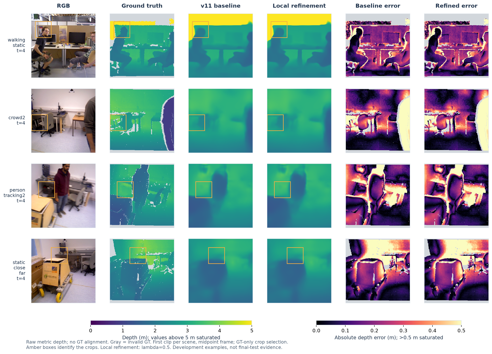
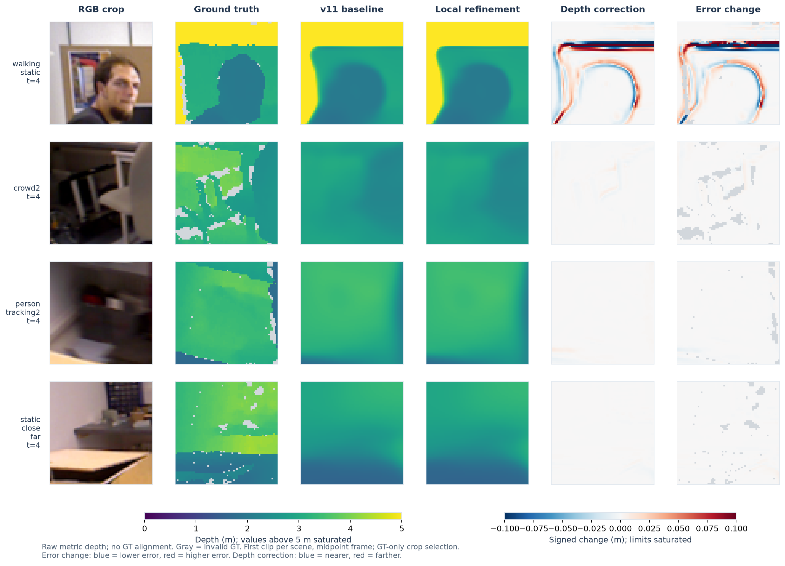
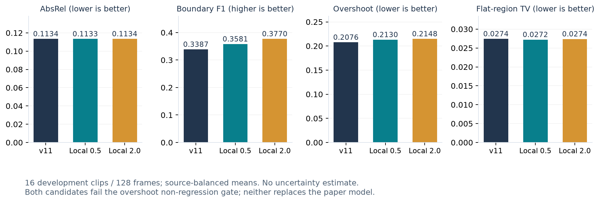

# 깊이 품질 고도화 시각화

기존 v11과 국소 경계 보정 후보 λ=0.5의 실제 개발 데이터 예측이다.
AI 생성 이미지나 정답을 이용한 예측 보정은 사용하지 않았다.
논문 최종 모델과 결과는 변경하지 않았다.

## 전체 깊이·오차 비교



왼쪽부터 RGB, 정답 깊이, 기존 모델, 보정 후보, 기존 절대 오차, 보정 후 절대 오차.
깊이 색상은 공통 0–5m, 오차는 0–0.5m이며 상한 이상은 포화된다.
회색은 정답이 없는 영역이다. 노란 상자는 다음 그림의 확대 위치다.

## 경계 확대



마지막 열의 파랑은 깊이 오차 감소, 빨강은 증가다. 그 앞 열은 깊이 자체의
변화로, 파랑은 더 가까운 예측, 빨강은 더 먼 예측이며 개선 여부를 뜻하지 않는다.
변화 지도는 공통 ±0.1m 범위다. 네 장면 순서는 walking_static, crowd2,
person_tracking2, static_close_far이다.

각 장면의 첫 캐시 클립에서 중간 프레임(t=4)을 고정 선택했다.
64×64 확대 영역은 유효 정답 log-depth 기울기 합이 가장 큰 위치로 정했으며,
후보가 잘 나온 영역을 검색하지 않았다. 정답 센서의 잡음이 선택에 영향을 줄 수 있다.

사람 머리 주변에는 국소 보정이 보이지만 개선·악화가 공존한다.
의자·책상 등의 작은 구조는 여전히 뭉개져 있고, 많은 영역에서 변화가 작다.
현재 모듈이 기본 예측에 없는 구조를 충분히 복원하지 못한다는 한계도 드러난다.

## 전체 개발 표본 지표



막대 그래프는 위 4프레임이 아닌 전체 개발 16클립·128프레임의 source 균등 평균이다.
경계 F1만 높을수록 좋고, 나머지는 낮을수록 좋다. λ=0.5의 경계 F1은 개선되지만
overshoot는 악화한다. 두 후보 모두 채택 gate를 통과하지 못했다.
신뢰구간·다중 seed·최종 테스트 결과가 아니며, 시간적 안정성도 이 정지화상으로 판단할 수 없다.

각 그림의 동명 PDF도 제공한다. `selected_predictions.npz`에 실제 배열,
`provenance.json`에 체크포인트·캐시·그림 해시 및 선택 프레임을 기록했다.

렌더링 명령(빈 출력 폴더 필요):

```bash
PYTHONPATH=work_dirs/paper_tools/quality_plot_python /home/hyunsu/miniforge3/envs/sokkanaem/bin/python scripts/visualize_quality_refinement.py
```
