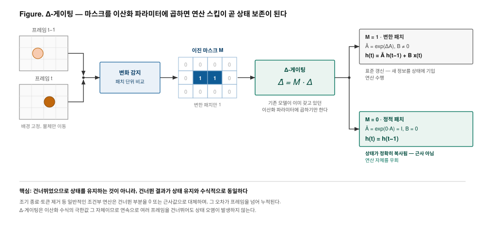
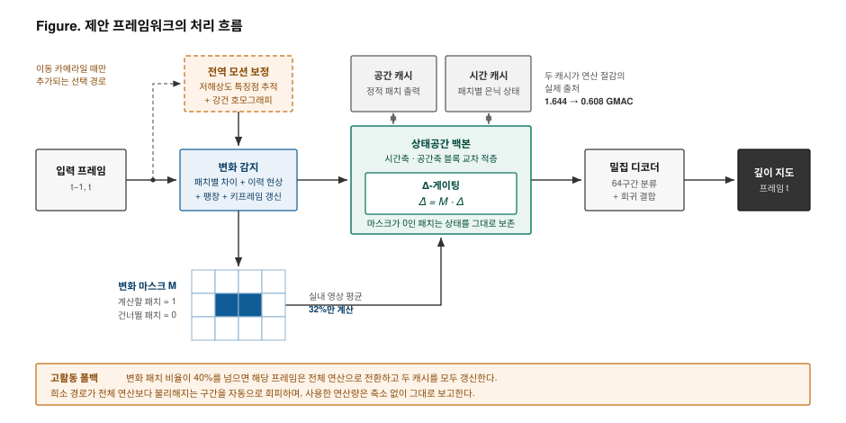
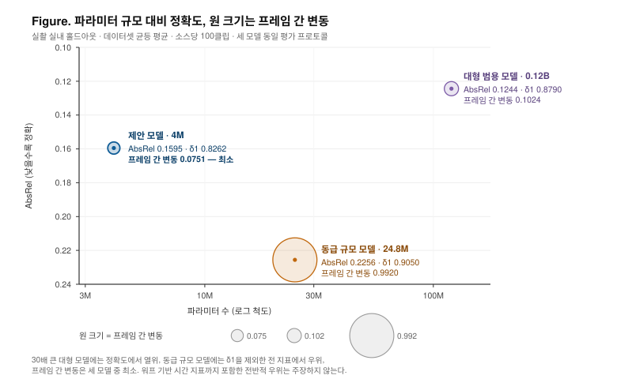
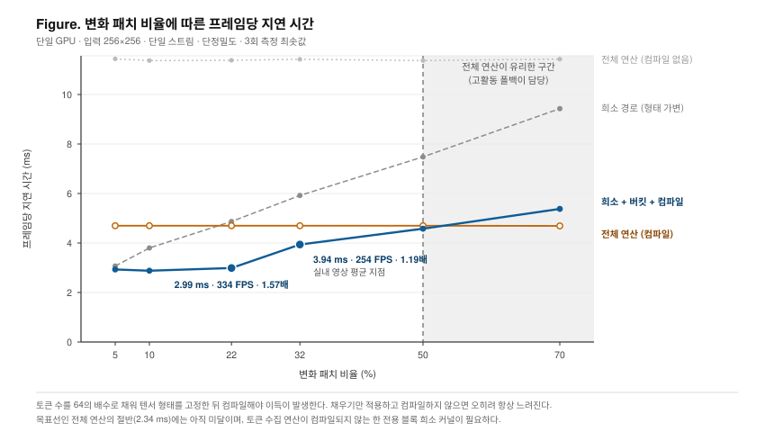

<!-- _class: title -->
<!-- _paginate: false -->

# SOKKANAEM

## 변화 패치 선택 연산 기반 실시간 비디오 깊이 추정

프레임 간 변화가 발생한 패치만 계산하는 스트리밍 깊이 추정 프레임워크

파라미터 4M

실내 영상 254 FPS

후처리 없는 프레임 간 안정성

랩 세미나 · 2026-08-18

<!--
첫 장에서 최고 정확도를 약속하지 않는다.
이 연구의 축은 정확도 순위가 아니라 효율과 시간 안정성의 교환 곡선임을 미리 심는다.
-->

---

# 연구 배경

## 비디오 깊이 추정의 연산 비용 문제

- **깊이 추정**
  - 한 장의 RGB 이미지에서 픽셀마다 카메라까지의 거리를 추정
  - 출력은 입력과 같은 해상도의 거리 지도
- **응용 영역**
  - 고정 카메라 감시, 실내 모니터링, 로봇, 드론
  - 공통 조건 — 영상이 끊기지 않고 들어오며 실시간 처리 필요
- **비디오에서 발생하는 비용 구조**
  - 대부분의 모델은 이미지 단위로 설계
  - 30 FPS 영상이면 초당 30회의 전체 순전파
  - 프레임 사이의 중복은 전혀 활용되지 않음
- **관찰**
  - 고정 카메라에서 프레임 간 변하는 영역은 소수
  - 배경은 수백 프레임 동안 동일

| 데이터셋 | 촬영 성격 | 변화 패치 |
|---|---|---:|
| TUM | 고정 실내 | 19.7% |
| PointOdyssey | 실내외 합성 | 30.8% |
| Virtual KITTI 2 | 주행 합성 | 25.8% |
| Bonn | 동적 객체 실내 | 44.7% |
| TartanAir V2 | 공격적 모션 | 92.1% |

표 1. 데이터셋별 실측 변화 패치 비율 (16×16 패치, 변화 감지 임계 0.05)

고정 카메라에서는 프레임의 80%가 이전과 사실상 동일하다. 카메라가 크게 움직이면 이 여지가 사라진다 — 방법의 적용 범위를 규정하는 수치.

<!--
표의 마지막 행을 먼저 인정하고 넘어간다. 유리한 숫자만 보여주면 질의에서 반드시 지적당한다.
-->

---

# 연구 배경

## 기존 접근의 한계와 연구 질문

- **기존 시간축 처리 방식**
  - 프레임별 독립 추정 후 시간축 후처리 평활화
  - 명시적 시간 모듈 추가 (Chen et al., 2025)
  - 다중 프레임 동시 입력 — 최신 대형 모델의 방식
  - 공통점 — 연산량이 프레임 수에 비례하며 중복 계산을 줄이지 않음
- **연산을 줄이는 일반적 기법의 한계**
  - 조기 종료, 토큰 제거, 희소 연산이 존재
  - 건너뛴 부분은 0 또는 근사값으로 대체
  - 상태가 프레임을 넘어 이어지는 구조에서 **오차가 누적**
  - 시간이 지날수록 예측이 드리프트

- **연구 질문**
  - 연산을 건너뛰면서도 건너뛴 토큰의 내부 상태를 **오차 없이** 유지할 수 있는가
- **가설**
  - 선택적 상태공간 모델의 이산화 파라미터가 이미 "입력을 상태에 얼마나 반영할지"를 제어 (Gu & Dao, 2023)
  - 이 파라미터에 변화 마스크를 개입시키면 별도 모듈 없이 조건부 상태 제어가 가능

새 모듈을 추가하는 접근이 아니라, 모델이 이미 갖고 있는 제어 지점을 찾아 사용하는 접근.

Chen, S., Guo, H., Zhu, S., Zhang, F., Huang, Z., Feng, J., &amp; Kang, B. (2025). Video Depth Anything: Consistent depth estimation for super-long videos. <i>CVPR</i>. 
Gu, A., &amp; Dao, T. (2023). <i>Mamba: Linear-time sequence modeling with selective state spaces</i>. arXiv:2312.00752.

---

# 핵심 아이디어

## Δ-게이팅의 수식 유도

그림 1. Δ-게이팅 동작 원리 — 정적 패치에서는 상태 전이 행렬이 항등이 되고 입력 행렬이 0이 되어 은닉 상태가 그대로 복사된다.

① 기존 이산화 식

$\bar{A}_i = \exp(\Delta_i A)$

$h_i = \bar{A}_i h_{i-1} + \bar{B}_i x_i$

② 본 연구의 개입

$\tilde{\Delta}_i = M_i \cdot \Delta_i$

$M_i \in \{0,\ 1\}$

③ 정적 패치 대입 결과

$\bar{A}_i = \exp(0 \cdot A) = I,\quad \bar{B}_i = 0$

$\Longrightarrow\quad h_i = h_{i-1}$

<!--
1. 이산화 파라미터의 의미 — 입력을 상태에 얼마나 반영할지 정하는 값. 원래부터 입력마다
   다르게 학습되며, 크면 새 입력을 많이 받고 0에 가까우면 상태를 유지한다. 게이트 역할을
   할 자리가 모델 안에 이미 존재했고, 우리는 새 모듈을 붙인 것이 아니라 그 자리를 사용했다.
2. 상태 전이 행렬이 항등이 되는 이유 — 지수함수 정의에 의해 exp(0·A) = I. 근사가 아니라 정확한 항등.
3. 입력 행렬이 0이 되는 이유 — 해당 항의 모든 성분에 이산화 파라미터가 곱해져 있어 0이면 항 전체가 0.
4. 따라서 은닉 상태는 이전 값 그대로. 해당 토큰의 연산은 계산할 필요가 없어 우회 가능.
   건너뛰었으니 상태를 유지하자가 아니라, 건너뛴 결과가 상태 유지와 수식적으로 동일하다.
5. 기존 조건부 연산과의 차이 — 근사 대체가 아니라 이산화 수식의 극한값 그 자체.
   몇 프레임을 연속으로 건너뛰어도 상태 오염이 발생하지 않는다.
6. 학습 — 마스크는 미분 불가능한 이진값이라 직통 추정기로 역전파 (Bengio et al., 2013).
   학습 중 무작위 마스크 비율을 0%에서 80% 스킵까지 스케줄링해 강건화.

예상 질문
- 정말 오차가 0인가 — 단위 테스트에서 상태 복사가 비트 단위로 일치함을 고정 (다음 슬라이드)
- 정적 패치는 영원히 갱신되지 않는가 — 키프레임 주기(실내 60프레임)로 강제 갱신,
  변화 감지에 이력 현상과 팽창 연산 적용
- 마스크를 곱하면 학습이 불안정해지지 않는가 — 이산화 파라미터는 원래 입력마다 값이 변하는
  값이라 0 근처가 분포 밖이 아님
-->

---

# 핵심 아이디어

## 정확한 상태 보존의 실험적 근거

| 주장 | 검증 방식 | 결과 |
|---|---|---|
| 상태 보존이 수학적으로 정확 | 마스크 0에서 상태 복사 비교하는 단위 테스트 | 비트 단위 일치 |
| 연산을 건너뛴 대가가 사실상 없음 | 스킵 비율을 올리며 정확도 측정 | 스킵 55%에서 저하 0.15% |
| 이득의 원인이 Δ-게이팅임 | 동일 마스크로 토큰 제거 방식과 대조 | Δ-게이팅이 우위 |

표 2. 세 가지 주장과 각각의 검증 방식

| 감지 임계 | 계산 패치 | AbsRel ↓ | δ1 ↑ | 변동 ↓ |
|---:|---:|---:|---:|---:|
| 0 (전체) | 100.0% | 0.2054 | 0.684 | 0.1033 |
| 0.05 | 68.1% | 0.2054 | 0.684 | 0.1002 |
| 0.10 | 44.6% | 0.2057 | 0.684 | **0.0962** |

표 3. 스킵 비율에 따른 정확도와 시간 안정성 (합성 주행 데이터, 예비 실험)

- 절반 이상을 건너뛰어도 정확도는 **상대 오차 0.15%** 수준으로 유지 — 주행 영상처럼 전역 모션이 있는 조건에서도 성립
- **스킵 비율이 올라갈수록 프레임 간 변동이 오히려 단조 개선** — 시간 안정성이 후처리가 아니라 구조 자체에서 나온다는 근거

<!--
표 3은 저해상도 예비 실험 수치이며 절대 성능이 아니라 교환 곡선의 형태를 보는 실험이다.
절대 성능은 슬라이드 8에서 제시한다.
-->

---

# 시스템 구성

## 전체 파이프라인과 구성 요소

그림 2. 전체 파이프라인 — 변화 감지가 만든 마스크가 백본의 Δ-게이팅으로 전달되며, 두 종류의 캐시가 실제 연산 절감을 만든다.

- **변화 감지** — 패치 차이 + 이력 현상 + 팽창 + 키프레임 갱신
- **백본** — 시간축·공간축 상태공간 블록 교차 적층 (Liu et al., 2024)
- **디코더** — 밀집 예측 구조 (Ranftl et al., 2021) + 64구간 분류·회귀 (Bhat et al., 2021)
- **두 캐시** — 연산 절감의 실제 출처, 1.644 → **0.608 GMAC**
- **이동 카메라 확장** — 전역 모션 보정 후 변화 감지
- **고활동 폴백** — 변화 패치 40% 초과 시 전체 연산
- **모델 규모** — 4.19M 파라미터, 스트림당 상태 12.75MB

Bhat et al. (2021). AdaBins. <i>CVPR</i>. · Liu et al. (2024). VMamba. <i>NeurIPS</i>. · Ranftl et al. (2021). Vision transformers for dense prediction. <i>ICCV</i>.

---

# 시스템 구성

## 학습 설정과 평가 프로토콜

| 데이터셋 | 종류 | 특성 |
|---|---|---|
| TUM RGB-D | 실촬 | 실내 고정 카메라 |
| Bonn RGB-D | 실촬 | 실내 동적 객체 |
| Virtual KITTI 2 | 합성 | 주행, 조밀한 정답 |
| TartanAir V2 | 합성 | 공격적 카메라 모션 |
| PointOdyssey | 합성 | 장기 시퀀스 |

표 4. 학습 및 평가에 사용한 데이터셋

- 학습에 사용하지 않은 시퀀스를 분리해 평가
- 데이터셋별 추출 확률 균등화
- **학습 설정** — 입력 256×256, 60,000 스텝, GPU 1장, 약 13시간
- 스케일 불변 로그 손실 (Eigen et al., 2014) + 구간 분류 손실, 보조 손실 2종

| 지표 | 정의 | 방향 |
|---|---|---|
| AbsRel | 예측과 정답의 상대 오차 평균 | 낮을수록 |
| RMSE | 제곱 평균 제곱근 오차 (m) | 낮을수록 |
| δ1 | 예측·정답 비율이 1.25 이내인 픽셀 비율 | 높을수록 |
| 프레임 간 변동 | 연속 프레임 예측의 평균 변화량 | 낮을수록 |
| 흐름 보정 불일치 | 광학 흐름 정렬 후의 예측 불일치 | 낮을수록 |
| 시간 일관성 오차 | 정답 기준 시간 방향 오차 | 낮을수록 |

표 5. 평가 지표 정의

프레임 간 변동은 출력이 상수일 때 최솟값이 되므로 단독 해석 금지. 정확도 수치는 클립 단위 중앙값 정합 후 산출 — 절대 거리 스케일은 주장하지 않는다.

Cabon, Y., Murray, N., &amp; Humenberger, M. (2020). <i>Virtual KITTI 2</i>. arXiv:2001.10773. · Eigen, D., Puhrsch, C., &amp; Fergus, R. (2014). Depth map prediction from a single image using a multi-scale deep network. <i>NeurIPS</i>. · Palazzolo, E., et al. (2019). ReFusion. <i>IROS</i>. · Sturm, J., et al. (2012). A benchmark for the evaluation of RGB-D SLAM systems. <i>IROS</i>, 573–580. · Wang, W., et al. (2020). TartanAir. <i>IROS</i>. · Zheng, Y., et al. (2023). PointOdyssey. <i>ICCV</i>.

---

# 실험 결과

## 깊이 추정 정확도와 외부 모델 대비 위치

그림 3. 파라미터 규모 대비 정확도 — 원의 크기는 프레임 간 변동, 작을수록 프레임 사이 흔들림이 적다.

| 모델 | 파라미터 | AbsRel ↓ | δ1 ↑ | 변동 ↓ | 시간 오차 ↓ |
|---|---:|---:|---:|---:|---:|
| 대형 범용 모델 | 0.12B | **0.1244** | **0.8790** | 0.1024 | **0.0252** |
| 동급 규모 모델 | 24.8M | 0.2256 | 0.9050 | 0.9920 | 0.1015 |
| **제안 모델** | **4M** | 0.1595 | 0.8262 | **0.0751** | 0.0323 |

표 6. 실촬 실내 홀드아웃 정확도 (소스별 100클립, 세 모델 동일 프로토콜)

- 30배 큰 대형 모델에는 **정확도와 시간 일관성 오차에서 열위**
- **원시 프레임 간 변동은 세 모델 중 최소** — 명시적 시간 모듈 없이 구조에서 확보
- 동급 규모 모델과 비교하면 δ1을 제외한 전 지표에서 우위
- 합성 데이터 AbsRel 0.3791, RMSE 14.22 — 원거리 구조가 많고 입력이 256px로 제한된 영향

시간 지표 세 가지 중 우위인 것은 원시 프레임 간 변동 하나. 주장은 후처리 없는 플리커 억제로 한정한다.

<!--
동급 규모 비교가 뒤집히는 이유 — 상대 깊이 모델은 클립마다 스케일과 이동량을 함께 정합한다.
대부분의 픽셀 순위는 맞으나 원거리 일부가 발산해 제곱 오차를 지배하므로,
δ1은 높으면서 AbsRel과 RMSE는 나쁜 형태가 나타난다.
-->

---

# 실험 결과

## 실측 처리 속도와 연산 절감

그림 4. 변화 패치 비율에 따른 프레임당 지연 시간 — 세로 점선이 희소 경로와 전체 연산의 성능이 같아지는 지점.

| 변화 패치 | 전체 연산 | 희소 경로 | 배수 |
|---:|---:|---:|---:|
| 5% | 4.70 ms | **2.93 ms** (341 FPS) | 1.60× |
| 22% | 4.70 ms | **2.99 ms** (334 FPS) | 1.57× |
| 32% | 4.70 ms | **3.94 ms** (254 FPS) | 1.19× |
| 50% | 4.70 ms | 4.58 ms | 1.03× |
| 70% | 4.69 ms | 5.38 ms | 0.87× |

표 7. 변화 패치 비율별 프레임당 지연 시간 (단일 GPU, 256px, 단일 스트림, 컴파일 적용)

- **연산량** — 전체 1.644 GMAC, 변화 패치 15.4%에서 0.608 GMAC (37.0%)
- **속도 전환에 필요했던 처리** — 토큰 수를 64의 배수로 채워 텐서 형태를 고정, 채운 부분은 마스크 0이라 결과 불변, 형태 고정 후 컴파일해야 이득 발생
- **적용 범위** — 50% 부근에서 동률, 그 이상은 고활동 폴백이 자동 전환
- **남은 몫** — 목표선 2.34 ms 미달, 전용 블록 희소 커널 필요

<!--
반정밀도는 속도 이득이 없다. 연산량이 아니라 커널 실행 횟수에 묶여 있기 때문이다.
최대 GPU 메모리는 75MB, 반정밀도 적용 시 42MB.
-->

---

# 논의

## 한계와 향후 계획

- **현재 검증되지 않은 것**
  - 통계적 신뢰도 — 본 학습은 조건당 1회 실행이라 절대 수치에 신뢰구간 없음
  - 일반화 범위 — 동일 데이터셋의 다른 시퀀스로 분리했을 뿐 외부 도메인 일반화는 미검증
  - 에지 디바이스 — 임베디드 지연 시간과 전력 미측정, 전력 이득 주장 불가
  - 이동 카메라 확장 — 합성 데이터에서만 검증
  - 절대 거리 스케일 — 중앙값 정합 기준이므로 미터 단위 절대 깊이 미주장
- **방법론적 교훈**
  - 짧은 예비 학습에서의 손실 항 순위가 장기 학습에서 역전됨을 관측
  - 예비 실험은 채택 여부 판단에는 쓸 수 있으나 가중치 결정에는 부적합

| 항목 | 확정하는 주장 | 선행 조건 |
|---|---|---|
| 전용 블록 희소 커널 | 속도 목표선 달성 | 없음 |
| 외부 도메인 평가 | 일반화 범위 | 없음, 약 2일 |
| 에지 디바이스 실측 | 전력 및 임베디드 성능 | 기기 확보 |
| 논문화 | — | 위 항목 완료 후 |

표 8. 향후 계획과 각 항목이 확정하는 주장

<b>요약</b> 
① 이산화 파라미터에 마스크를 곱하면 연산 스킵이 정확한 상태 보존과 수식적으로 동일해진다 
② 4M 파라미터로 실내 영상 254 FPS, 프레임 간 변동은 30배 큰 모델보다 작다 
③ 절대 정확도는 아직 열위이며 다음 관문은 전용 커널과 외부 도메인 검증

---

# 부록

## 참고문헌

Bengio, Y., Léonard, N., &amp; Courville, A. (2013). <i>Estimating or propagating gradients through stochastic neurons for conditional computation</i>. arXiv:1308.3432.

Bhat, S. F., Alhashim, I., &amp; Wonka, P. (2021). AdaBins: Depth estimation using adaptive bins. <i>CVPR</i>, 4009–4018.

Cabon, Y., Murray, N., &amp; Humenberger, M. (2020). <i>Virtual KITTI 2</i>. arXiv:2001.10773.

Chen, S., Guo, H., Zhu, S., Zhang, F., Huang, Z., Feng, J., &amp; Kang, B. (2025). Video Depth Anything: Consistent depth estimation for super-long videos. <i>CVPR</i>.

Eigen, D., Puhrsch, C., &amp; Fergus, R. (2014). Depth map prediction from a single image using a multi-scale deep network. <i>NeurIPS</i>, 27.

Gu, A., &amp; Dao, T. (2023). <i>Mamba: Linear-time sequence modeling with selective state spaces</i>. arXiv:2312.00752.

Liu, Y., Tian, Y., Zhao, Y., Yu, H., Xie, L., Wang, Y., Ye, Q., &amp; Liu, Y. (2024). VMamba: Visual state space model. <i>NeurIPS</i>, 37.

Palazzolo, E., Behley, J., Lottes, P., Giguère, P., &amp; Stachniss, C. (2019). ReFusion: 3D reconstruction in dynamic environments for RGB-D cameras exploiting residuals. <i>IROS</i>.

Ranftl, R., Bochkovskiy, A., &amp; Koltun, V. (2021). Vision transformers for dense prediction. <i>ICCV</i>, 12179–12188.

Sturm, J., Engelhard, N., Endres, F., Burgard, W., &amp; Cremers, D. (2012). A benchmark for the evaluation of RGB-D SLAM systems. <i>IROS</i>, 573–580.

Teed, Z., &amp; Deng, J. (2020). RAFT: Recurrent all-pairs field transforms for optical flow. <i>ECCV</i>, 402–419.

Wang, W., Zhu, D., Wang, X., Hu, Y., Qiu, Y., Wang, C., Hu, Y., Kapoor, A., &amp; Scherer, S. (2020). TartanAir: A dataset to push the limits of visual SLAM. <i>IROS</i>.

Yang, L., Kang, B., Huang, Z., Zhao, Z., Xu, X., Feng, J., &amp; Zhao, H. (2024). Depth Anything V2. <i>NeurIPS</i>, 37.

Zheng, Y., Harley, A. W., Shen, B., Wetzstein, G., &amp; Guibas, L. J. (2023). PointOdyssey: A large-scale synthetic dataset for long-term point tracking. <i>ICCV</i>.

서지 확인 필요 — Depth Anything 3(본문에서는 대형 범용 모델로 지칭), TartanAir V2 별도 서지, Video Depth Anything 게재처.

